# AM410 Day 1 - Enhancing Intelligent Access

- [AM410 Day 1 - Enhancing Intelligent Access](#am410-day-1---enhancing-intelligent-access)
  - [Lab Environment Setup](#lab-environment-setup)
  - [Lesson 1 - Exploring Authentication Mechanisms](#lesson-1---exploring-authentication-mechanisms)
    - [Authentcation & Authorization](#authentcation--authorization)
    - [Realms](#realms)
    - [Authentication Lifecycle](#authentication-lifecycle)
    - [Intelligent Authentication](#intelligent-authentication)
  - [Lesson 2 - Protecting A Website With IG](#lesson-2---protecting-a-website-with-ig)
  - [Lesson 3 - Controlling Access](#lesson-3---controlling-access)

## Lab Environment Setup

Task 1: Examine the AM installation inside of Student workbook > page 17

The VM is available on the internet.

## Lesson 1 - Exploring Authentication Mechanisms

###  Authentcation & Authorization

Businesses offer services and resources to their users. Businesses typically use identity & access management (IdAM) tools to gate access to their services and resources. All access management tools need to:
* Identify who the user is. This is called **Authentication**.
* Identify what the user is allowed to do. This is called **Authorization**.

The **ForgeRock Access Management (FR AM)** tool provides authentication and authorisation. Once a user has successfully authenticated, FR AM maintains information about that user's session a server-side in a structure called an `SSOToken`. Users need to be authenticated to FR AM before they can access any services gated by FR AM.

AM services are written in Java. The layers in this image are:

1. The Protected resources users are trying to access.
2. REST API layer. This is exposed to the world to provide a common way to access FR AM resources. e.g. request user information.
3. AM core services. e.g. authentication and session managment.
4. Persistent storage for FR AM configuration, identities, policies, applications, sessions. e.g. sessions are stored in the **Core Token Service (CTS)** which is a **ForgeRock Directory Services (FR DS)** LDAP instance.

### Realms

Realms:
* Configure AM experiences according to groups of users.
* Organize applications and authorization.
* Manage configuration efficiently and securely:

Realms can configure:
* Authentication
* End user branding
* Identities (users, groups, and privileges)
* Identity stores
* Service configuration
* Authorization
* Applications (policy agents, OAuth 2.0 (OAuth2) clients, and federation)

Realms can be used to create a specific user experience for a group of users. If a solution must be put in place for various sets of users, multiple realms can be created.

Top Level Realm:
* Is the default realm created when AM is installed.
* Should be used by FR AM admins only.
* It is also known as `/` or `root` Realm.

Subrealms:
* Should always be created for other use cases rather than using the Top Level Realm.
  * A single subrealm is appropriate if the user population is a single community and requires a uniform FR AM experience.
  * Multiple subrealms are appropriate is the user population isn't a single community and requires a different FR AM experience per community.
* Application owners can have access to their Subrealm through the FR AM UI to be able to configure it.

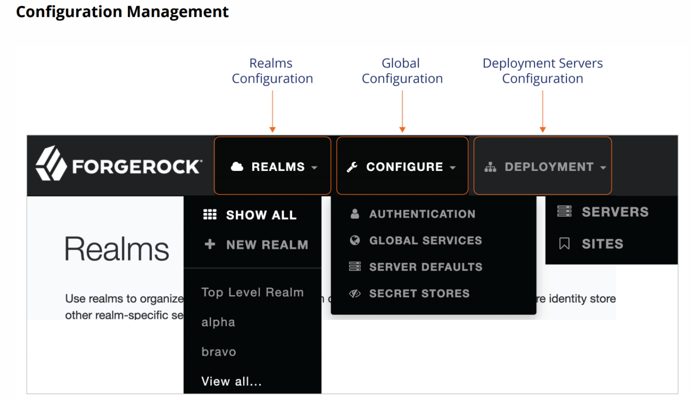

The top level in the UI is for global configuration and the left side panel is for the currently selected Realm.

When the FR AM server receives an authentication request, one of the first decisions made is to determine the Realm to which the user is trying to authenticate.

There are 2 ways to access a realm:
1. Use the `realm` URL parameter to access the authentication interface, e.g. [https://am.example.com:9443/login/XUI/?realm=/alpha#login](https://am.example.com:9443/login/XUI/?realm=/alpha#login) would log into the alpha Realm.
2. You could make a better user experience by using a DNS alias for this URL, e.g. [https://subscribers.example.com:9443/login/XUI/#login](https://subscribers.example.com:9443/login/XUI/#login) would redirect the user to the correct page. This can be done in Realm configuration (e.g. click edit on the Realm in the Dashboard).

### Authentication Lifecycle

When AM services are used as part of an access management solution, every protected resource will somehow need to authenticate the end user before they can access it. FR AM authentication is done through a series of REST API calls. This can be done through a user's browser or by an application using the REST API. The user's credentials are checked against the FR DS CTS and if they are valid a session is granted. Users will no longer need to authenticate to FR AM while they have a valid session. The `SSOToken` is a unique ID that stores a user session and is used by all AM systems. A `SSOTokenID` is given to the client. The `SSOTokenID` is either set as a cookie when using a browser, returned to the service in case of a REST call, or included in a JSON Web Token (JWT) when using **ForgeRock Identity Gateway (FR IG)** or a web agent.

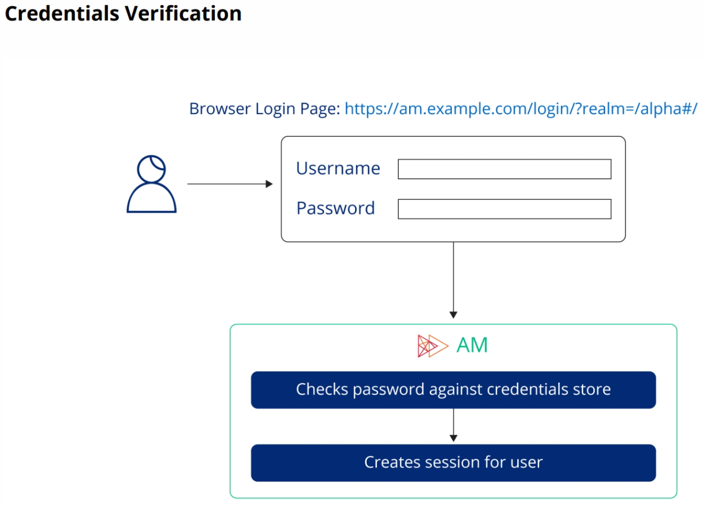

Users accessing AM or a resource protected by AM for the first time do not have an existing session and are called unauthenticated users. They will be required to authenticate with AM.

There are 2 session types in FR AM:

**Authentication sessions** are the process of getting user credentials and validating them. They:
* Keep track of the state during authentication.
* Have a limited lifetime which is the authentication process, up to a maximum of 2 minutes. This is stored in the `amlbcookie` clientside cookie.

**Authenticated sessions** are the result of a successful authentication. They:
* Represent an interactive exchange between AM and an identity.
* Created after successful authentication.
* Persisted in the CTS store, by default.
* Referenced using a unique `SSOTokenID` value.
* Contain internal and custom properties.
* Have idle timeout and maximum lifetime. Each time the session is checked for validity by an application or a service, its idle timeout is reset.
* Invalidated by timeout (idle or lifetime), active logout from the user, and administrative invalidation.

Every session has an enforced idle timeout and maximum lifetime:
* Idle timeout: After 30 minutes (default) of inactivity, the session is deactivated.
* Maximum lifetime: After 120 minutes (default), the session is deactivated.

Timeouts can be configured globally, per realm, or per user through the session service.

A session contains information to make access management decisions, such as the user's identity, authentication method, remaining session time, and the authentication realm.

After authentication and AM creates a session, AM needs to communicate a reference about the session to any party that may need it, such as IG, web agents, and applications.

Where no browser is involved, AM returns the `SSOTokenID` directly; for example, as a JSON Response to a REST call. When a browser is used, the browser is instructed to set a cookie. The cookie name is` iPlanetDirectoryPro` by default. You should change the default cookie name for production environments.

`iPlanetDirectoryPro` cookie is the most important clientside cookie as it has the authentication session from ForgeRock AM. This cookie is always sent to ForgeRock AM with each request so ForgeRock AM knows the user is still authenticated. ForgeRock AM will check to see if that session is still valid. This approach is useful when you have full control of the network and want SSO, but isn't desireable for internet facing applications. When you don't have control of the network use another approach like OAuth2 or OIDC.

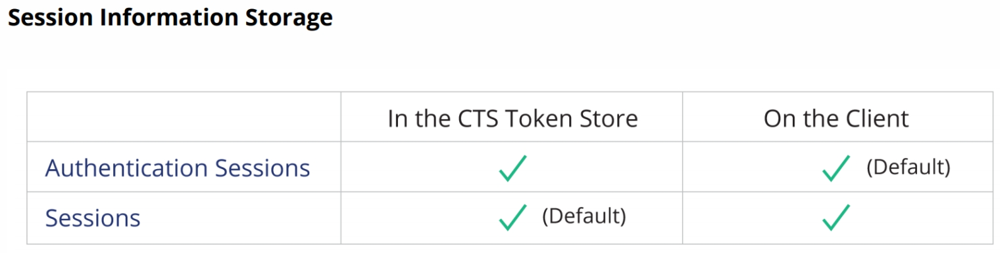

AM can be configured to use one of the following two methods to keep track of the session:
* A CTS-based session, which is stored in FR DS and is the default approach.
* A client-based session, which is stored in a user's browser using JWT token. You could decode this is https://jwt.io but remember JWT's start with `ey` so delete anything before `ey`.

AM creates an authentication session to track the user or entity progress through an authentication tree.

The session cookie:
* Is an SSOTokenId value for CTS-based sessions.
* Is a JWT containing the SSOTokenId value for client-based sessions.
* Has a domain scope by default, which defines the visibility of the cookie.
  * If the cookie has not expired, it is presented to the server within the scope.
  * If the cookie has expired or not within the scope, it is not presented.

By default, the AM cookie is configured as domain cookie based on the AM **fully qualified domain name (FQDN)**. In this class, the cookie domain is [am.example.com](am.example.com). Therefore, the cookie is not available to [fec.example.com](fec.example.com) or [am.example.org](am.example.org), and would be available to [subdomain.am.example.com](subdomain.am.example.com).

**Note:** By default the session cookie has the scope of a domain name. So in the brower's developer tools your session cookie is not displayed when the browser accesses another domain, because the cookie is configured as a domain-based cookie that is visible to the domain from which it was sent, and subdomains of the cookie domain. Once you return the previous domain your session cookie will be accessible again. When logging out the cookie is removed.

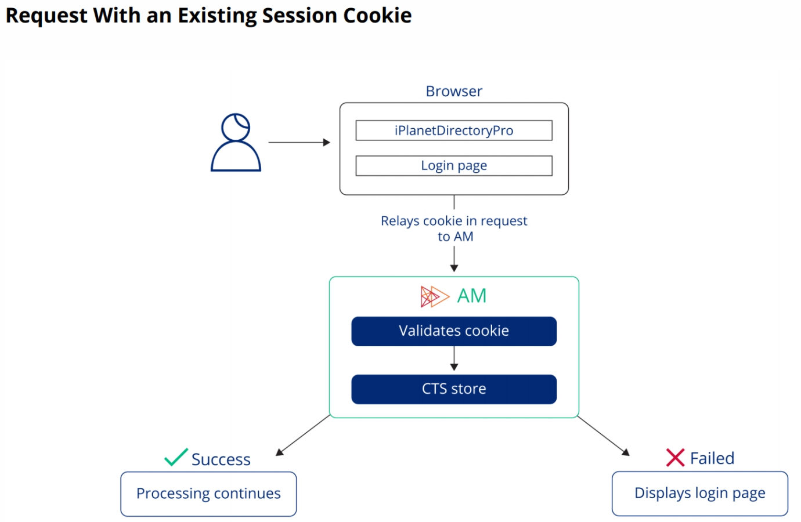

When a cookie is set in the browser and the user returns to the AM login page, AM can read the cookie and validate it. If the validation is successful, AM can proceed with the flow. Otherwise, AM considers that the user is not authenticated and displays the login page again.

Once authentication is successful, the end user may end up on different pages, depending on the context.

Note that changing the Default Success Login URL or the Default Failure Login URL values requires the new URL values to be added to the Validation Service whitelist.

An end user, however, only has access to their user profile page and self-service areas, if configured. Note that a user account may be granted full administrative privileges. If that is the case, the user would then have access to both the AM Admin UI and the user's profile page and self-service areas.

The AM Admin UI can only be accessed by AM administrator users.

An end user, however, only has access to their user profile page and self-service areas, if configured. Note that a user account may be granted full administrative privileges. If that is the case, the user would then have access to both the AM Admin UI and the user's profile page and self-service areas.

In most cases, however, AM is only one step in a process of accessing entirely independent resources, such as access to a website. The user would be redirected to AM and, after successful authentication, would expect to return where they came from. AM login URLs can add a goto URL parameter to specify a redirection URL when authentication is successful. For example:

[https://am.example.com/login/?realm=/alpha#login/&goto=https://fec.example.com](https://am.example.com/login/?realm=/alpha#login/&goto=https://fec.example.com)

After successful authentication or validation of existing `SSOTokenID`, AM sends a redirect response to the browser, and the user is redirected to the `goto` URL.

By default, the `goto` and `gotoOnFail` parameters can only reference:
* URLs that share the same scheme, FQDN, and port as AM.
* URLs that are relative to AM URL.

To access other `goto` and `gotoOnFail` URL values, add the URLs to the realm's Validation Service.

**GOTCHA:** AM requires that all goto redirection URLs are whitelisted in the access management Validation Service for the Realm.

When you are logged into a Realm and try to access aother Realm that you are not logged into, you will see the page `LEAVING SITE`, also called the switchRealm page (check the fragment name in the URL). It is a page displayed when a user is already authenticated to a realm and tries to access another one. This demonstrates that a user can only be logged in to one realm at a time.

### Intelligent Authentication

AM authentication mechanisms use:
* A tree is the primary mechanism for authentication.
* All authentication takes place through a tree, either through:
  * The default tree for a given realm.
  * A tree specified in the URL by adding the `service=<tree-name>` parameter.

When a user accesses the AM login page, AM looks into its configuration and starts a specific authentication process. To decide what that process is, AM takes into account the URL request and the parameters provided in the request.

In the absence of parameters around authentication choices, AM uses the defaults defined for the specific realm being accessed.

AM uses:
* Credentials to authenticate the user and capture credentials:
  * Interactively: LDAP, WebAuthn.
  * Non-interactively: Device profile.
* Authentication nodes within trees to:
  * Control the type of credentials asked of the user.
  * Connect to the credentials store and validate the credentials.
* Trees to control the logical flow of the authentication process.

**Interactive authentication** is when the user is actively involved in the authentication process and is requested for credentials or a touch ID. A **non-interactive authentication** method uses credentials to authenticate the user, but the user does not have to manually supply said credentials. For example, the device profile could be used.

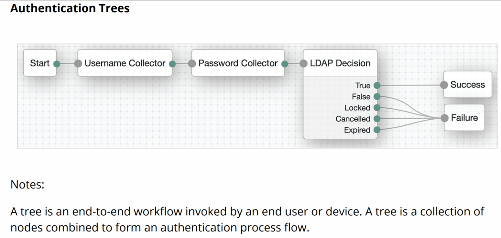

A **tree** is an end-to-end workflow invoked by an end user or device. A tree is a collection of nodes combined to form an authentication process flow. Trees:
* Defines an authentication process.
* Utilizes authentication nodes to build a flexible logical process flow: loops, branches, and recursions.
* Starts at a single entry point. Lets nodes store and retrieve information.
* Completes with one exit point: Either a success or failure ending that determines the authentication result.
* Can be nested or reused as an inner tree within other trees.

Each tree has one entry point and one exit point at runtime. A tree ends with either a success or a failure result.

**Authentication nodes** are the building blocks of a tree authentication flow. Each node corresponds to a single task. Authentication nodes:
* Are building blocks of a tree authentication flow.
* Correspond to a single task in the tree, such as:
  * Starting or finishing the tree.
  * Collecting user data and contextual information
  *  Taking decisions based on configuration and available data.
  *  Locking an account.
* Can have either single or multiple outcomes.
* Can be extensible through JavaScript via the Scripted Decision node or custom nodes written in Java.

Manage trees:
* Use and modify pre-configured templates for common authentication requirements.
* Edit trees with the Tree editor.
* Start from scratch to create a custom tree.
* Configure one tree as the default for a realm.

The AM Admin UI lets you:
* Create, edit, and delete trees.
* Configure the default tree for a realm

AM pre-configured tree templates can be used as is for common end user trees.

The login page presented to the user depends on the URL realm parameter or DNS alias used.
The authentication tree selected by AM is:
* The default tree for the realm.
* The URL parameters `authIndextype` and `authIndexValue;` for example, `authIndexType=service&authIndexValue=MyTree`.
* The End User UI with the tree name added with the service parameter in the URL; for example: https://am.example.com/login/?realm=/alpha&service=MyTree#login

The Tree editor:
* Is a visual interface for creating and editing trees.
* Supports drag-and-drop actions for nodes and their connections.
* Provides a searchable list of nodes in the Nodes panel on the left.
* Displays configurable properties, if any, for a selected node in the configuration panel on the right.

A tree is called an inner tree when it is nested inside another tree by using an Inner Tree Evaluator node, which can be used by any number of other trees. So, if you modify an element in the inner tree, the change affects all the trees using it.

AM nodes are grouped into the following categories:
* Basic Authentication Nodes
* Multi-Factor Authentication Nodes
* Risk Authentication Nodes
* Behavioral Authentication Nodes
* Contextual Authentication Nodes
* Federation Authentication Nodes
* Identity Management Authentication Nodes
* Utilities Authentication Nodes
* IoT Authentication Nodes

The basic authentication nodes include:
* The Data Store Decision node: Uses the AM identity store to validate credentials collected.
* The Kerberos Node: Enables desktop SSO such that a user who has already authenticated with a Kerberos Key Distribution Center can authenticate to AM without having to provide the login information again.
* The LDAP Decision node: Validates credentials by using an external directory server using LDAP/LDAPS.
* Username Collector node: Prompts the user for their username.
* Password Collector node: Prompts the user for their password.

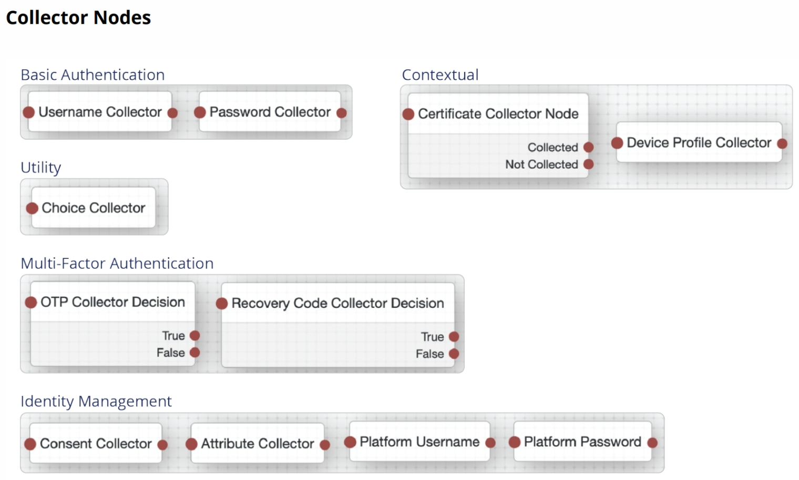

Collector nodes prompt for user input and device data, such as device profile, location, and certificates. Some collector nodes are also decision nodes. Most collector nodes have a single outcome, except the collectors that are also decision nodes. Most of these collector nodes require some additional configuration.

* OTP Collector Decision node: Prompts for a one-time password to be entered and compares the entered value with a generated value.
* Recovery Code Collection Decision node: Collects a recovery code from the user and compares its hash to a hashed code belonging to the user.
* Choice Collector node: Obtains a choice from the user whose value is one of the node outcomes.

Any node outcome can be connected with the input of another node to form a loop mechanism. A node, such as a decision node, can have more than one outcome to provide a branch or alternate path to the flow. Inner Tree Evaluator nodes follow the logic defined in another tree.

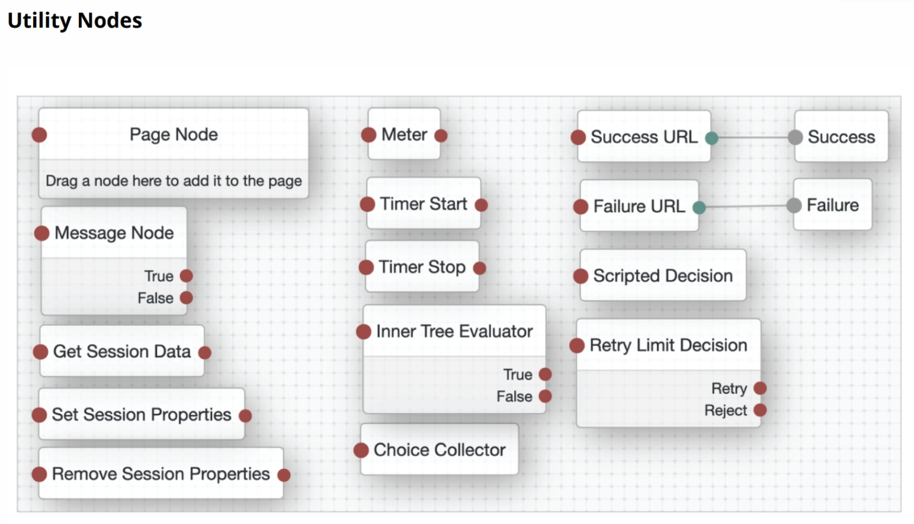

* The Page Node combines multiple nodes, such as the Username Collector node and Password Collector node, that request input into a single page for display to the user.
* The Message Node displays a custom, localized message on the page, and can provide a localized positive and negative response that the user can select to proceed.
* The Choice Collector node defines two or more options to display to the user when authenticating. Each choice corresponds to a different outcome.
* The Get Session Data, Set Session Properties, and Remove Session Properties nodes can be used to read, write, and delete session properties.
* The Meter node increments a specified metric key each time the node is encountered.
* The Timer Start and Timer Stop nodes can be used to track elapse time between nodes in a tree.
* The Inner Tree Evaluator node allows the nesting and evaluation of authentication trees as a child within a parent tree. There is no limit to the depth of nested trees.
* The Scripted Decision node allows the execution of scripts during authentication. Tree evaluation continues along the outcome path matching the script result. Scripts must first be created in the Script section.
* The Retry Limit Decision node allows the specified number of passes through the Retry outcome path, before continuing along the Reject path.
* The Success URL and Failure URL nodes set the redirection URL to be applied when authentication succeeds or fails, respectively.

The process of adding a script to a tree involves:
1. Navigating to SubRealm > Scripts.
2. Creating a Decision node for authentication trees script, and writing the code in JavaScript or Groovy. The example shows the outcome is set to one of two results: "success" or "fail" as a string value, depending on the result of a condition in the logic.
3. Add the Scripted Decision node to the tree and configure the node:
   1. Use your script, myTreeScript, as shown in the example.
   2. Define outcomes that match those returned by the script.

## Lesson 2 - Protecting A Website With IG

Protecting resources or services involves the ability to:
* Intercept requests.
* Instruct end users on how to obtain required access passes.
* Validate a user's identity.
* Evaluate their access rights.
* Relay the request to the backend, when validation is successful.

AM provides authentication, SSO, and policy functionality to enterprise applications. There are many different approaches to enterprise application integration. We will use **Forgerock Internet Gateway (FR IG)** to protect a website and demonstrate AM functionality.

IG is a standalone product used to offer web access management to all web applications, including legacy applications with built-in legacy authentication mechanisms. IG also offers SAML2 support to all applications, and is easy to integrate. IG can also support OIDC operations. IG replaces the old FR Java Web Agent.

Edge clients must be registered with AM before they can participate.  This takes the form of an entry within the AM configuration. The configuration is used by AM to specify how to communicate with the client, how the client authenticates, and the client actions that are allowed.

Integration of applications can take many paths as their context can vary a lot. For example:
* Is the application standalone?
* Is it a mobile application or an SPA?
* Is it deployed in a container for which an agent exists?
* Does the application manage its own authentication and authorization?

FR IG offers:
* Offers web access management to all web applications (including legacy applications).
* Offers easy to integrate SAML2 support.
* Supports OpenID Connect (OIDC) operations.

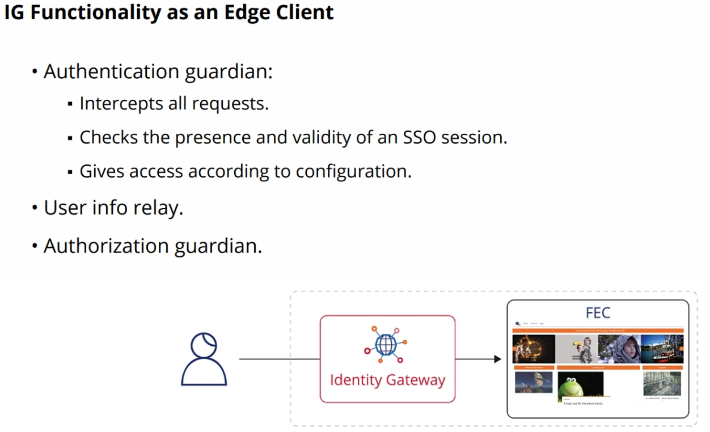

As an authentication guardian, IG intercepts all the communication trying to reach the website. It will try to assess whether the request should be allowed to go through or not. A second functionality is that IG can relay user information to the website/backend application. IG can also verify if access can be granted for that user under current circumstances.

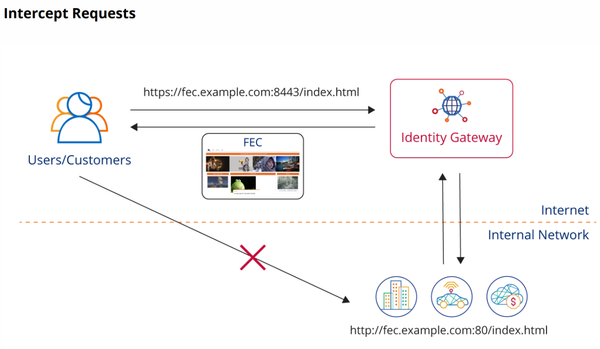

IG must intercept all the access requests to protected resources. Typically, the architecture ensures that end users can access IG but cannot access the underlying resources directly. IG listens to the port, intercepts the request, and processes it based on its configuration

When a user requests a page from the FEC website, IG intercepts the request and searches for the presence of a cookie, as defined in its configuration. If the cookie is present, IG decodes its value, retrieves the SSO token value, and communicates with AM to find out if the SSO token is valid.
* If it is valid, IG proceeds with the flow.
* If it is not valid, or if the cookie does not exist, IG redirects the user to AM for authentication.

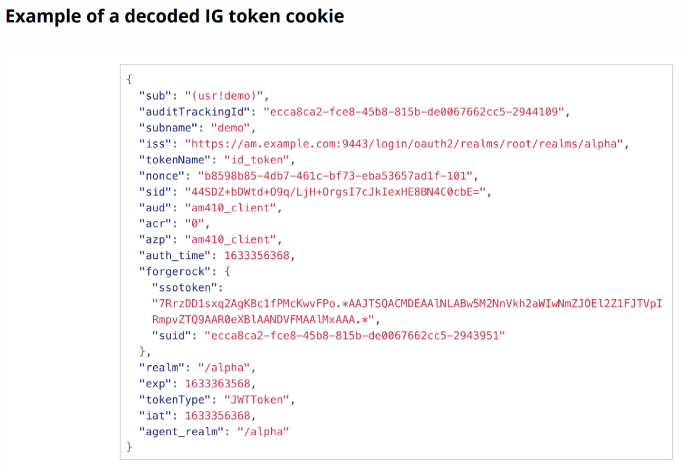

If you decode the IG JWT token you will see the information above. One of the most relevant pieces of information is contained in the `ssotoken key`. The value of the field is the `SSOTokenId`, which is a reference to the session created after the user authenticated successfully with AM, and which is persisted in the AM CTS store. The token also contains information about the realm where authentication took place, a reference to the end user, the name of the edge client for whom the token was created, and so on.

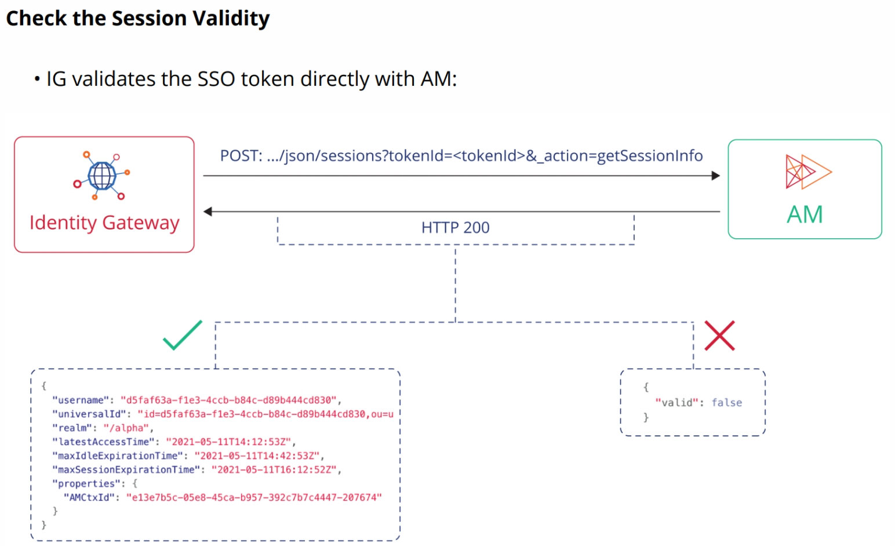

When IG finds the IG cookie, it needs to validate the SSO token it contains. To do so, IG accesses the `.../am/json/realms/root/sessions?_action=getSessionInfo` endpoint of AM, providing the SSO token value in the request.
* If the session is not valid, AM responds with a JSON message containing a `"valid":false` key/value pair.
* If the session is valid, AM responds with a JSON message containing information about the session, as shown in the image above.

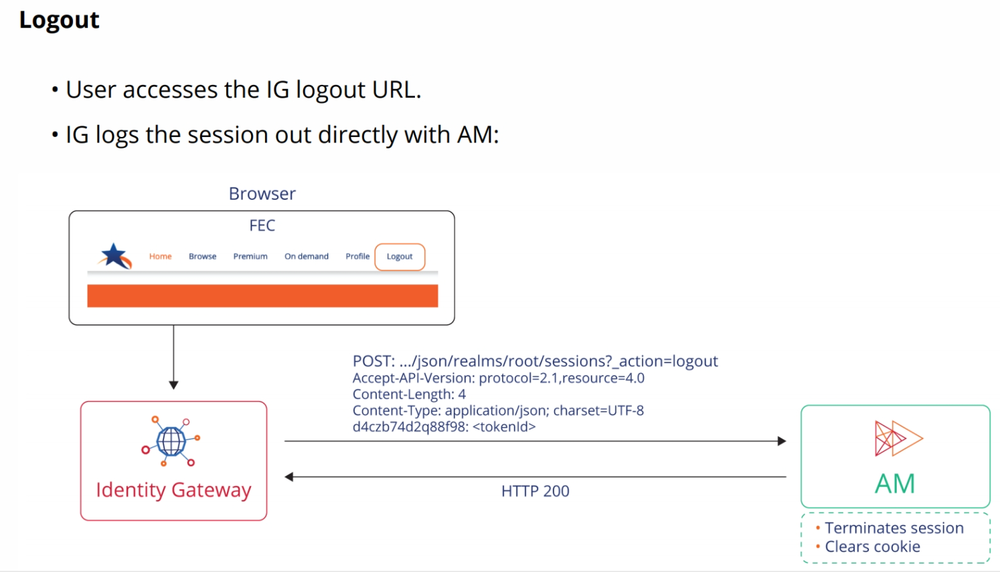

To log out from an application, protected with IG integrated with AM, you must log out of AM. You can either integrate a link in your website, which accesses the AM logout page, or use functionality from IG.

## Lesson 3 - Controlling Access
