# AM410 Day 2 - Improving Access Management Security

- [AM410 Day 2 - Improving Access Management Security](#am410-day-2---improving-access-management-security)
  - [Lab Environment Setup](#lab-environment-setup)
  - [Lesson 1 - Increasing Authentication Security](#lesson-1---increasing-authentication-security)
    - [MFA](#mfa)
    - [OAuth](#oauth)
    - [Push](#push)
    - [WebAuthN](#webauthn)
    - [HOPT Via Email Or SMS](#hopt-via-email-or-sms)
    - [Labs](#labs)
      - [MFA](#mfa-1)
      - [WebAuthN](#webauthn-1)
  - [Lesson 2 - Modifying A User's Authentication Experience Based On Context](#lesson-2---modifying-a-users-authentication-experience-based-on-context)
    - [Discovery](#discovery)
      - [User Context](#user-context)
      - [Devices](#devices)
      - [Risk Analysis](#risk-analysis)
    - [Lock and unlock accounts](#lock-and-unlock-accounts)
  - [Lesson 3 - Checking Risk Continuously](#lesson-3---checking-risk-continuously)
    - [Upgrading & Downgraing Session Entitlements](#upgrading--downgraing-session-entitlements)
    - [Transactional Authorisation](#transactional-authorisation)
    - [Labs](#labs-1)
      - [Account Locks & Unlocks](#account-locks--unlocks)
      - [Step Up](#step-up)
      - [Transactional Authorisation](#transactional-authorisation-1)

## Lab Environment Setup

Task 1: Examine the AM installation inside of Student workbook > page 17

The VM is available on the internet.

## Lesson 1 - Increasing Authentication Security

### MFA

**Multi-factor authentication (MFA)** is the process by which users must provide more than one form of credentials. Either different types, such as a username/password combined with a one-time password, or obtained from different devices; for example, username/password followed by a code received on the phone.
MFA can be requested for each authentication, which is the usual process for high-security applications, or only if there is an elevated risk.

There are 3 common MFA approachs:
1. OPT - An OTP is like a password but it can only be used once, thus it stands for **one-time password.**
2. HOPT - The “H” in HOTP stands for Hash-based Message Authentication Code (HMAC). Put in layman’s terms, **HMAC-based One-time Password algorithm (HOTP)** is an event-based OTP where the moving factor in each code is based on a counter.

3. TOPT - **Time-based One-time Password (TOTP)** is a time-based OTP. The seed for TOTP is static, just like in HOTP, but the moving factor in a TOTP is time-based rather than counter-based.

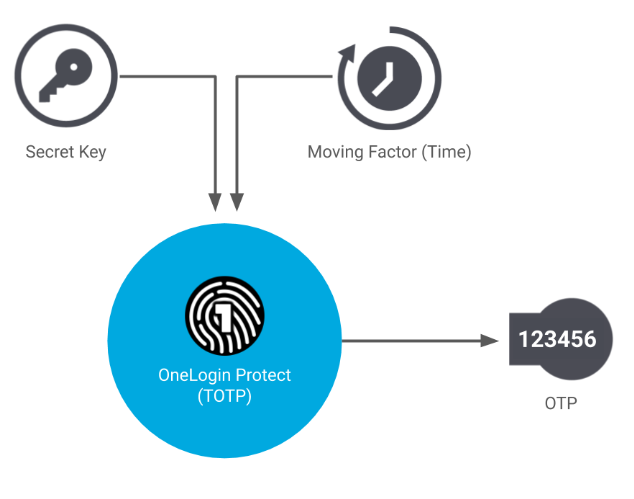

AM supports the following MFA protocols:
* **Open Authorization (OAuth)**: Enable **One time password (OTP)** authentication. It comprises HOTP and TOTP support.
* Push Notifications: Receive push notifications in a device as part of the authentication process.
* **Web Authentication (WebAuthn)**: Enable authentication using an authenticator device, such as a fingerprint scanner.
* OTP codes: Sent using an email address or a phone number associated with the user.

### OAuth

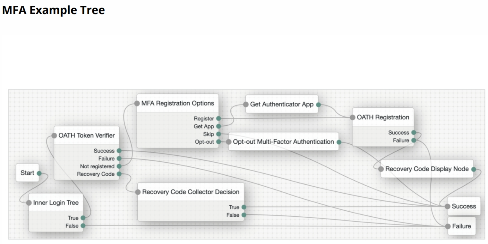

The image above shows an example of a tree containing OAuth as second-factor authentication. The tree not only contains the authentication step itself, but also the registration and recovery steps. Note that you can organize your solution to have three separate trees instead: one for registration, one for authentication, and one for recovery.

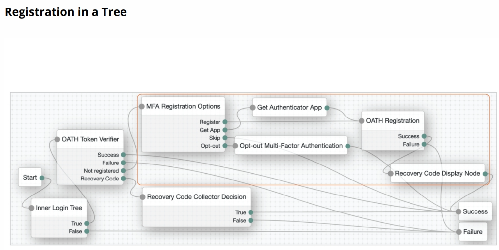

In the MFA example tree above, the highlighted section represents the registration tree.

* The Get Authenticator App displays an information window and links to the ForgeRock Authenticator app in the Apple and Google stores.
* When the authentication process reaches a Registration Node in the tree, such as the OAuth Registration node, it displays a QR code in the browser.
* If a user opts out of MFA, their decision should be persisted with their profile. This is the role of the Opt-out Multi-Factor Authentication node.
* When registering a device to use during a second-factor authentication, there is always a risk of the user losing access to their device, either because it is lost, broken, or stolen. Recovery codes address this issue. They are provided at registration time by the Recovery Code Display Node. The Recovery Code Display Node displays a window containing recovery codes. It is usually placed after a successful device registration in a tree.
* When a user has lost their device, or if the device has been stolen, they won't be able to provide the verification code during the MFA process. In such a case, they can select the USE RECOVERY CODE button and a window asking for a recovery code is displayed. The corresponding node is called the Recovery Code Collector Decision node.

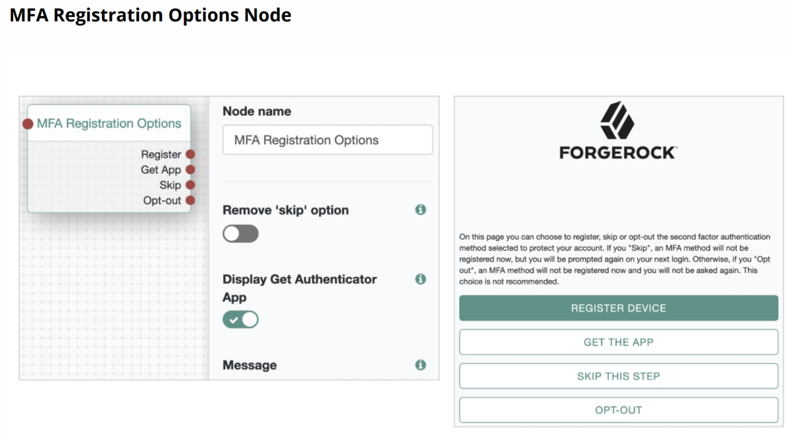

The MFA Registration Options node lets users decide if they want to use MFA to protect their account or not. The options are to register a device, get the ForgeRock Authenticator app, skip the step, or opt out. The text on each button on the display window can be customized and localized.

The Get Authenticator App displays an information window and links to the ForgeRock Authenticator app in the Apple and Google stores. The node message and the button text are configurable and can be localized.

When the authentication process reaches a Registration Node in the tree, such as the OAuth Registration node, it displays a QR code in the browser.

To register a device, users must have installed the ForgeRock Authenticator on their device. They can then open the application, select the + icon, and scan the QR code.

The QR code contains all the information needed to register the device with the user's profile in AM, to create a local account for the user in the application, and to facilitate following logins.

The authentication flow and actions required from the user are slightly different for each of the MFA mechanisms and are detailed in the corresponding sections.

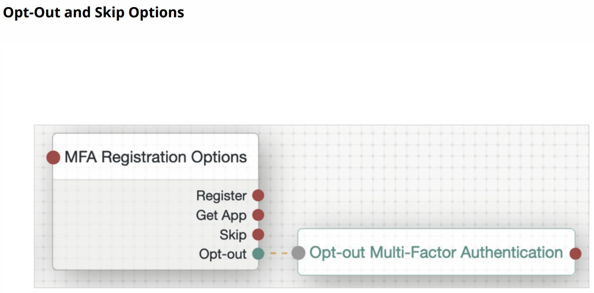

If a user opts out of MFA, their decision should be persisted with their profile. This is the role of the Opt-out Multi-Factor Authentication node.

However, if a user chooses the Skip option in the MFA Registration Options node, the decision applies for the current authentication only, and the user will be presented with the options again on the next authentication cycle.

When registering a device to use during a second-factor authentication, there is always a risk of the user losing access to their device, either because it is lost, broken, or stolen. Recovery codes address this issue. They are provided at registration time by the Recovery Code Display Node. If a user is unable to authenticate using the MFA method, OAuth in our example tree, they can select the Recovery Code button and provide a recovery code from their saved list. If they are successful, they can register a new device for MFA, for subsequent logins.

The Recovery Code Display Node displays a window containing recovery codes. It is usually placed after a successful device registration in a tree.

Each code can be used only once. AM saves a hashed version of each code together with the user's profile. This is why codes can only be displayed once and the instructions provided recommend that users save the list in a safe place.

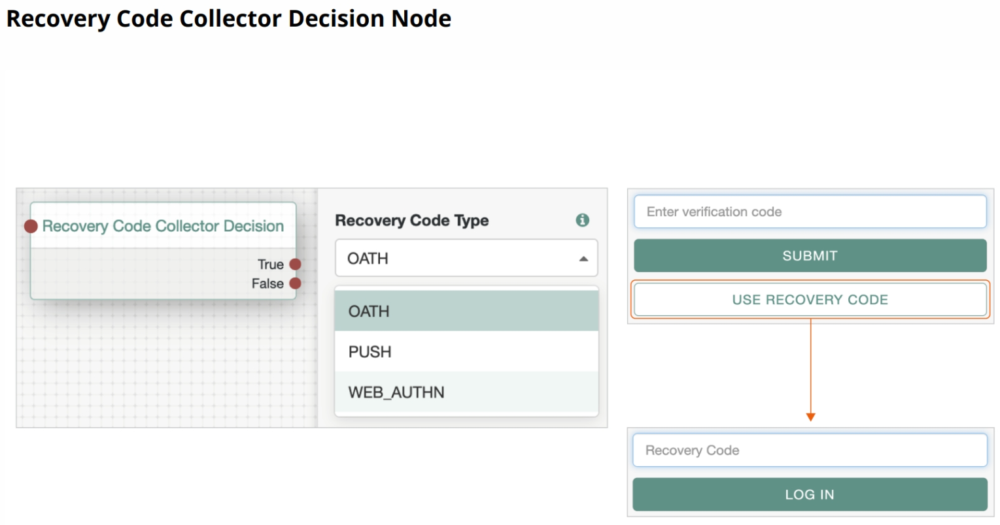

When a user has lost their device, or if the device has been stolen, they won't be able to provide the verification code during the MFA process. In such a case, they can select the USE RECOVERY CODE button and a window asking for a recovery code is displayed. The corresponding node is called the Recovery Code Collector Decision node. It can be configured to accept a recovery code created during an OAuth, a Push notification, or a WebAuthn authentication flow.

If the recovery code hash corresponds to an entry with the user, and has not been used before, the flow proceeds through the True outcome. This gives the user a chance to register a new device. Alternatively, it could simply continue to the success exit for the tree; in which case, there should be a separate tree for people who need to register a new device.

To use OAuth authentication, the user must have a device with a camera and install the ForgeRock Authenticator app. Before authentication can take place, the device must be registered. The registration step can be done out-of-band using a specific registration tree in AM, or the registration and authentication steps can be part of the same tree. In this course, we focus on the latter approach.

During the authentication process, if no device is registered for the user, the browser displays a QR code. The user scans the QR code with the ForgeRock Authenticator installed on their device. Note that the app asks for permission to access the camera.

The QR code contains information about settings related to the algorithm used by OAuth, the username, and a shared secret. The ForgeRock Authenticator creates an account for the user and saves the related settings for later use. AM also keeps track of the settings and the shared secret for the user.

During the following logins, AM requests a code for the user to enter. The user must open their ForgeRock Authenticator app, select the corresponding account, and enter the code provided.

* The OATH Registration node displays a QR code in the user's browser.
* A tree needs to collect the username, before calling the OATH Token Verifier node. The OATH Token Verifier node uses the username to find out if a device is registered for the user for OATH authentication.

OAuth authentication can use one of two algorithms:
1. Time-based one-time password (TOTP) generates a code based on the shared secret and the current time. This is the recommended one.
2. HMAC-based one-time password (HOTP) generates a code based on the shared secret and a counter.

Margin set to accept some sync/time differences. A reset process is needed if the sync difference is too big.

The OAuth Registration node displays a QR code in the user's browser. The settings are used to build the look and feel of the window, and to create the QR code itself. The ForgeRock Authenticator uses the information received in the QR code to adjust the settings to calculate the code for the user.

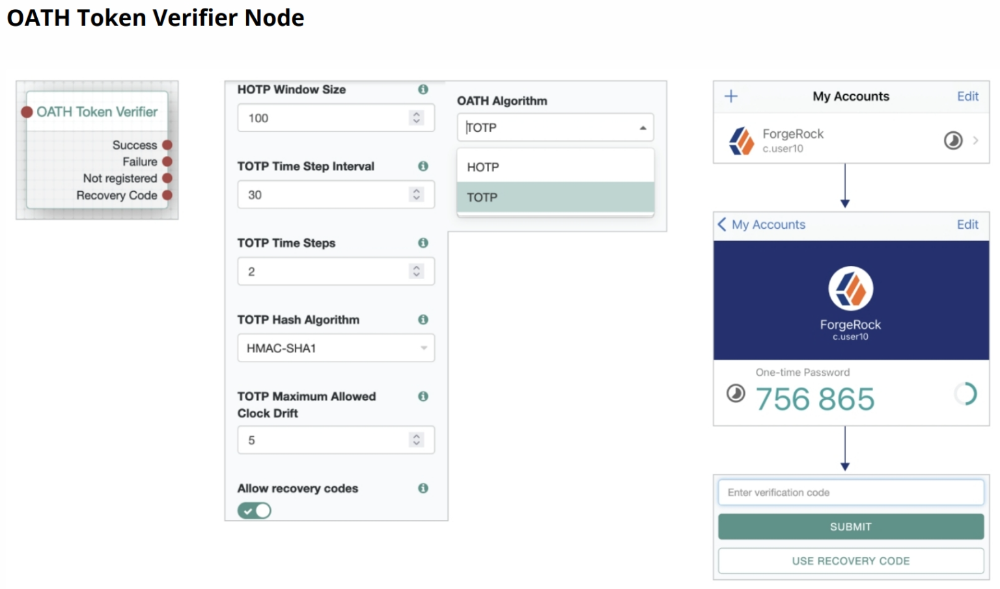

A tree needs to collect the username, before calling the OAuth Token Verifier node. The OAuth Token Verifier node uses the username to find out if a device is registered for the user for OAuth authentication.

If a device is registered, it displays the Enter verification code window. The user opens their ForgeRock Authenticator app, selects their account, enters the OTP code in the Enter verification code field, and selects Submit. The node verifies the code. If it is correct, the tree proceeds to the Success outcome. If the code is incorrect, the tree proceeds to the Failure outcome.

If no device is registered, the Enter verification code window is not displayed and the flow proceeds along the Not registered outcome. The user may also have lost access to the device that generates the OTP code.

**Gotcha:** Recovery codes can only be used once

### Push

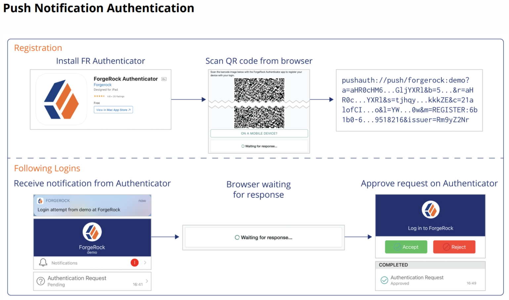

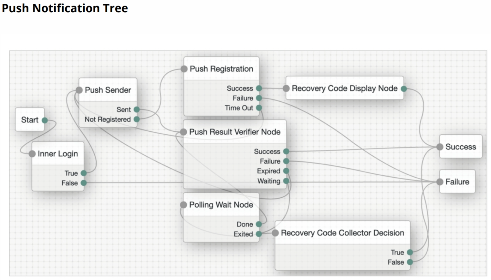

To use push notification authentication, the user must have a device with a camera and install the ForgeRock Authenticator app. Before authentication can take place, the device must be registered. During the following logins, AM instructs the push server to send a notification to the device, and waits for the user to approve the request on their device, using the ForgeRock Authenticator.

* The Push Registration node displays a QR code in the user's browser.
* A tree needs to collect the username, before calling the Push Sender node. The Push Sender node uses the username to find out if a device is registered for the user for push notification.
* The Push Result Verifier Node is usually following the Sent outcome of the Push Sender node in an AM tree.
* After the notification is sent to the user, the system must wait until the user accepts or rejects the request. In the meantime, the Polling Wait Node is called and displays a Waiting for response screen.

### WebAuthN

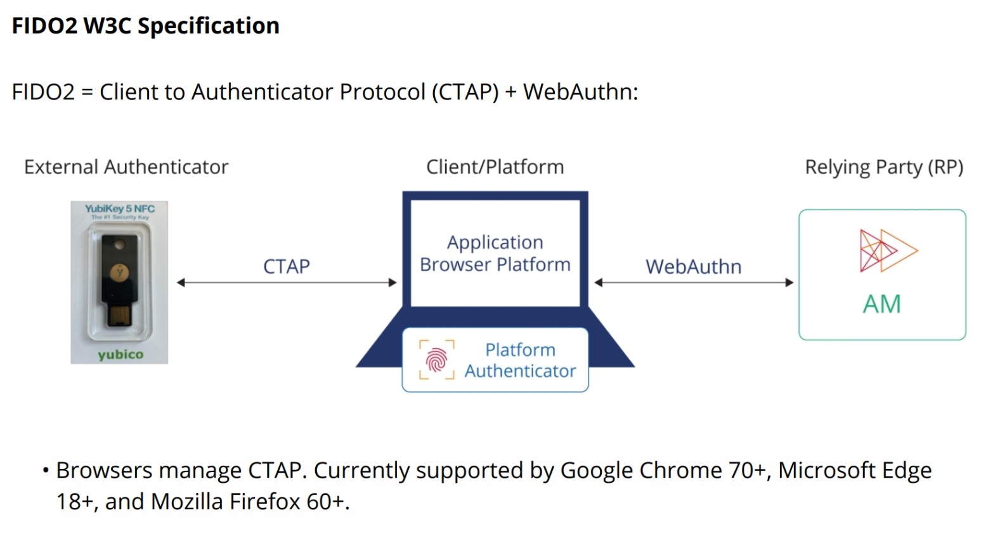

Usernames and passwords are the leading attack vector for breaching accounts. With AM, you can:
* Use FIDO2 WebAuthn registration and login nodes to design seamless, secure usernameless and passwordless trees.
* Eliminate the risks of phishing, all forms of username and password theft, and replay attacks.

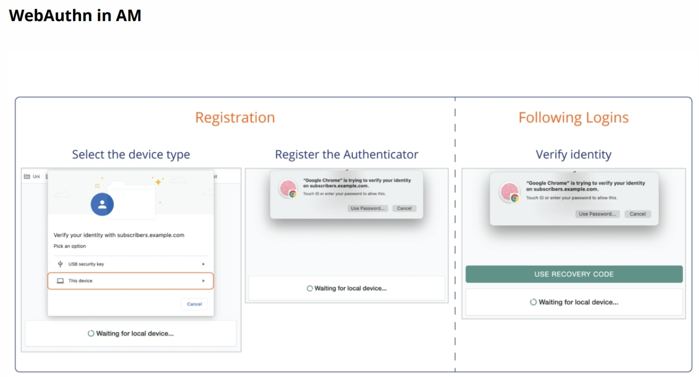

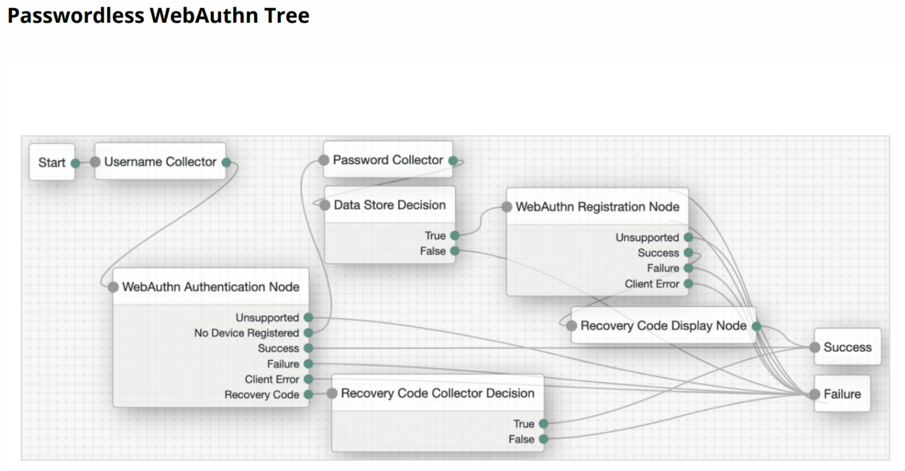

To use WebAuthn, the user must have an external authenticator. Before authentication can take place, the authenticator must be registered.

* The WebAuthn Registration Node displays a choice of authenticator in the user's browser.
* A tree needs to collect the username before calling the WebAuthn Authentication Node. The WebAuthn Authentication Node uses the username to find out if an authenticator is registered for the user for WebAuthn.

If the user is connected using a client which does not support WebAuthn, the flow proceeds along the Unsupported outcome.

### HOPT Via Email Or SMS

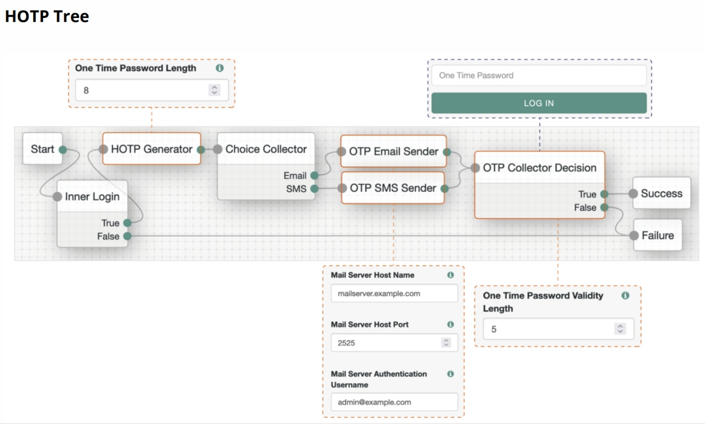

HOTP authentication uses the HMAC algorithm to generate an HOTP code. When the code is generated, it is sent to the user's email or phone number. This implies that the user must be known and have either an email or a phone number in their profile. It also means that a mail server must be configured. You must have access to a device which supports WebAuthn. This can be a Mac with Touch ID, a Windows machine with Face recognition, or a Yubikey.

### Labs

#### MFA

Need to use the ForgeRock Authenticator app.

#### WebAuthN

Create a passwordless tree with WebAuthN. In this context, WebAuthn is no longer a second-factor authentication mechanism, but is the only authentication needed. It offers a great user experience with strong security.

## Lesson 2 - Modifying A User's Authentication Experience Based On Context

### Discovery

The authentication process protecting resources and access to services does not have to be static. It can be adapted depending on the context in which the authentication takes place.

* Discover who you are interacting with.
* Discover the context around the interaction; for example:
  *  Device
  *  Location
  *  Browser used
  *  Potential involvement in bot attacks
  *  Previous login failures
*  Analyze the context: Are they trusted or not?
*  Adjust the behavior according to the analysis.

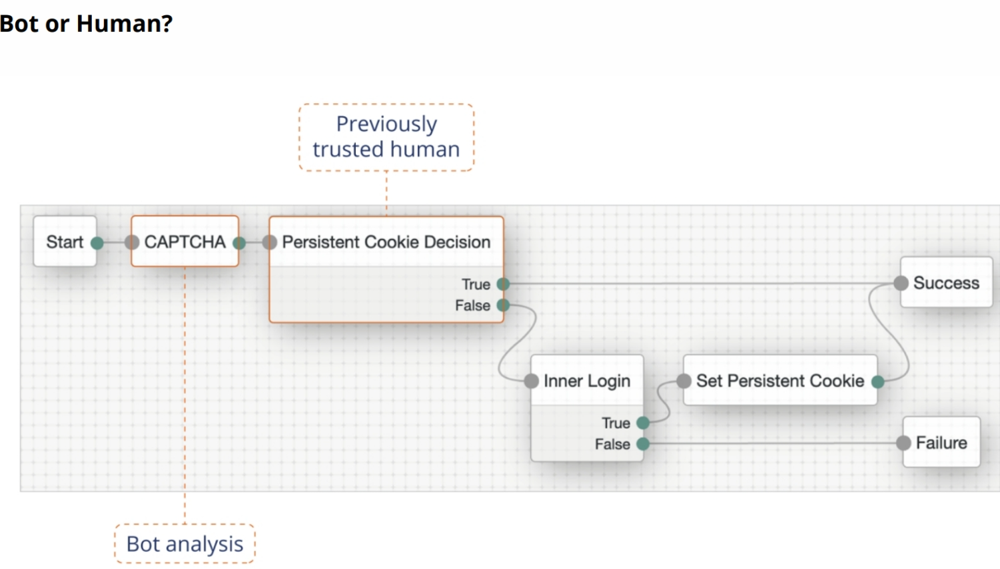

AM provides nodes which can discover some information about context before calling any authentication mechanism. This can be used to detect if a request comes from a bot or a human. If the request comes from a human, it can check the presence of a persistent cookie, which indicates that the user was trusted previously.

* The CAPTCHA node implements Google's reCAPTCHA v2 widget and hCaptcha's hCaptcha v1 widget. This node verifies the response token received from Google or hCaptcha in addition to creating a CAPTCHA callback for the UI to interact with.
* The Persistent Cookie Decision node checks for the existence of the persistent cookie specified in the Persistent cookie name property; the default is `session-jwt`.
* The Set Persistent Cookie node creates a persistent cookie named after the value specified in the Persistent cookie name property; the default is `session-jwt`.

#### User Context

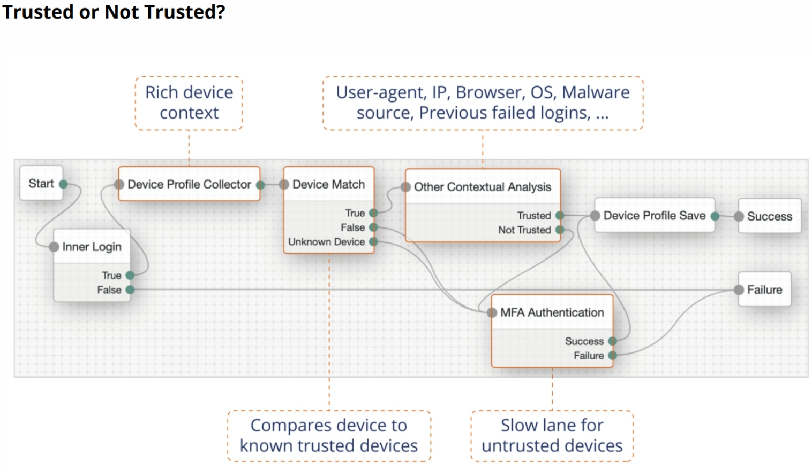

AM also lets you modify a user's experience based on contextual information gathered during authentication.  A request sent from a device that is known to AM, and trusted, can lead to a quicker and simpler authentication process. Similarly, checking if the browser used, or the IP address of the origin changed from one login to the next, may lead to a different authentication experience.

#### Devices

Device profile nodes can collect device data, analyze the device context, or save the collected profile.

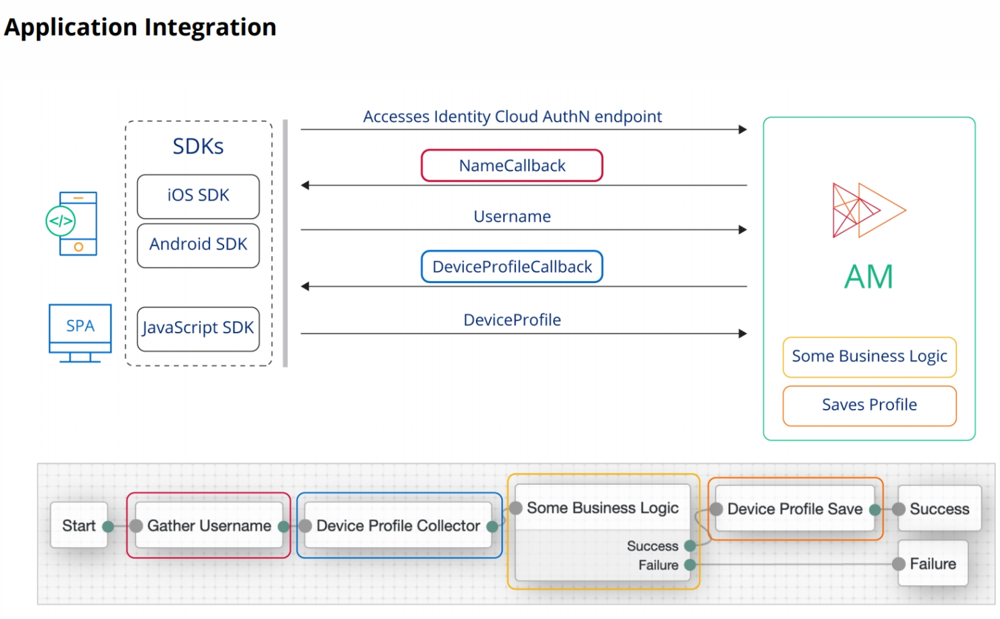

AM communicates with edge clients using a Java object called a callback. It is enough to understand that it is a way for AM to request information from the client.

The graphic above shows how collecting device profile information can help reduce the friction during a user login experience, while preserving or increasing security.

When a user logs in with a new device for the first time, the device is unknown. AM will request strong authentication, often including MFA. If the process is successful, AM saves the device profile as an attribute of the authenticated user's profile.

When the user logs in with the same device again, and the ForgeRock SDKs provide device information to AM, AM can use this information to find out if the device is already registered.

If it is already registered, AM will use a lighter authentication approach.

A device profile is a set of features associated to a device. Examples of information that can be collected:
* Hardware, such as the number of cameras in a mobile device.
* Platform, such as the OS and its version.
* User-agent string based on the system information.
* Current location of the device.

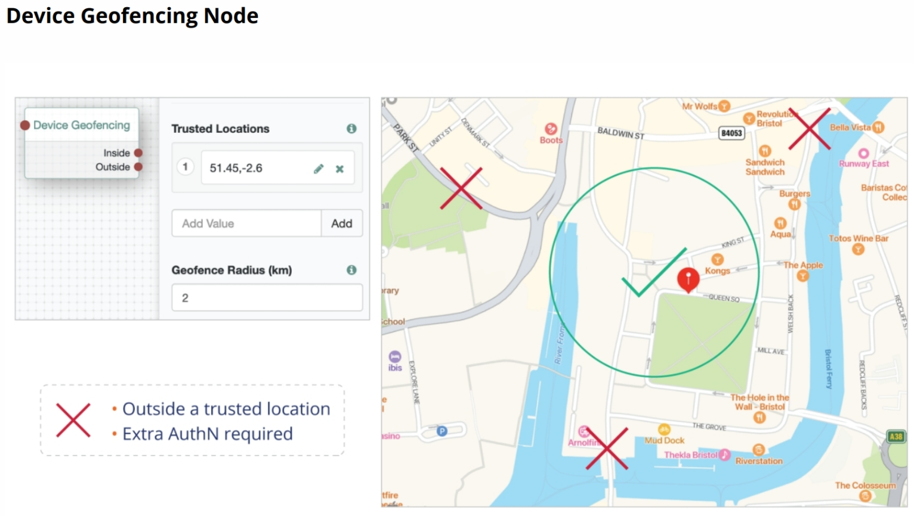

The Device Geofencing node defines trusted areas, based on coordinates and a radius.

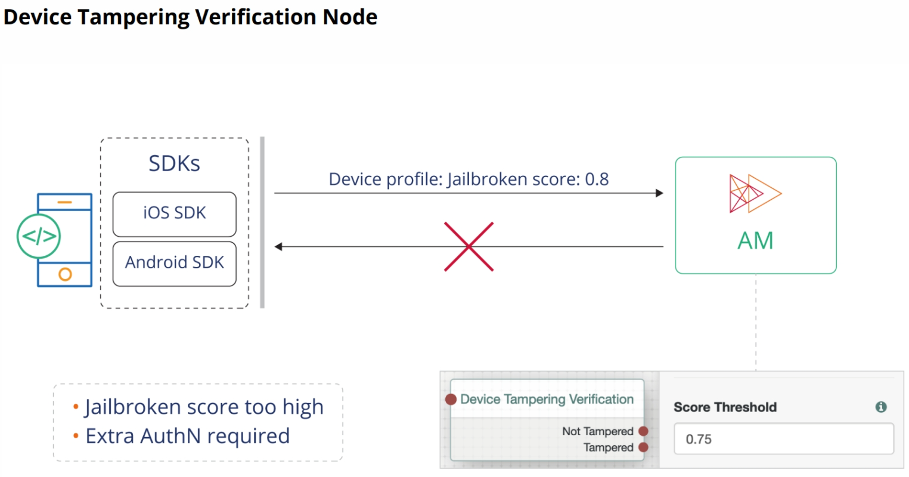

It is important for security reasons to be able to evaluate the risk that a device has been jailbroken or rooted. Android and iOS provide various detection tools to evaluate that risk, from 0 to 1, with 1 a very high probability that the device is jailbroken or rooted.

Although you can never assume that a low score means your device has not been jailbroken or rooted, it makes sense to request strong authentication, or reject access, if the score is very high. So, this approach is typically an extra layer of security for suspicious phones.

The location variance can address the problem of impossible travel. The approach is based on differences in location from one login to another. If a user normally logs in from Paris, but suddenly tries to log in from New York, asking for further authentication is reasonable.

When processing the Device Location Match node, AM retrieves a saved profile for the user and the device, and compares the saved location to the current location.

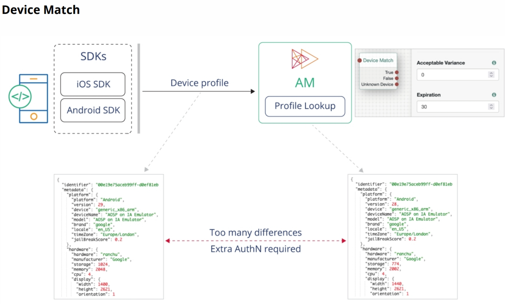

The Device Match node analysis is based on differences between the device profile attributes from one login to another. If a user logged in last from a device with a specific profile, but suddenly tries to log in from the same device, and ten attributes have changed, it makes sense to ask for further authentication.

With the Device Match node, a custom matching script can be used, instead of the built-in matching mechanism.

#### Risk Analysis

To evaluate the risk surrounding an authentication request, designers can use intelligent authentication to:
* Collect context information
* Compare with the expected or desired context
* Calculate the risk
* Decide on an outcome

Some examples of context-related information that can be useful when evaluating the risk of an authentication request:
* Previous failed authentications
* Browser, operating system values
* Compromised account or credentials:
  * Have I been Pwned
  * Vericlouds CredVerify
* IP values:
  * Historical
  * Range
  * Open Threat Intelligence
* Cookie or header values
* Geolocation

There isn't a unique way to implement a solution when using trees. The solution we propose in the slide above is a generic example of what can be done. To illustrate the flexibility of intelligent authentication, the example uses scripts for most of its logic. But AM also provides interesting utility nodes and regularly adds new nodes and functionality to its offerings.

We mentioned the need to store data a few times. Where can AM store data?
* In shared state. Information that does not need to be persisted can be stored in the shared state. Data in the shared state is available to the next nodes in the tree. e.g.:
  * IP address comparison with a fixed range
* With the user profile. If the data needs to be retrieved after authentication and at a later date, it can be stored with the user profile. e.g:
  * Device profile
  * Browser
  * Operating system
* In the session. If the data is needed by an application after authentication, it can be added to the session that will be created if the authentication is successful. e.g:
  * Session upgrade case

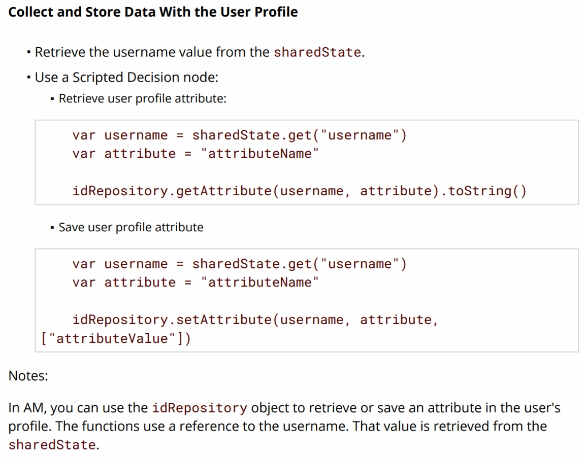

### Lock and unlock accounts

Account lockout is an attempt to mitigate the risk linked to brute force attacks, where the attacker gets hold of a username and keeps trying to log in using various methods. To mitigate such an attack, AM provides a node that keeps track of failed login attempts, allows retries up to a threshold, then rejects retries when the limit is reached. AM also provides a node that can lock or unlock a user account.

The tree above is a very simple example of locking an account. It uses an Inner Login tree to authenticate the user. If the authentication fails, the flow proceeds to the Retry Limit Decision node.

* The Retry Limit Decision node keeps track of each failed login attempt, and lets the user retry to log in up to the defined limit. By default, the Save Retry Limit to User setting is enabled, and the node persists the number of failed attempts with the user's profile.
* In the configuration of the Account Lockout node, you can select LOCK or UNLOCK for the Lock Action setting.

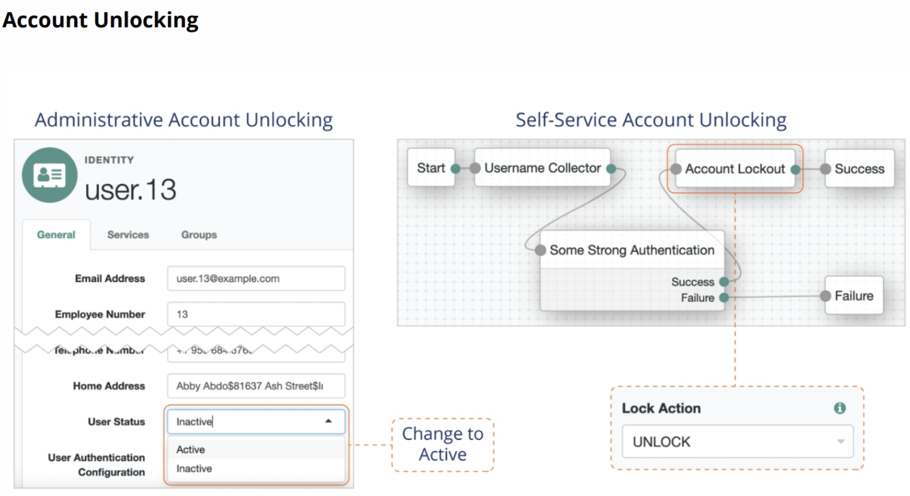

Unlocking an account can be performed either by an administrator or using self-service. Typically, a user would call a customer help desk to unlock their account. After verifying the user's identity, the help desk administrator can change the Status setting from Inactive to Active in the AM Admin UI, or using an Identity Management solution.

## Lesson 3 - Checking Risk Continuously

### Upgrading & Downgraing Session Entitlements

Entitlements define a set of permissions for users. Entitlements can often be extended if the context is modified. e.g. you can access an exhibition for an extra fee in an otherwise free-access museum.

In an access management context, you can extend entitlements by changing the authentication context. e.g. a user provides stronger credentials in order to change the address in their profile.

The frequency at which the risk of an authorization request should be assessed depends on how sensitive the protected resource is.

An authenticated user can access low-risk resources without having to authenticate either once again or to a higher assurance level.

To perform an action that presents some elevated risk or to request access to a sensitive resource, you can use step-up authentication which will ensure an elevated authentication level for the length of the session.

An authenticated user may be required to reauthenticate. Reauthentication would generate a different authentication context. The user can be requested to access the same tree or a different one. This is called **session upgrade**. For a session upgrade to be successful, the user must stay the same. The only way to step down is logging out.

Step-up authentication is a mechanism that requests further authentication when authenticated users want to access a resource which requires a higher level of assurance. Once access is granted, no further check will be needed for the length of the session.

The slide illustrates the step-up authentication flow using FR IG.

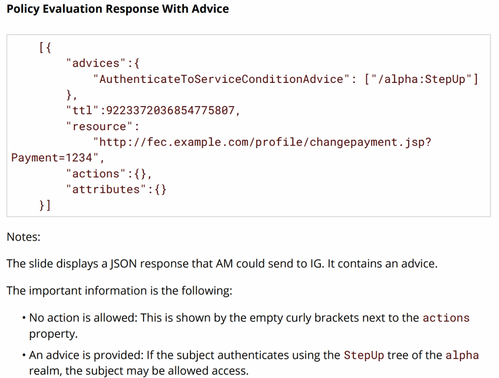

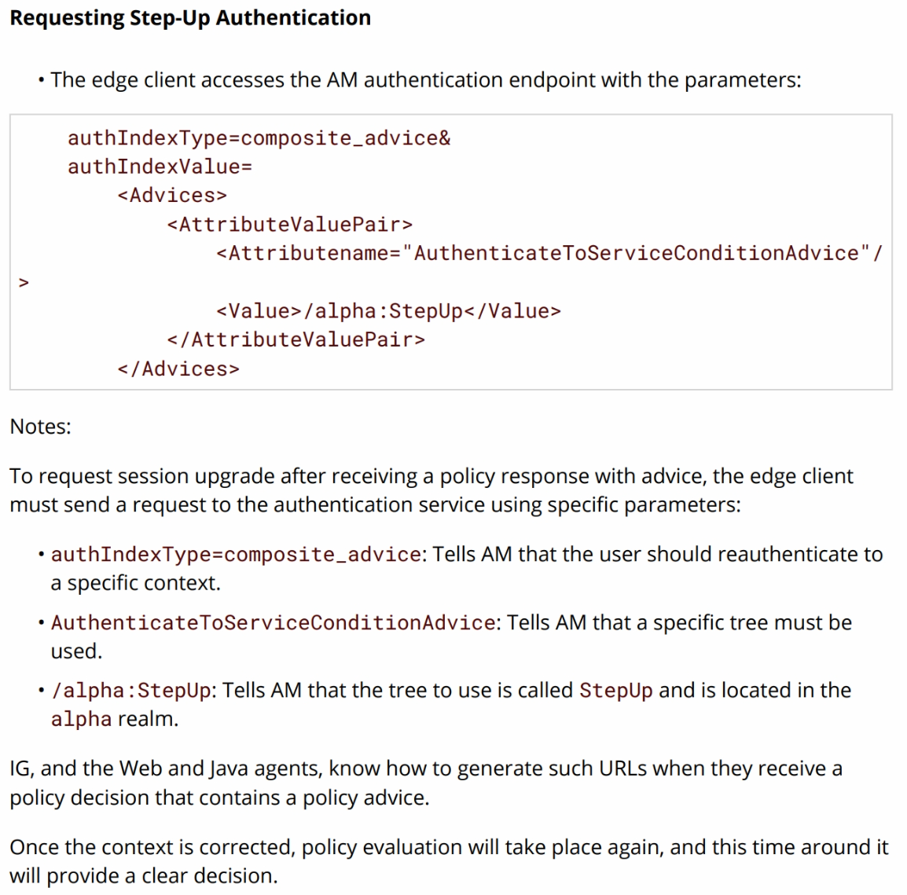

There is no step-down authentication feature. Step-down can be enforced:
* By adding an environment condition based on a time limit on the upgraded session.
* When max session time reached, user is forced to authenticate again to the default context, effectively stepping authentication down.

Consider using transactional authorization instead.

### Transactional Authorisation

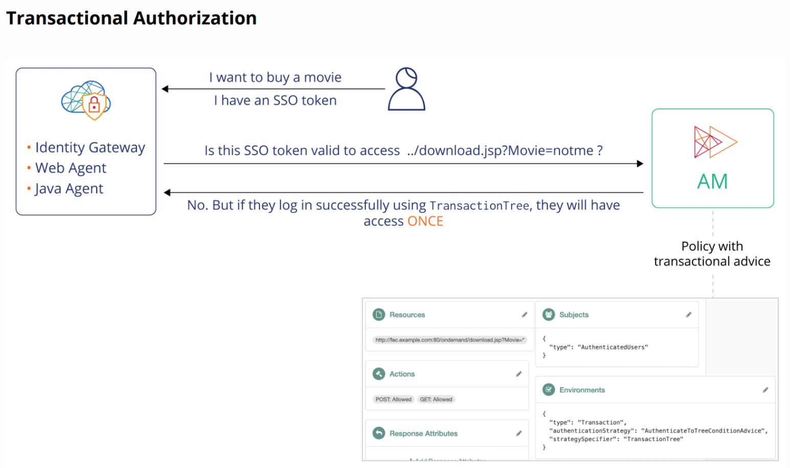

Transactional authorization is the mechanism used to evaluate access to a request continuously. Continuously, in this context, means each time the resource is requested. e.g. each time you make a banking payment above a certain amount.

### Labs

#### Account Locks & Unlocks

The Retry Node in the VMs is broken so it doesn't work. The work around is replace the inner decision tree with a username and password collector and LDAP decision, rather than calling it from the inner node.

#### Step Up

Step up is used in FEC for accessing the premium content.

The Get Session Data node can only be used in the context of a session upgrade; that is, when a user already has a session. It will retrieve attributes from the session and add them to the `sharedState`, making the values available to the rest of the authentication tree.

#### Transactional Authorisation

To browse various pages in the FEC website, users only have to enter their username and password. To change their method of payment, they must go through a second-factor authentication mechanism. If successful, they are able to change their payment method without being challenged for the rest of the session.

There is a last action on the website that is still unavailable to all the users: downloading a movie. In this exercise, you implement the configuration required in AM to force the user to consent to an extra payment each time they want to download a movie.

**Note:** Transactional authorization grants access for only one access.

Options to mitigate the MFA bypass:
* Never promote to production test or sample trees.
* Associate protected resources with the trees that protect them:
  * In AM: Create policy with advice for the resource, as per the two previous exercises.
  * At the application level: Enforce policy evaluation with AM when a user attempts to request access to a resource. This is enforced by IG with the `PolicyEnforcementFilter`, as per previous exercise, and by Web or Java agents when the SSO Only mode is not enabled.
