# AM410 Day 2 - Improving Access Management Security

- [AM410 Day 2 - Improving Access Management Security](#am410-day-2---improving-access-management-security)
  - [Lesson 1 - Integrating Applications With OAuth2](#lesson-1---integrating-applications-with-oauth2)
    - [OAuth2](#oauth2)
      - [Overview](#overview)
      - [Concepts](#concepts)
    - [OAuth2 In AM](#oauth2-in-am)
      - [Authorisation Server](#authorisation-server)
      - [OAuth2 Client](#oauth2-client)
    - [Labs](#labs)
      - [OAuth2](#oauth2-1)
  - [Lesson 2 - Integrating Applications With OIDC](#lesson-2---integrating-applications-with-oidc)
    - [ODIC Overview](#odic-overview)
    - [Labs](#labs-1)
      - [OIDC](#oidc)
  - [Lesson 3 - Authenticating OAuth2 Clients and using mTLS in OAuth2 for PoP](#lesson-3---authenticating-oauth2-clients-and-using-mtls-in-oauth2-for-pop)
    - [Labs](#labs-2)
  - [Lesson 4 - Transforming OAuth2 Tokens](#lesson-4---transforming-oauth2-tokens)
    - [Labs](#labs-3)
  - [Lesson 5 - Implementing Social authentication](#lesson-5---implementing-social-authentication)
    - [Social Access](#social-access)
    - [Labs](#labs-4)

## Lesson 1 - Integrating Applications With OAuth2

### OAuth2

#### Overview

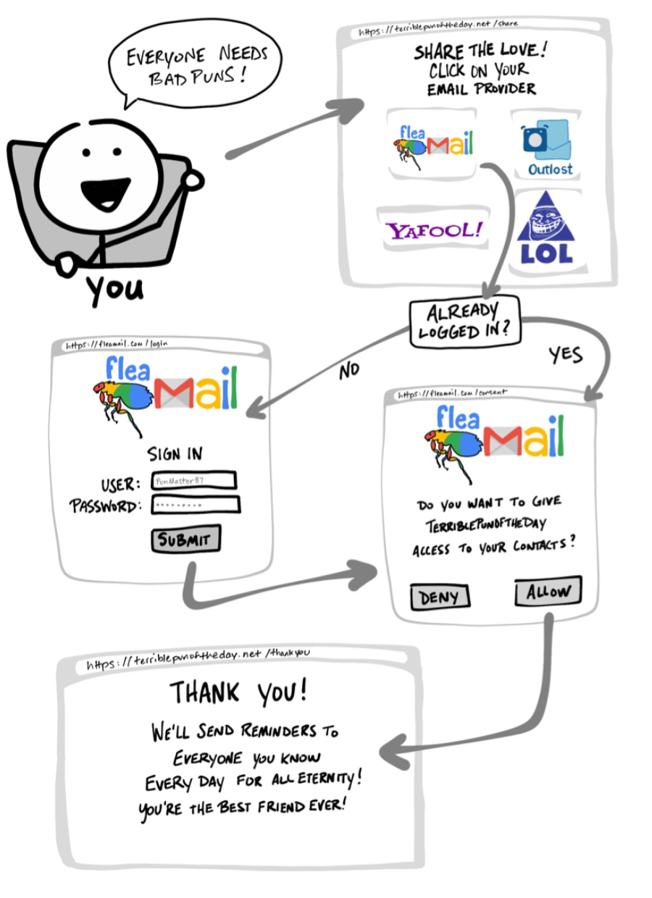

https://developer.okta.com/blog/2019/10/21/illustrated-guide-to-oauth-and-oidc - OAuth 2.0 is a security standard where you give one application permission to access your data in another application. The steps to grant permission, or consent, are often referred to as authorization or even delegated authorization. You authorize one application to access your data, or use features in another application on your behalf, without giving them your password. Sweet!

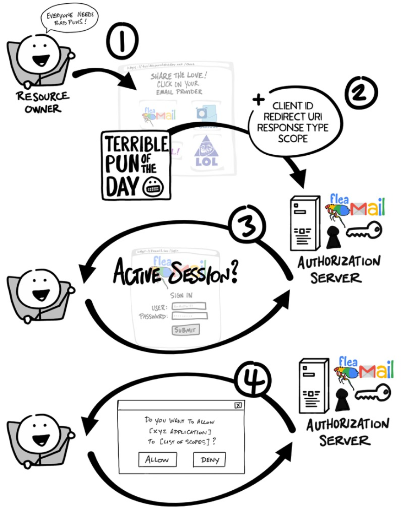

OAuth2 is a framework that defines a flexible agreement for how applications interact. Provides a method for an application to access resources with the resource owner consent, respecting consent withdrawal. With OAuth2, the resource owner credentials do not need to be shared. The result of an OAuth2 handshake is a security token, called an access token. JWTs are commonly used because it is an easy way to encode and pass around JSON data without having to escape it for different contexts.

Some OAuth2 usages are:
* Consumer applications:
  * Mobile applications
  * IoT/low-level devices
* REST API protection
* Authorization in applications without identity data, or use OIDC
* Open Banking solutions

**Note:** OAuth2 is an authorization protocol, not an authentication protocol.

Four main actors take part in OAuth2 processes:
1. Resource owner (or end user): An entity able to grant access to a protected resource.
2. Resource server (an API server): Hosts protected resources; able to accept and respond to requests with access tokens for accessing a protected resource.
3. Client: An application that requests access to protected resources on behalf of the resource owner and with its authorization.
4. Authorization server: Issues access tokens to the client after the resource owner successfully authenticates and provides authorization.

https://www.digitalocean.com/community/tutorials/an-introduction-to-oauth-2

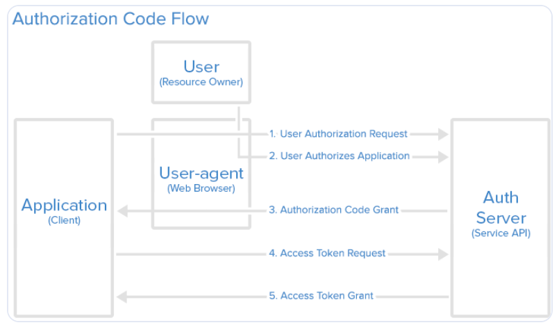

The access token gives access to the bearer of the token to specified resources for a limited period of time. Once the client receives the access token, it can make a request to the resource server

In most use cases, the authorization server and the resource server are controlled by the same organization. The resource server must be able to process (validate) the access token issued by the authorization server.

#### Concepts

* The **Resource Owner (RO)**:
  * Typically wants to access a service related to some resources they own.
  * Must give consent to the application by authenticating with the **Authorization Server (AS)**, and allow consent using a consent form.
* The **Resource Server (RS)**
  * Often runs from the same organization as the AS.
  * Stores resources held by the RO.
  * Allow access or perform actions on the resource. This is usually implemented using a REST API.
  * Must validate the access token with the AS and may also be able to retrieve further information from the AS.
* The **OAuth2 clients (OC)**:
  * Receive a request from the RO.
  * Obtain a mandatory access token.
  * Request resources from the RS API by presenting an access token that must be validated by the RS.
* The AS:
  * Authenticates RO and requests their consent.
  * Validates client configuration at runtime.
  * Issues access tokens, and possibly an authorization code and refresh tokens.
  * Exposes REST API endpoints to validate and retrieve access token information.
* **Access Tokens (AT)**:
  * Are commonly either an opaque token or a JW
  * Are the result of all OAuth2 grant type flows.
  * Are bearer tokens, which means anyone presenting it can obtain access, and it needs to be protected with TLS and **Proof-of-Possession (PoP)**.
  * May include key-value pairs that can be modified by using a script.

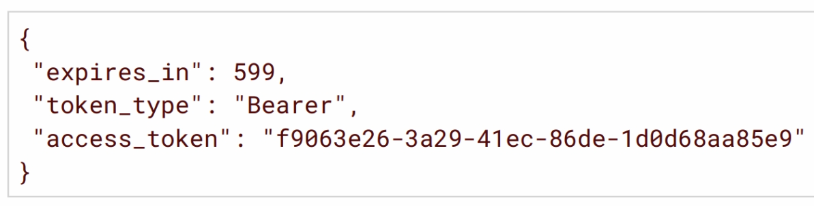

* AT Validation:
  * When clients present the access token to the RS API to obtain a resource, the RS must validate it to AM before returning resources.
  * Validation requires:
    * Verifying the access token's existence.
    * Checking the access token has not expired; they are typically short lived.
* AT PoP
  * Follows Proof-of-Possession Key Semantics for **JSON Web Tokens (JWT)** internet-draft.
  * Associates PoP key with a JWT access token.
  * PoP is not configured by default.
* **Authorization Code (AC):**
  * Are requested in the OAuth2 Authorization Code flow:
    * User logs in to AM and gives consent.
    * Client receives the authorization code.
    * Client exchanges the authorization code for an access token.
  * Are credentials representing the RO's authorization.
  * Provide security benefits: Authenticate to the client and send the access token directly to client, not via the browser.
* **Refresh Tokens (RT):**
  * Are used to obtain a new access token, which are short lived for security reasons.
  * Are opaque, not JWTs, and cannot be decoded and verified.
  * Can be used in one place, the token endpoint of an authorization server.
  * Can be obtained when receiving an access token.
  * Are not allowed nor recommended for all grant type flows.

* **Macaroons**:
  * Are a type of bearer token issued with a broad scope to a client, in place of regular OAuth2 access or refresh tokens.
  * Are designed to share a single token with multiple clients and resource servers without compromising security.
  * Can be created by the client, as needed, from the single macaroon access token.
  * Offer distributed token modification restricting scopes by using caveats.
  * Are useful in microservices: A single client delegates tasks to services with restrictions.

Using an OAuth2 Access Token Modification Script, you can modify the key-value pairs contained within an OAuth2 access token. Token modification scripts work for client-based and CTS-based access tokens. Modification works when macaroons are used in place of regular tokens.

* Obtaining Authorization and Access Tokens:
  * OAuth2 grant types are interaction flows designed for different clients to acquire access tokens.
    * There are a lot of OAuth2 grant types.
    * Each grant type was developed with specific use cases in mind.
  * All grant type flow communication must be performed through a secure channel.

Authorization Code grant type is a two-step interactive process used when the client, running on a server, requires access to protected resources.

The Authorization Code grant type flow is intended for server-side web applications that can keep the client secret secure, and can be used when a web browser is available to redirect the end user to the authorization server.

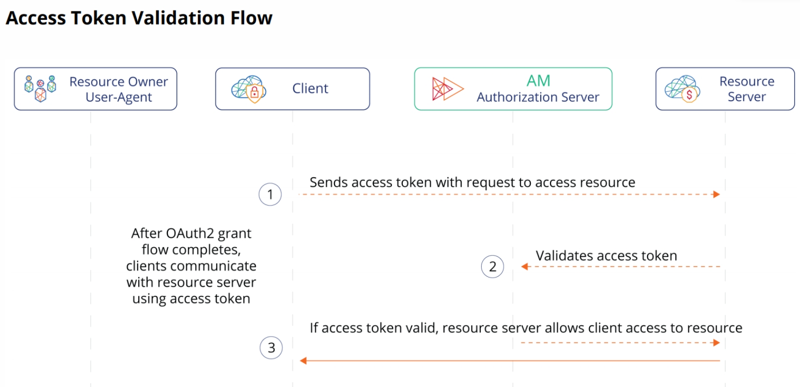

After the access token is acquired as the result of the end of the Authorization Code grant type flow, or any grant type flow, it is best practice that the access token is validated before access to the resource is given. If the RO refuses to grant permission, the OAuth2 process stops.

In this case, the access token is retrieved by the client through communicating directly with AM. Because the client must authenticate to request and obtain an access token, extra security is offered only if the client can securely store the client secret.

The Authorization Code and Device Code grant types, when combined with the **Proof Key Code Exchange (PKCE)** standard RFC7636: Proof Key for Code Exchange by OAuth Public Clients, are used when the client, usually a mobile or a JavaScript application, requires access to protected resources. The client must generate a code that must be part of the communication between the client and the authorization provider. This code mitigates against interception attacks performed by malicious users.

**Note:** The example would actually use OIDC and not just OAuth2. OIDC is discussed in the next lesson.

It is best practice that the client sends that access token to the resource server when requesting access to a resource. The resource server should always validate the access token with the authorization server.

Client Credentials grant type is a suitable choice when:
* The protected resources are controlled by the client or public.
* The resources are public.
* The flow does not involve an end user.

The graphic shows a real-life use case example where the client credentials grant could be used in a machine-to-machine (M2M) interaction. It includes:
* The client as the survey application.
* The resource server as the survey service that provides a REST API to view survey data.
* The OAuth2 authorization server, which is hosted by the organization that provides the survey resource server.

Device Code grant type flow is intended for devices with a limited user interface and no web browser.

**Note:** AM does not display the confirmation nor the consent pages if the user has a valid session when entering the code, and the client is allowed to skip consent.

Device Code with PKCE example.

Implicit grant type:
* Has been deprecated because it is hard to secure; use Authorization Code with PKCE instead.
* Used inside a web browser as a simple all-in-one request.

Resource Owner Password Credentials grant type:
* Is a last resort for legacy applications; not for new applications.
* Is used for single request; no need to store the credentials

Recommended OAuth2 Guidelines:
* Always use secure communications (e.g. TLS) between OAuth2 components (players).
* The resource server should validate every access token it receives.
* Confirm the access token grants the authorizations (scopes) that match the action requested.
* Choose the appropriate grant type flow for the application.

OAuth2 grant type flows require scopes to limit the client's access to resources. Scopes are:
* A method to restrict client access to the RO's resources.
* Not associated with data.
* Concepts specified as strings, that the resource server interprets, to provide access or resources to the client.
* Dependent on the architecture of your environment.

A client can request one or more scopes, which AM may display in the consent screen. If the RO agrees to share access to their resources, scopes are included in the access token.

OAuth2 Scopes:
* Help the resource server to determine if a resource should be returned.
* Are specific to the application and resource server requirements.

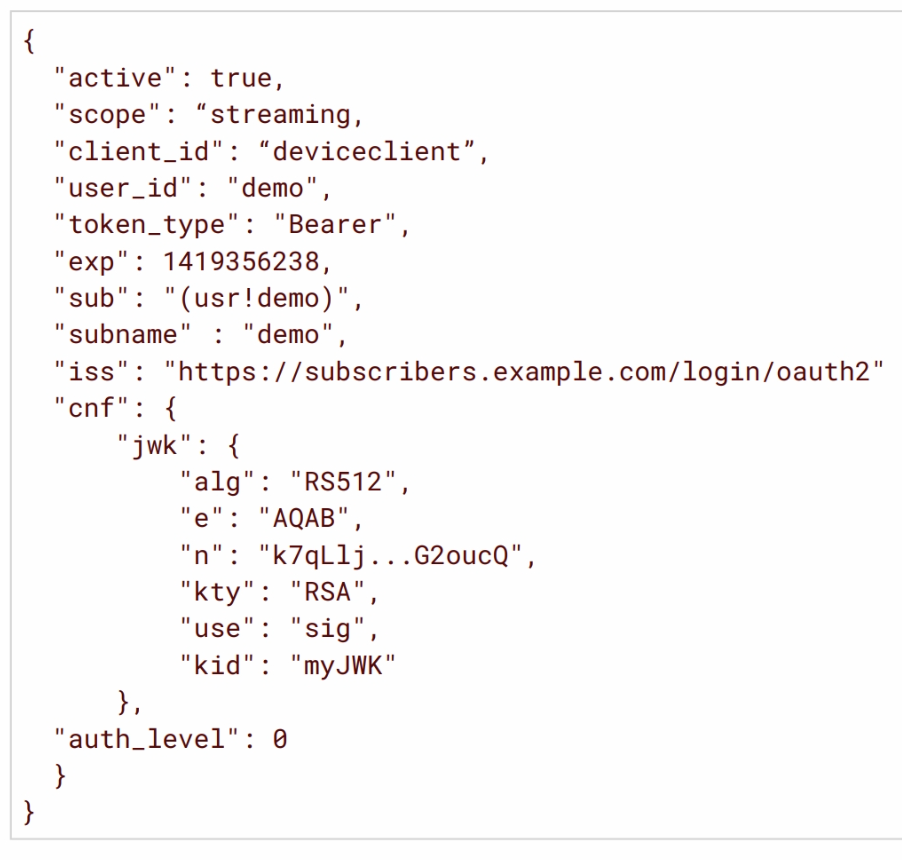

Scopes can be granted statically or dynamically. When AM receives a request for an access token, it decides which scope to grant. AM decides which scope to grant statically or dynamically when:
* The RO authenticates successfully.
* The client is registered with scopes. For example, scope A and B; and there is a request for scope A and B.

AM grants the scopes:
* Statically: The RO is redirected to a client registered with requested scopes; then scope A and B is granted for each user.
* Dynamically: The RO is redirected to a client with a list of scopes and authorization policies evaluated; then each user may get different scopes based on policy conditions.

Many OAuth2 and OIDC flows require the user to explicitly consent (agree) to provide the client with access to their resources. One of the pillars of OAuth2 and OIDC is the act of trust by giving consent. OAuth2 Consent:
* Is required by many OAuth2 and OIDC flows to access a resource.
* Is an act of trust and one of the pillars of OAuth2 and OIDC.
* Is granted by users based on scopes, which can limit information shared with, and actions performed by the client.
* Can be stored to minimise user interaction.
* Can be revoked by users at any time.
* Can be skipped when no user interaction is needed for trusted applications or services.

### OAuth2 In AM

OAuth2 client functionality is implemented through the use of AM authentication nodes in a tree. Therefore, you do not need to deploy your own resource server implementation when AM is an OAuth2 client. In this case, you use web or Java agents or IG to protect resources.

AM can be configured to take the role of:
* An authorization server (or authentication provider)
  * To authenticate ROs and obtain authorization before returning an access token to a client.
  * By registering confidential or public clients statically or dynamically.
* An OAuth2 client
  * To provide a session after successfully authenticating the RO and obtaining authorization.
  * To access resources protected by agents.
  * By using OAuth2/OIDC nodes in authentication trees.

#### Authorisation Server

1. In the AM Admin UI, select the desired realm.
2. On the realm page, select Service, then select Add a Service.
3. From the drop-down menu, select the OAuth2 Provider service, then select Create.
   1. If the OAuth2 Provider service is already configured in the realm, select OAuth2 Provider to edit the configuration.

For clients to communicate with AM, configured as an OAuth2 Provider authorization server, they must be registered with AM. Registering the client configures AM to become aware of them, and provides the means for clients to both connect (authenticate) and communicate with AM to obtain an access token.

#### OAuth2 Client

2 types of client types:
1. Public:
   1. Can't be trusted to keep a secret. e.g. Native applications and Single Page Applications (SPAs).
   2. Not required to authenticate.
2. Confidential:
   1. Can be trusted to keep a secret. e.g. Web applications and services.
   2. Required to authenticate. Can use mTLS.

3 types of client profiles:
1. Native/SPA, Native apps are developed for specific platforms or devices. e.g. Mobile apps.
2. Web apps, are clients that run on a web server. End users (ROs) access web apps using a web browser. The web app makes API calls using a server-side programming language.
3. Service Machine to Machine (M2M) or service apps interact with an API, without user involvement. The M2M app acts on behalf of itself, and not a user, and can ask for an access token directly without involving a user at all.

The client type registered can determine the grant type flow used for communication with AM.

Changing the client profile configuration depends on your working knowledge of the OAuth2: the grant types and components.

There are a variety of OAuth2 endpoints. e.g. `/oauth2/authorize` and `/oauth2/access_token` which provide OAuth2 related data.

AM OAuth2 services are stateless unless otherwise indicated; they do not hold any token information locally. Instead, the OAuth2 service either stores the OAuth2/OIDC tokens in:
* CTS token store
* Clientside

Macaroons are layered on top of existing CTS-based and client-based OAuth2 tokens. When macaroons are enabled, AM issues:
* CTS-based macaroon tokens, where:
  * The access token is stored in the CTS.
  * The macaroons are issued to clients as tokens, and the macaroon ID is a reference to the access token in the CTS.
* Client-based macaroon tokens, such that:
  * The access token is a signed and/or encrypted JWT wrapped in a macaroon.
  * The resulting token size may impact deployment, is limited by browser token size, and may impact network performance.

### Labs

**Note:** You can download an FR API collection for Postman and it will install common FR API end points.

#### OAuth2

Before OAuth2 client applications can communicate with AM as an authorization server, AM must be configured with an OAuth2 Provider service, which is also an OIDC Provider.

* Subscribers of the ForgeRock Entertainment Company (FEC) website may use a Smart TV (the OAuth2 client) to stream content. To be able to stream content, the Smart TV needs to obtain an access token for a specific subscriber.
* The Smart TV is an OAuth2 device-type client that can use the Device Code OAuth2 grant type flow to obtain the access token needed. After the Smart TV gets the access token, it presents the access token to the FEC application (the resource server), and requests to access a specific resource (a movie to stream).
* To decide whether access to the resource should be allowed or not, the FEC application validates the access token and checks if it contains the `streaming` scope.
* Only the scopes defined for, and requested by a specific client, can be added to the access token.
* You register an OAuth2 client profile, in AM, for the Smart TV OAuth2 client to communicate with AM as an OAuth2 Provider (authorization server) by using the Device Code grant type flow and the `streaming` scope.

An OAuth2 client can only request an access token from AM, provided that the client is registered and can successfully authenticate itself with AM.

Depending on the type of OAuth2 client, you create a client profile configured with the client credentials and scopes that it can request

Emulate the SmartTV being authorized to stream movies by using:
* Postman REST API requests to initiate and test the Device Code grant type flow.
* A web browser to enter the unique user code and authorize the SmartTV for the streaming scope.

## Lesson 2 - Integrating Applications With OIDC

### ODIC Overview

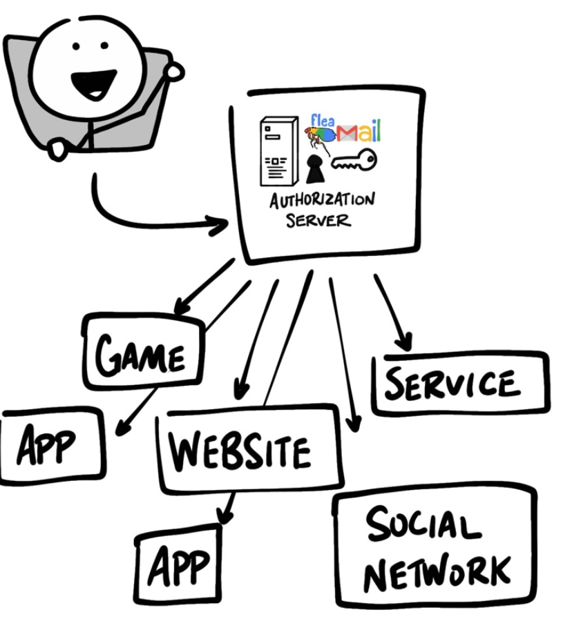

https://developer.okta.com/blog/2019/10/21/illustrated-guide-to-oauth-and-oidc - OAuth 2.0 is designed only for authorization, for granting access to data and features from one application to another. OpenID Connect (OIDC) is a thin layer that sits on top of OAuth 2.0 that adds login and profile information about the person who is logged in. Establishing a login session is often referred to as authentication, and information about the person logged in (i.e. the Resource Owner) is called identity. When an Authorization Server supports OIDC, it is sometimes called an identity provider, since it provides information about the Resource Owner back to the Client.

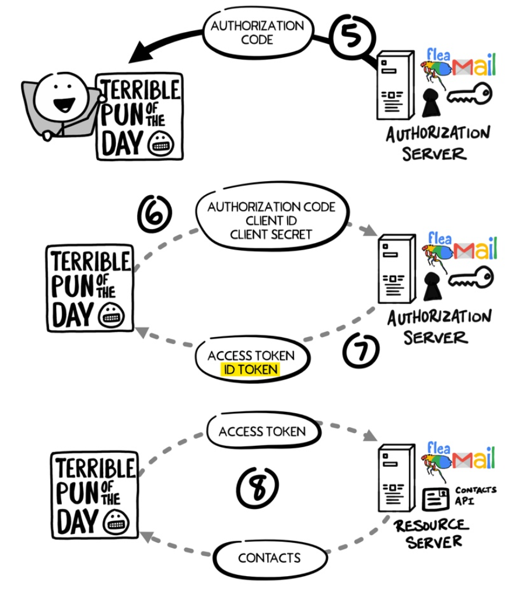

**OpenID Connect (OIDC)** is an identity layer built on top of the OAuth 2.0 framework. It allows third-party applications to verify the identity of the end-user and to obtain basic user profile information. OIDC uses **JSON web tokens (JWTs)**, which you can obtain using flows conforming to the OAuth 2.0 specifications.

While OAuth 2.0 is about resource access and sharing, OIDC is about user authentication. Its purpose is to give you one login for multiple sites. Each time you need to log in to a website using OIDC, you are redirected to your OpenID site where you log in, and then taken back to the website.

JWTs contain claims, which are statements (such as name or email address) about an entity (typically, the user) and additional metadata.

Full-featured applications must be available both on the backend and on the front end; for example, on native applications, in order to support personalization.

Personalization is key, and because personal data is usually kept with the server, a technology needs to be used to ensure the identity of the app user. After the user identity has been ensured, the relevant user personal data can be retrieved from the server and made available to the application.

The ID token is a JWT that is:
* The primary extension that OIDC makes to OAuth2 to enable end users to be authenticated.
* A security token that contains claims about the authentication of an end user, and potentially other requested claims.
* Signed, encoded, and optionally encrypted.
* Asserts the identity of the end user so that it can be used for authentication.

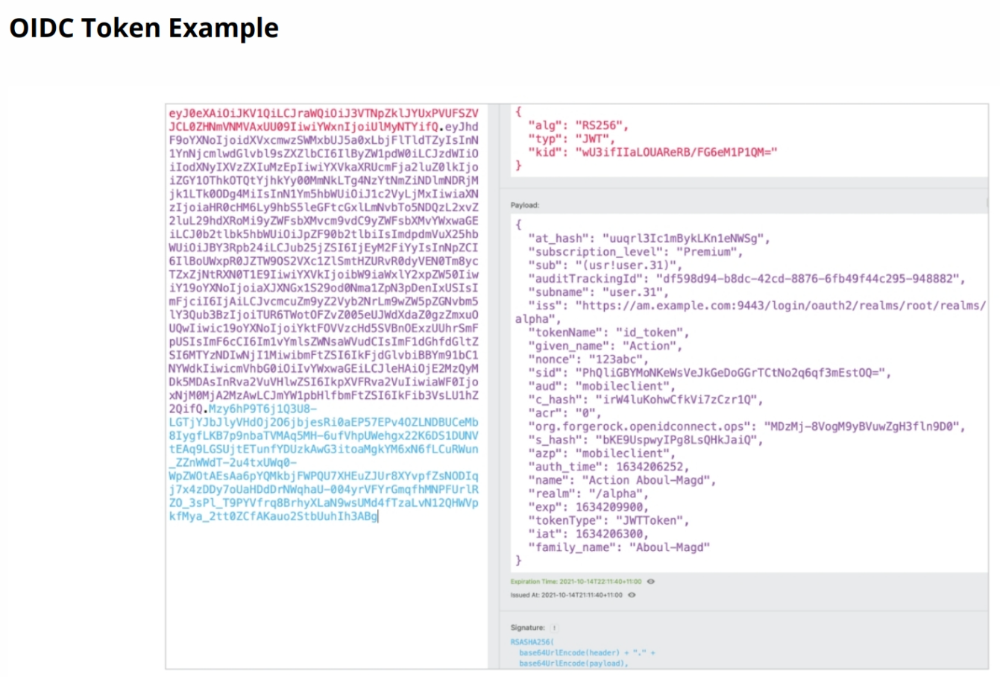

The ID token contains three parts separated by a period (.) character:
1. The first part is a base 64-encoded representation of the algorithm used to encode the signature.
2. The second part is a base 64-encoded representation of the token content itself. It holds information such as the issuer (iss), the user id (sub), the audience (aud), the expiry (exp), and the nonce value.
3. The third part is the signature, which is signed the authorization server.

The client must validate the signature to ensure that the expected authorization server emitted the token.

OIDC can provide information about the user through the use of scopes and claims.
* A claim corresponds to a user profile attribute.
* A scope is a set of claims of the same nature.

The scope is mapped to its claims, and the claims are mapped to their individual user attributes from the user profile. The scope and claim mappings are defined in an OIDC script.

AM currently supports 5 OIDC grant types.

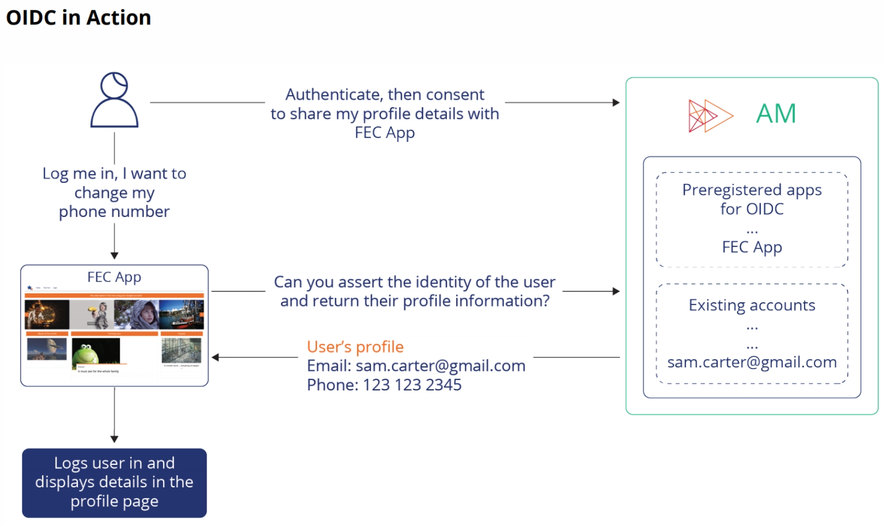

At the start, the end user wants to modify a profile setting, such as a phone number in an application. The application needs the identity of the user to be asserted by the OIDC provider before they allow the user to sign in and change their profile settings.

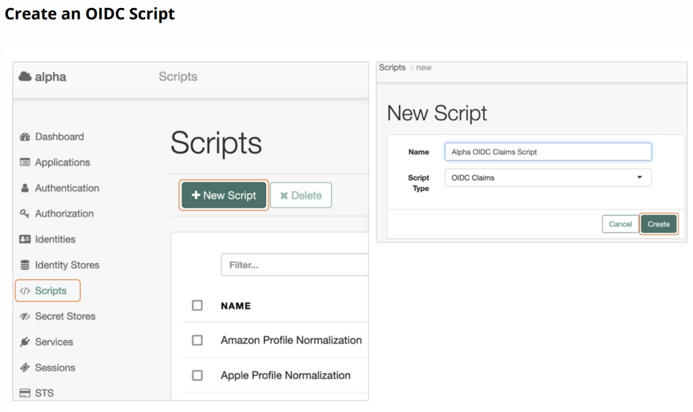

AM provides an OIDC claims script, called `OIDC Claims Script`, that includes the profile scope and related claims in the ID token. This is written in Groovy and you can write them in JavaScript also.

### Labs

#### OIDC

## Lesson 3 - Authenticating OAuth2 Clients and using mTLS in OAuth2 for PoP

###

### Labs

## Lesson 4 - Transforming OAuth2 Tokens

###

### Labs

## Lesson 5 - Implementing Social authentication

Optional.

### Social Access

In many contexts, it makes sense to simplify the user flow to improve the user's experience.

Website registration and login issues:
* Time consuming
* Forgotten login information
* Multiple accounts, e.g. password management and password reuse.

Social registration and login unifies and simplifies the process:
* Fewer accounts for users to manage
* Data sharing and authorization control with OAuth2
* Make both social and traditional login available.

Some users are reluctant to use social login as it comes with its own risks: lack of trust in the social media, what if the social account itself is compromised, and similar concerns. For that reason, most organization propose both social and traditional login to their users.

Social access has two components:
1. Social registration - basic social registration is available for AM, it belongs to the identity management sphere, and the Identity Platform, which integrates ForgeRock Identity Management (IDM), should be used for more complex solutions.
2. Social authentication - is an IAM task. It is implemented in AM by adding the social identity provider service to the realm, and defining the supported social identity providers

Using a third-party OIDC provider means that AM is now filling the role of the client or relying party in an OAuth2/OIDC flow. AM provides a set of social identity provider nodes that effectively transform AM into an OAuth2/OIDC client.

The flow then becomes fairly simple; the social identity provider nodes are included in a tree that is called when the user tries to log in.

To implement social registration and authentication in AM, you must add the social identity provider service to the realm and ensure it is enabled. You can then add all the social providers supported by your company.

If you support a social identity provider that is not part of the predefined list, find out if the flow used by the social identity provider is OAuth2 or OIDC and use the corresponding generic choice in the drop-down menu.

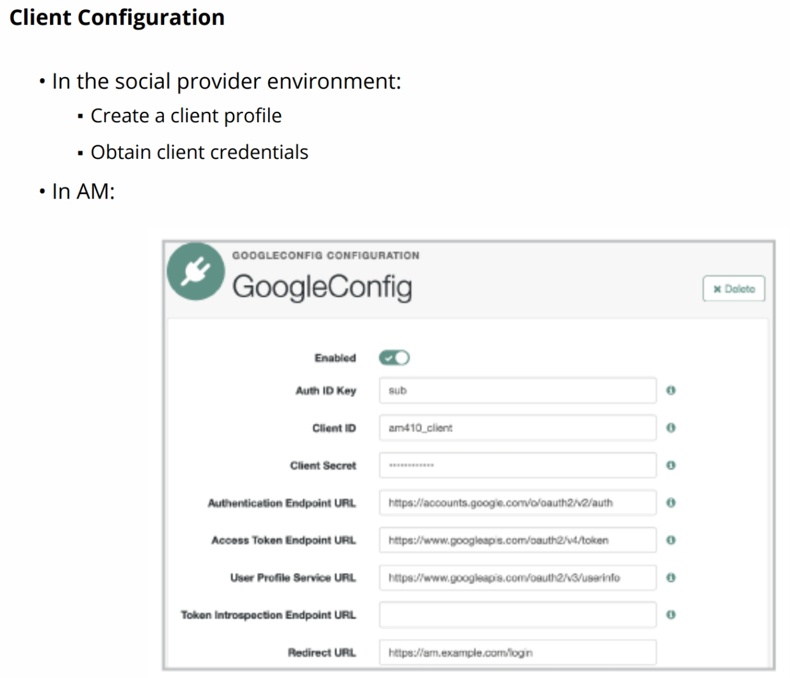

To make a social identity provider available to your solution, you must first access the provider site and register a client representing your application. Check the social identity provider documentation to find out how to do that. At the end of the process you should have obtained client credentials, and defined the various elements for the OAuth2/OIDC flow to be successful.

To delegate social registration and social authentication to a social identity provider, the authentication tree can be modified to include a Select Identity Provider node, a Social Provider Handler Node, and a Provision Dynamic Account node.

### Labs