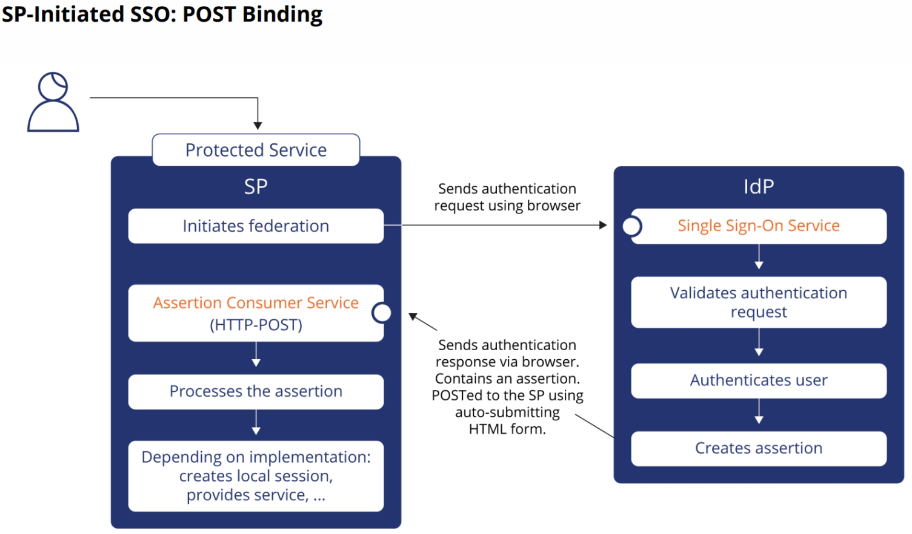
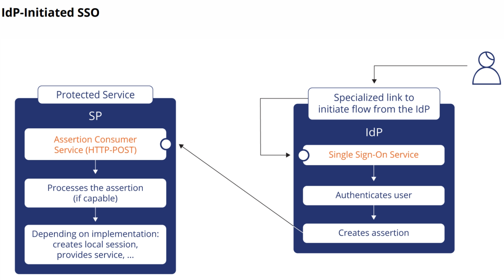
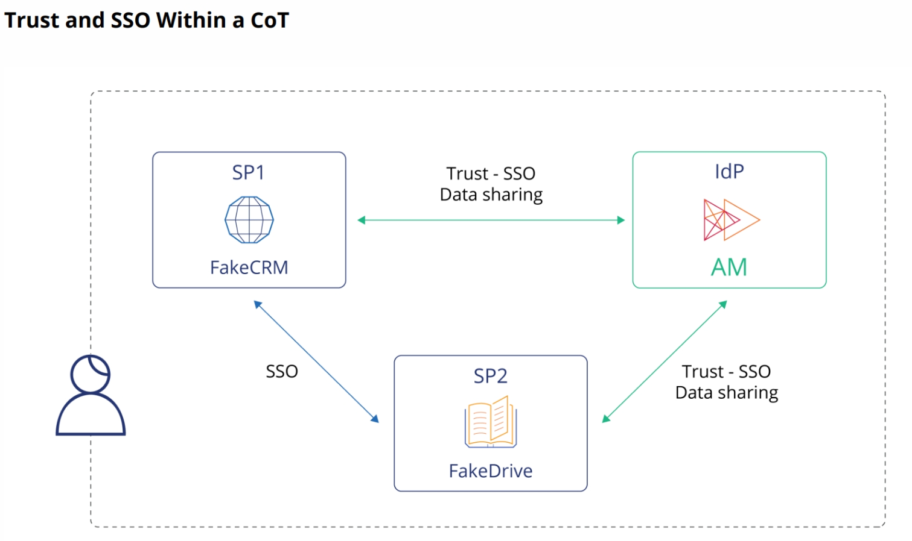
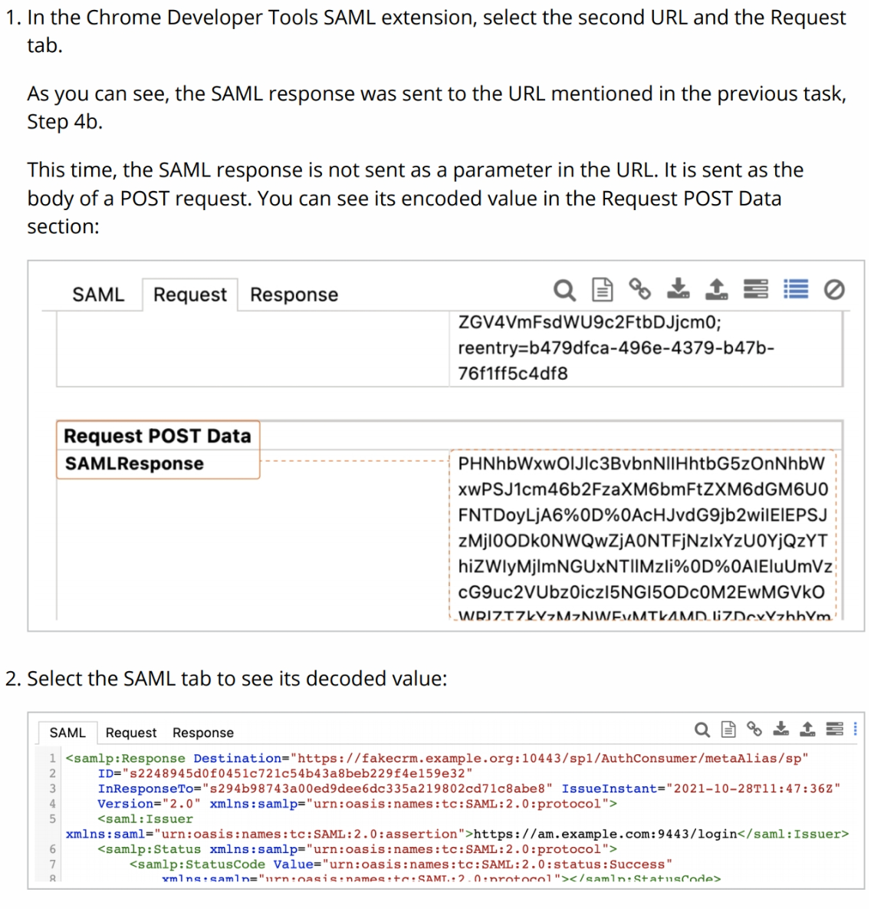
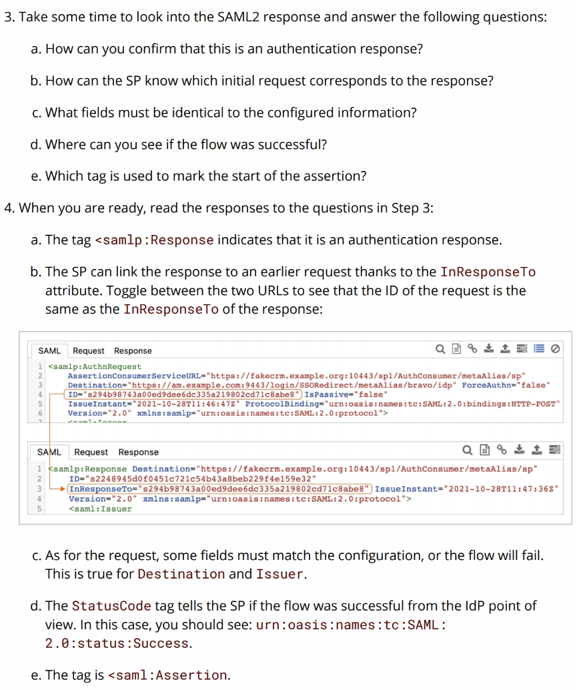
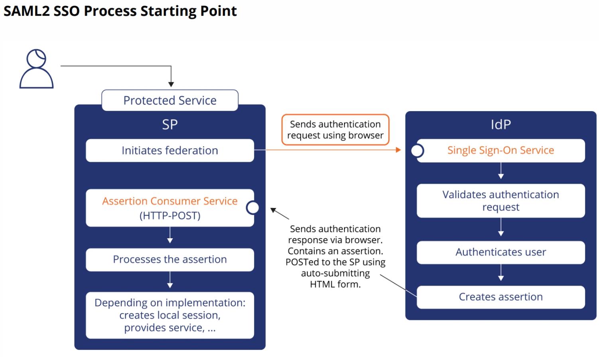
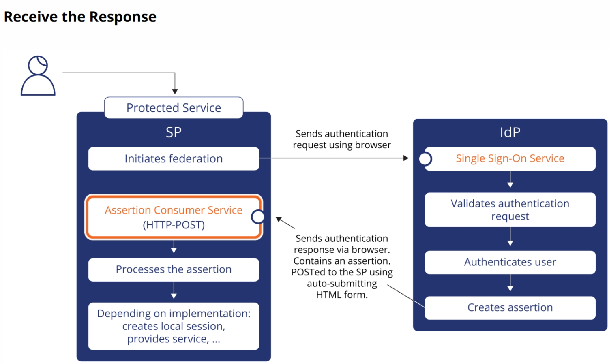
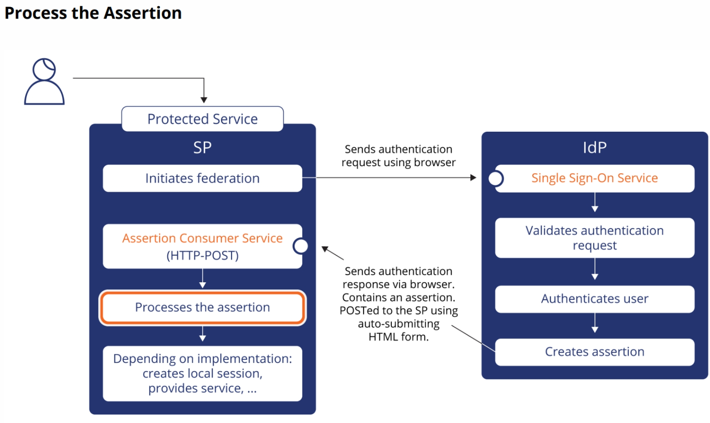
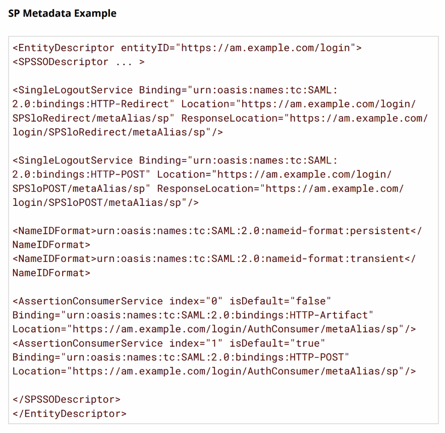
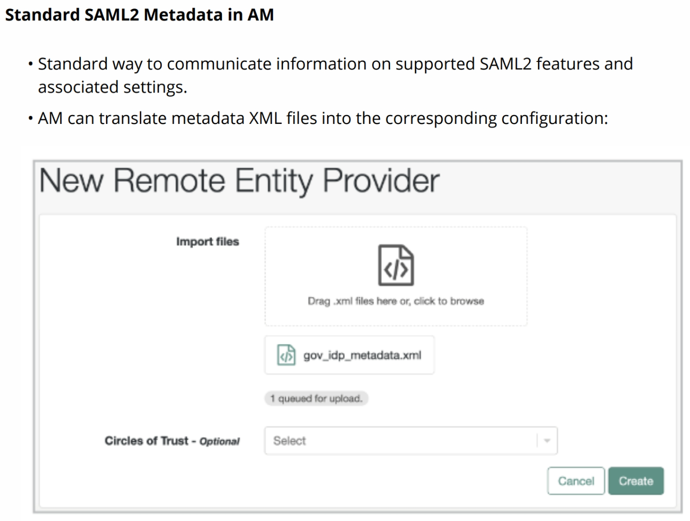

# AM410 Day 4 - Federating Across Entities Using SAML2

- [AM410 Day 4 - Federating Across Entities Using SAML2](#am410-day-4---federating-across-entities-using-saml2)
  - [Lesson 1 - Implementing SSO Using SAML2](#lesson-1---implementing-sso-using-saml2)
    - [Okta & Duo SAML Explanation](#okta--duo-saml-explanation)
    - [SAML In AM](#saml-in-am)
    - [Labs](#labs)
      - [Set Up Federation](#set-up-federation)
      - [Federation](#federation)
  - [Lesson 2 - Delegating Authentication Using SAML2](#lesson-2---delegating-authentication-using-saml2)
    - [AM As A SAML2 SP](#am-as-a-saml2-sp)
    - [SAML2 Metadata](#saml2-metadata)
    - [Labs](#labs-1)

## Lesson 1 - Implementing SSO Using SAML2

### Okta & Duo SAML Explanation

https://support.okta.com/help/s/article/Beginners-Guide-to-SAML?language=en_US

https://duo.com/blog/the-beer-drinkers-guide-to-saml

**SAML (Security Assertion Markup Language)** is an XML-based standard for exchanging authentication and authorization data between an identity provider (IdP) such as Okta, and a service provider (SP) such as Box, Salesforce, G Suite, Workday, etc, allowing for a **Single Sign-On (SSO)** experience.
* **Identity Provider (IdP)** is the software tool or service that performs the authentication; checking usernames and passwords, verifying account status, invoking two-factor, etc. This is often visualized by a login page and/or dashboard.
* **Service Provider (SP)** is the web application where user is trying to gain access.
* **SAML Assertion** is a message asserting a user’s identity and often other attributes, sent over HTTP via browser redirects.
* **Federating identities** is a common practice where user identities are stored across disparate applications and organizations. SAML allows these federated apps and organizations to communicate and trust one another’s users.

SAML provides a way to authenticate users to SP provided third-party web apps (e.g. Gmail for Business, Office 365, etc.) by redirecting the user’s browser to a company login page. Then after successful authentication on that login page, redirecting the user’s browser back to that third-party web app where they are granted access. **The key to SAML is browser redirects!**

SAML is the common underlying protocol that makes web-based SSO possible. A company maintains a single login page, single or multiple identity stores, and various authentication rules. Then they can easily configure any web app that supports SAML to allow their users to log in all web apps from the same login screen with a single password. It also has the security benefit of neither forcing users to maintain and potentially reuse passwords for every web app they need access to, nor exposing passwords to those web apps.


1. Bob walks to the Wristband Tent, where his ID is checked and a wristband is provided.
   1. The Wristband Tent is the IdP, it verifies Bob's identity to make sure he meets the criteria to get a wristband.
2. Bob walks over the Beer Tent and uses his wirstband to get a beer.
   1. The Beer Teen is the SP, it provides the service that Bob wants.

There are two different sign-in flows for which authentication can be handled by SAML:
1. SP-initiated flow.
2. IdP-initiated flow.


SP-initiated flow occurs when the user first navigates to the SP, getting redirected to the IdP with a SAML request, and then redirected back to the SP with a SAML assertion.


IdP-initiated flow occurs when the user first navigates to the IdP (typically a login page or dashboard), and then going to the SP with a SAML assertion.


**Note:** **SAML Tracer**, a free add-on available for Firefox, is an extremely useful tool in helping understand and troubleshoot SAML assertions. It allows you to extrapolate SAML assertions from your browsing session and examine them line-by-line.

### SAML In AM

* Standard for exchanging data between organizations and across security domains.
* XML-based protocol.
* Uses assertions to pass information:
  * About a principal (usually an end user)
  * From an Identity Provider (holds the identities, manages authentication)
  * To a Service Provider (protects and provides a service)
* AM can be configured as an IdP or an SP.

SPs and IdPs participating in a federation need a common understanding about:
* **Circle of Trust (CoT)**: The entities that are part of the system.
* Metadata: Configuration parameters of the participating entities.
* SAML2 protocol objects:
  * Requests, responses, and assertions
  * Facilitate communication at runtime


The CoT is a group of federated entities, normally the federation partners, who have come together to form a trusted federation. Entities in the federation share security and connection information with each other, and create a trust relationship by which they can exchange and utilize federated identity information between them.



SP-initiated means that the federation is initiated and controlled by the SP.

1. User tries to access a service.
2. SP sends a SAML2 authentication request.
3. IdP processes the request and authenticates the user.
4. IdP creates an assertion.
5. IdP sends a SAML2 response containing an assertion to the SP.
6. SP processes the response.
7. SP proceeds with the flow.


**Artifact binding** defines the way the assertion created by the IdP is transmitted to the SP. It ensures that the assertion is never exposed to the client; the client is given an artifact (a unique semi-random number) that can be used by the SP to retrieve the assertion from the IdP. The artifact binding does require that the SP can reach the IdP directly. It uses Simple Object Access Protocol (SOAP) to communicate with the IdP.




IdP-initiated means that the federation is initiated and controlled by the IdP.


The process of associating the IdP and SP accounts correctly is called **linking accounts.** To be able to perform account linking, something must be present in the assertion in order to link the authenticated user with a local account on the SP. That can take two forms:
1. Common key, a common key is used to link the accounts.
   1. Must be established before federation can take place:
      1. Out-of-band (Microsoft requirement for Azure integration).
      2. Established during first access.
      3. Requires user to log in to both IdP and SP.
2. Common attribute, a common attribute is used to link the accounts, e.g. an email address.
   1. Requires user to log in to IdP only.
   2. Called auto-federation.


* AM as an IdP is called the hosted IdP.
  * Monitoring the SSO service endpoint.
  * Validating authentication request.
  * Authenticating end user.
  * Creating an assertion.
  * Sending the response.
* Third-party SP is called remote SP.


The IdP can return profile attributes of the principal. It checks its configuration to find out which attributes need to be returned. That process is governed by the IdP attribute mapper.



Trust and SSO are two separate concepts. In SAML2, trust is established between an SP and an IdP. This trust relationship allows things such as data sharing. There is no trust relationship across SPs, but there is SSO functionality for all of them.


Entities within the same realm are able to use SSO even if they belong to separate CoTs.

### Labs

Two applications are installed on the CloudShare CentOS VM. They represent Software as a service (SaaS) services used by a company, let's call it Infocrew, for daily operations. In this exercise, you will observe how AM as an IdP can integrate with the two SAML2-compliant service providers.

#### Set Up Federation

1. Configure AM as a hosted IdP
   1. Create a hosted IdP in AM
2. Configure remote SPs in AM
   1. Import the SP metadata into AM.
3. Create a Circle of Trust (CoT) which contains the IdP and SPs, so that they are able to communicate with each other in a SAML2 context.
4. Integrate AM metadata in the third-party SAML2 entities environments
   1. Download the AM metadata and provide to the SPs.

#### Federation

When a user federates an account for the first time, they need to create a link between the account on the IdP and the account on the SP. In our example, FakeCRM has no reason to know that user.40 is the same person as their user called a.adamski.

There are different ways to address this question. The solution adopted in this exercise is a two-step process:
1. Initial federation access: The user enters their credentials in the IdP, is redirected to the SP, and then enters their local credentials for the SP. After this step, the accounts are linked and both SP and IdP will be able to process the next step. SP sends a `samlp:AuthnRequest` to IdP
2. Following federation accesses: The user only needs to enter credentials in the IdP, and the SP will know the user. IdP sends a `samlp:Response` containing the SAML assertion to SP.

Request

```xml
<samlp:AuthnRequest xmlns:samlp="urn:oasis:names:tc:SAML:2.0:protocol" ID="s2b95037fbadda642f4a995a0d00a51a81022b4e39" Version="2.0" IssueInstant="2022-07-28T01:37:17Z" Destination="https://am.example.com:9443/login/SSORedirect/metaAlias/bravo/idp" ForceAuthn="false" IsPassive="false" ProtocolBinding="urn:oasis:names:tc:SAML:2.0:bindings:HTTP-POST" AssertionConsumerServiceURL="https://fakecrm.example.org:10443/sp1/AuthConsumer/metaAlias/sp">
 <saml:Issuer xmlns:saml="urn:oasis:names:tc:SAML:2.0:assertion">https://fakecrm.example.org:10443/sp1</saml:Issuer>
 <samlp:NameIDPolicy xmlns:samlp="urn:oasis:names:tc:SAML:2.0:protocol" Format="urn:oasis:names:tc:SAML:2.0:nameid-format:persistent" SPNameQualifier="https://fakecrm.example.org:10443/sp1" AllowCreate="true"></samlp:NameIDPolicy>
 <samlp:RequestedAuthnContext xmlns:samlp="urn:oasis:names:tc:SAML:2.0:protocol" Comparison="minimum">
  <saml:AuthnContextClassRef xmlns:saml="urn:oasis:names:tc:SAML:2.0:assertion">urn:oasis:names:tc:SAML:2.0:ac:classes:PasswordProtectedTransport</saml:AuthnContextClassRef>
 </samlp:RequestedAuthnContext>
</samlp:AuthnRequest>
```


Response

```xml
<samlp:Response xmlns:samlp="urn:oasis:names:tc:SAML:2.0:protocol" ID="s29220908c78d8691694fdbcddc7d1d35a516ed6a6" InResponseTo="s2b95037fbadda642f4a995a0d00a51a81022b4e39" Version="2.0" IssueInstant="2022-07-28T01:37:31Z" Destination="https://fakecrm.example.org:10443/sp1/AuthConsumer/metaAlias/sp">
 <saml:Issuer xmlns:saml="urn:oasis:names:tc:SAML:2.0:assertion">https://am.example.com:9443/login</saml:Issuer>
 <samlp:Status xmlns:samlp="urn:oasis:names:tc:SAML:2.0:protocol">
  <samlp:StatusCode xmlns:samlp="urn:oasis:names:tc:SAML:2.0:protocol" Value="urn:oasis:names:tc:SAML:2.0:status:Success"></samlp:StatusCode>
 </samlp:Status>
 <saml:Assertion xmlns:saml="urn:oasis:names:tc:SAML:2.0:assertion" ID="s29829c867c4e2b81118dd0fc0c780f46dc4b8dadd" IssueInstant="2022-07-28T01:37:31Z" Version="2.0">
  <saml:Issuer>https://am.example.com:9443/login</saml:Issuer>
  <ds:Signature xmlns:ds="http://www.w3.org/2000/09/xmldsig#">
   <ds:SignedInfo>
    <ds:CanonicalizationMethod Algorithm="http://www.w3.org/2001/10/xml-exc-c14n#"></ds:CanonicalizationMethod>
    <ds:SignatureMethod Algorithm="http://www.w3.org/2001/04/xmldsig-more#rsa-sha256"></ds:SignatureMethod>
    <ds:Reference URI="#s29829c867c4e2b81118dd0fc0c780f46dc4b8dadd">
     <ds:Transforms>
      <ds:Transform Algorithm="http://www.w3.org/2000/09/xmldsig#enveloped-signature"></ds:Transform>
      <ds:Transform Algorithm="http://www.w3.org/2001/10/xml-exc-c14n#"></ds:Transform>
     </ds:Transforms>
     <ds:DigestMethod Algorithm="http://www.w3.org/2001/04/xmlenc#sha256"></ds:DigestMethod>
     <ds:DigestValue>ia1SxYbQkphIzfpCJJpOH5mSUeFQWF5DNbrv+2MKeQ4=</ds:DigestValue>
    </ds:Reference>
   </ds:SignedInfo>
   <ds:SignatureValue>lLqJJ3CWhysHFAkA3QsrwTl1VvrHO810Sk9Ny73aQwOQ89/at2WxD6ENfoH/AtIU9sgRM+/BLefAlrtys5M4AG0fO0g5EQ0gYXWtTVXv7fgMq2EVmAL4z1GhafmYi067mZAV/Hrh9fY/yIilMFyHpBfuOW/5OqCMmSDHhae9qq0t/CzpmR1sPgyGyMHomFXXLtrZeycxBh7i9r50HPb8hzd3jgxONTSlHNDjDl6kTwsb+1YooAHDTIaaFOOarFHZkynap/NFfelXuHr4KA7S7Te/rpEzd4GTKjm8vRsKUwQa7xAXsaqYNFrjJoI7dRurzUzaTXve7jC2wqe7eNN85A==</ds:SignatureValue>
   <ds:KeyInfo>
    <ds:X509Data>
     <ds:X509Certificate>MIIDdzCCAl+gAwIBAgIES3eb+zANBgkqhkiG9w0BAQsFADBsMRAwDgYDVQQGEwdVbmtub3duMRAwDgYDVQQIEwdVbmtub3duMRAwDgYDVQQHEwdVbmtub3duMRAwDgYDVQQKEwdVbmtub3duMRAwDgYDVQQLEwdVbmtub3duMRAwDgYDVQQDEwdVbmtub3duMB4XDTE2MDUyNDEzNDEzN1oXDTI2MDUyMjEzNDEzN1owbDEQMA4GA1UEBhMHVW5rbm93bjEQMA4GA1UECBMHVW5rbm93bjEQMA4GA1UEBxMHVW5rbm93bjEQMA4GA1UEChMHVW5rbm93bjEQMA4GA1UECxMHVW5rbm93bjEQMA4GA1UEAxMHVW5rbm93bjCCASIwDQYJKoZIhvcNAQEBBQADggEPADCCAQoCggEBANdIhkOZeSHagT9ZecG+QQwWaUsi7OMv1JvpBr/7HtAZEZMDGWrxg/zao6vMd/nyjSOOZ1OxOwjgIfII5+iwl37oOexEH4tIDoCoToVXC5iqiBFz5qnmoLzJ3bF1iMupPFjz8Ac0pDeTwyygVyhv19QcFbzhPdu+p68epSatwoDW5ohIoaLzbf+oOaQsYkmqyJNrmht091XuoVCazNFt+UJqqzTPay95Wj4F7Qrs+LCSTd6xp0Kv9uWG1GsFvS9TE1W6isVosjeVm16FlIPLaNQ4aEJ18w8piDIRWuOTUy4cbXR/Qg6a11l1gWls6PJiBXrOciOACVuGUoNTzztlCUkCAwEAAaMhMB8wHQYDVR0OBBYEFMm4/1hF4WEPYS5gMXRmmH0gs6XjMA0GCSqGSIb3DQEBCwUAA4IBAQDVH/Md9lCQWxbSbie5lPdPLB72F4831glHlaqms7kzAM6IhRjXmd0QTYq3Ey1J88KSDf8A0HUZefhudnFaHmtxFv0SF5VdMUY14bJ9UsxJ5f4oP4CVh57fHK0w+EaKGGIw6TQEkL5L/+5QZZAywKgPz67A3o+uk45aKpF3GaNWjGRWEPqcGkyQ0sIC2o7FUTV+MV1KHDRuBgreRCEpqMoY5XGXe/IJc1EJLFDnsjIOQU1rrUzfM+WP/DigEQTPpkKWHJpouP+LLrGRj2ziYVbBDveP8KtHvLFsnexA/TidjOOxChKSLT9LYFyQqsvUyCagBb4aLs009kbW6inN8zA6</ds:X509Certificate>
    </ds:X509Data>
   </ds:KeyInfo>
  </ds:Signature>
  <saml:Subject>
   <saml:NameID Format="urn:oasis:names:tc:SAML:2.0:nameid-format:persistent" NameQualifier="https://am.example.com:9443/login" SPNameQualifier="https://fakecrm.example.org:10443/sp1">xrlMTAYdoBqeydNcu0/50a5Esz6f</saml:NameID>
   <saml:SubjectConfirmation Method="urn:oasis:names:tc:SAML:2.0:cm:bearer">
    <saml:SubjectConfirmationData InResponseTo="s2b95037fbadda642f4a995a0d00a51a81022b4e39" NotOnOrAfter="2022-07-28T01:47:31Z" Recipient="https://fakecrm.example.org:10443/sp1/AuthConsumer/metaAlias/sp"></saml:SubjectConfirmationData>
   </saml:SubjectConfirmation>
  </saml:Subject>
  <saml:Conditions NotBefore="2022-07-28T01:27:31Z" NotOnOrAfter="2022-07-28T01:47:31Z">
   <saml:AudienceRestriction>
    <saml:Audience>https://fakecrm.example.org:10443/sp1</saml:Audience>
   </saml:AudienceRestriction>
  </saml:Conditions>
  <saml:AuthnStatement AuthnInstant="2022-07-28T01:37:31Z" SessionIndex="s256df4f69d90609e9f2963b3a8447c98b00bbaf01">
   <saml:AuthnContext>
    <saml:AuthnContextClassRef>urn:oasis:names:tc:SAML:2.0:ac:classes:PasswordProtectedTransport</saml:AuthnContextClassRef>
   </saml:AuthnContext>
  </saml:AuthnStatement>
 </saml:Assertion>
</samlp:Response>
```






So far, you have observed how users can get access to a service automatically, simply because they are authenticated to the IdP. If you add a new service to the CoT and set up federation between the IdP and that new SP, you will be able to achieve SSO across SP1 and SP2. So when you log into the IdP and have an active session all subsequent logins to the SP don't require you to login.

## Lesson 2 - Delegating Authentication Using SAML2

### AM As A SAML2 SP

If AM is the SP then it is called a hosted SP. The third-party IdPs are called remote IdPs.



An can SP can start a federation process. Typically, federation will start with a user trying to access a web page or a service using a browser.
* End user wants to access a resource.
* End user selects a login link that starts SAML2 flow in:
  * Integrated mode: Uses a SAML2 authentication node in a tree.
  * Standalone mode: Uses a JavaScript file with parameters.

Integrated mode:
* Integrates SAML2 authentication into the normal AM authentication process.
* Uses the SAML2 authentication node in a tree:
  * The SAML2 authentication node acts as the SP and handles the SAML2 protocol details.
  * Does not support SLO with trees.
* Only supports SP-initiated SSO; you cannot trigger IdP-initiated SSO.

Standalone mode:
* Provides specific JavaScript pages to initiate SSO and SLO:
  * `spSSOInit.jsp` and `spSingleLogoutInit.jsp`
  * Uses parameters to indicate the entities taking part and potentially overwrite defaults. e.g. `https://am.example.com/login/saml2/jsp/spSSOInit.jsp?idpEntityID=https%3A%2F%2Fgovidp.example.net%2Fidp&metaAlias=/sp`
* Supports SP-initiated and IdP-initiated SSO and SLO.



Once the SAML2 request has been sent, the SP must wait until it receives a response from the IdP. That response must be sent to the assertion consumer service.

To validate the response, the SP must compare the content of the response with information it holds in its configuration or cache. It must validate the response itself, and then the assertion contained in the response.



The SP retrieves the information held in the assertion and links the principal with a local user. It is possible to federate users who do not have an account with the SP specifically. In such cases, you could link the user to an anonymous account on the SP. e.g. uni library allowing students access to their website using their student account, yet the website doesn't care who the student is.

To link the principal to a local account, the SP verifies the `NameID` format. If it is persistent, it retrieves the user associated with the provided key. If no such key exists, it means it is a first access for the user, and the user is asked to authenticate locally. If attributes are used, the SP will try to find the user with the corresponding attribute.


What happens once the account is linked locally will depend on the business requirements and your implementation. In AM, a local session must always be created. Once the local user is retrieved, AM as an SP creates a local session and injects all the attributes from the assertion in the session.

### SAML2 Metadata

Federation between two entities must be negotiated and configured before federation can take place. OASIS standard defines SAML2 metadata, an XML document that contains configuration data. It lets a third-party set up federation automatically with no need for negotiation. An entity can publish their metadata document, and any entity wishing to federate with them has enough information to do so automatically. If the basic information is not enough, or if specific behavior is expected, some negotiation may be needed.

Metadata includes information about the supported identifiers, binding supported service endpoints, certificates, and keys, as well as cryptographic capabilities and security and privacy policies.

Metadata can be shared informally (e.g. email) and does not have to follow the standard SAML2 metadata format. In such cases, setting up the federation would be a manual process.



This is an example of SP metadata. It contains blocks defining how this specific entity will federate with other entities. It contains information such as:
* `EntityDescriptor`: Defines the entity ID which corresponds to the outside world name.
* `SPSSODescriptor`: Shows that this metadata belongs to an SP.
* Service endpoints: Information, such as where assertions should be sent to.
* `NameID` format: Defines which identifiers are supported and can be sent in the response.


This is an example of IdP metadata. It contains blocks defining how this specific entity will federate with other entities. It contains information, such as:
* `EntityDescriptor`: Defines the entity ID which corresponds to the "outside world" name.
* Signing and encryption information.
* `IDPSSODescriptor`: Shows that this metadata belongs to an IdP.
* Service endpoints: Information, such as where SAML2 authentication requests should be sent to.
* `NameID` format: Defines which identifiers are supported and can be sent in the response.

 Metadata key building blocks
* `EntityDescriptor`: Describes system entity such as IdP or SP: `<EntityDescriptor entityID="https://am.example.com/login">`
* `IDPSSODescriptor` or `SPSSODescriptor`: Determines the role of the entity.
* `KeyDescriptor`: Defines information related to security, such as signing and encryption algorithms or certificates.
* `NameIDFormat`: Defines the supported ways to provide a `NameID` (for an IdP) and to understand NameID (for an SP).

One difference between IdP and SP metadata is the descriptor block that defines the role of the entity. Another difference is within the list of services endpoints that must be provided. **Service endpoints** describe where SAML2 protocol objects, such as SAML2 requests, SAML2 responses, and SAML2 assertions, should be sent. Another difference between metadata for SPs and IdPs is the service endpoints that can be defined. \



AM is able to automatically upload SAML2 metadata XML files and generate the corresponding configuration in the Admin UI.

Standard metadata only provides minimal information about the federation. Anything more complex must be configured manually in the AM Admin UI. For example, attribute mapping or auto-federation settings are not part of the standard metadata.

The meta alias uniquely identifies entities participating in a SAML2 federation within an AM deployment:
* Must be unique across the entire AM deployment.
* Contains the subrealm in the name. For example, `/bravo/idp`.
* Used extensively within AM. For example, SSO service endpoint may look like: `https://am.example.com/login/SSORedirect/metaAlias/bravo/idp`

The Entity ID is a unique identifier for the outside world:
* Often uses URL. For example, Entity ID may be: `https://am.example.com/login.`


### Labs
