# AM410 Day 5 - Installing and Deploying AM

- [AM410 Day 5 - Installing and Deploying AM](#am410-day-5---installing-and-deploying-am)
  - [Lesson 1 - Installing AM](#lesson-1---installing-am)
    - [Deployment Planning](#deployment-planning)
    - [DS Configurations](#ds-configurations)
    - [Deployment Topology](#deployment-topology)
    - [Deployment Preparation](#deployment-preparation)
    - [Releases](#releases)
    - [Support Tickets](#support-tickets)
    - [Environment Preparation](#environment-preparation)
    - [Tomcat](#tomcat)
    - [Downloads](#downloads)
    - [Deploying AM](#deploying-am)
    - [Install Tools](#install-tools)
    - [Preparing DS](#preparing-ds)
    - [Preparing Truststore](#preparing-truststore)
    - [Installing](#installing)
      - [Web Wizard](#web-wizard)
      - [Common Deployment Problems](#common-deployment-problems)
      - [Amster](#amster)
    - [Bootstrap Process](#bootstrap-process)
    - [Labs](#labs)
  - [Lesson 1 - Upgrading AM](#lesson-1---upgrading-am)
    - [Versions](#versions)
    - [Upgrade Overview](#upgrade-overview)
    - [Backup Steps](#backup-steps)
    - [Upgrade Steps](#upgrade-steps)
    - [Restore From Backup](#restore-from-backup)
  - [Lesson 2 - Hardening AM (Security)](#lesson-2---hardening-am-security)
    - [Considerations](#considerations)
    - [Communications](#communications)
    - [Changing Defaults](#changing-defaults)
    - [Secure Authentication](#secure-authentication)
    - [Secure Administration](#secure-administration)
    - [Secrets](#secrets)
    - [Keys & Certificates](#keys--certificates)
    - [Secrets](#secrets-1)
    - [Keystores](#keystores)
    - [Secret Stores](#secret-stores)
    - [Key Resolution](#key-resolution)
    - [Default AM Keystore](#default-am-keystore)
    - [Labs](#labs-1)
  - [Lesson 2 - Hardening AM (Auditing & Monitoring)](#lesson-2---hardening-am-auditing--monitoring)
    - [Auditing](#auditing)
    - [Monitoring](#monitoring)
    - [Labs](#labs-2)
  - [Lesson 3 -  Clustering AM](#lesson-3----clustering-am)
    - [High Availability](#high-availability)
    - [Scalability](#scalability)
    - [Creating The Cluster](#creating-the-cluster)
    - [Labs](#labs-3)
  - [Lesson 4 - Deploying the Identity Platform to the Cloud](#lesson-4---deploying-the-identity-platform-to-the-cloud)
    - [Identity Platform](#identity-platform)
    - [CDK & CDM](#cdk--cdm)
    - [Cloud Environment Setup](#cloud-environment-setup)
    - [Bundled Third Party Software](#bundled-third-party-software)
    - [Kubernetes](#kubernetes)
    - [Labs](#labs-4)

## Lesson 1 - Installing AM

### Deployment Planning

Read https://backstage.forgerock.com/docs/am/7.1/deployment-planning-guide/ for full details about:
* Planning the deployment architecture
* Deployment configuration locations
* An example deployment topology
* Sizing hardware and services for deployment
* Deployment requirements for product disk storage requirements and recommendations

Consider some important questions regarding your system:
* What are you protecting?
  * It can highlight plans for additional services that also require protected access.
* How many users are supported?
  * Is based on system usage and helps to project future growth and capacity needed to support growth.
* What are your product service-level agreements?
  * The SLAs help define your scaling and high availability requirements. You can scale your deployment using:
    * **Vertical scaling:** This involves increasing resources to a single host server.
    * **Horizontal scaling:** This involves adding additional host servers to form a cluster, typically behind a load balancer, so that the servers can function as a single unit.
* What are your high availability requirements?
  * **High availability** refers to your system's ability to operate continuously for a specified length of time. High availability systems design aims to prevent single points of failure and for continuous availability.
* Which type of clients will be supported?
  * Web applications may require a web agent or IG to protect them.
  * Java applications may require a Java agent or IG to protect them.
  * An AJAX application can use AM's RESTful API.
  * Legacy or custom applications can use ForgeRock Identity Gateway (IG).
  * Third-party applications can use SAML federation or a fedlet, OpenID Connect (OIDC), or OAuth 2.0 (OAuth2).
* What are your Secure Sockets Layer (SSL)/ Transport Layer Security (TLS) requirements?
  * Two common approaches to handling SSL are:
    * **SSL pass-through:** Using SSL through to the application servers containers themselves.
    * **SSL offloading:** Using a load balancer (or proxy) network device or software configured for SSL and using non-SSL communication between the load balancer and internal servers.
* What are your other security requirements? e.g. firewalls, DNS, etc.

Deployment plan tasks include:
* Project initiation, defines the overall scope and requirements of the deployment. In addition, it determines roles and responsibilities of stakeholders and resources required for the deployment.
* Architecting involves designing the deployment elements.
* Implementation is deploying the infrastructure and software.
* Automation and continuous integration for DevOps.
* Functional testing:
  * Test all functionality to deliver the solution without any failures.
  * Ensure customizations and configurations are covered.
* Non-functional testing:
  * Testing failover and disaster recovery procedures
  * Monitoring
  * Load testing to determine system demand and measure its responses to help anticipate peak load conditions.
* Supportability:
  * Creating the runbook for system administrators including procedures for backup and restoration, debugging, change control, and other processes.

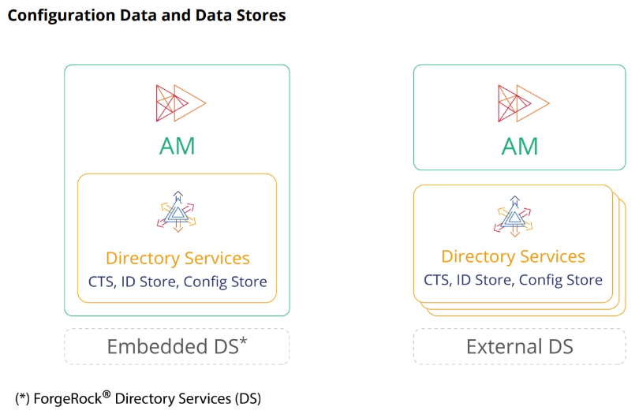

### DS Configurations

For demo or evaluation purposes, you can install AM with an embedded **ForgeRock Directory Services (FR DS)** that supports the data for the CTS, identity data, and the configuration. The embedded DS is not supported for production purposes.

External DS instances are recommended for production environments. It is more common to create a separate DS:
* The CTS store
* The identity store
* The configuration store


The graphic shows three different ways for storing and managing the AM configuration data stores:
1. Embedded DS configuration: Stores all the data in the single embedded DS server that is included with an AM installation.
2. External DS configuration: Storing configuration data in an external DS data store(s).
  1. Is shared between the AM instances in your deployment.
  2. Can be replicated between multiple DS instances in a cluster.
  3. Can be made available to AM instances in different regions; improving availability and data integrity.
3. File-based configuration: Used specifically for automated cloud deployments, and is only available and supported when used within Docker images.
  1. Saved as files in the file system.
  2. Checked into a source control system, such as Git.

### Deployment Topology

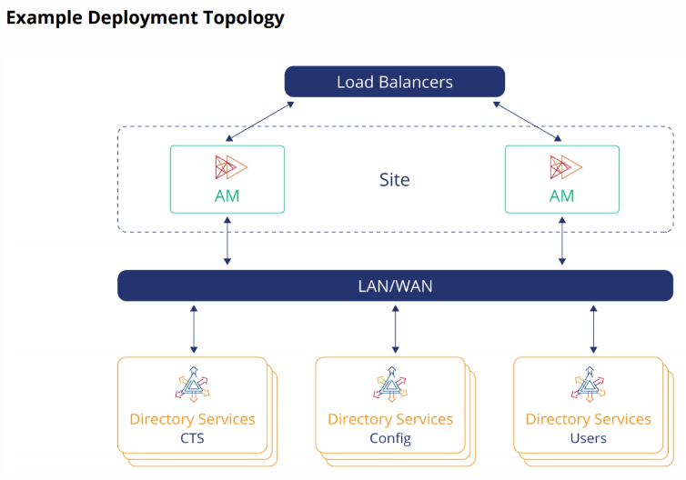

The example topology is a basic starting point for a highly available and scalable AM configuration. The goal is to ensure there is no single point of failure. In this case, the load balancers represent more than one load balancer, possibly in an active-passive configuration, or other forms supported by the load balancer software or hardware used. The load balancer is configured to distribute requests among the AM instances within the site.

The AM instances have the same configuration so that they can all communicate with the same DS infrastructure, which is configured with replicated external DS instances for the CTS store, the configuration store, and the identity (user) store.

AM relies on the DS SDK for load balancing, failover, and heartbeat capabilities to spread the load across the directory servers or to throttle performance. Therefore, it is not recommended to place a load balancer in front of the external DS instances.

https://backstage.forgerock.com/docs/am/7.1/deployment-planning-guide/deploy-topologies-onprem.html has more details.

### Deployment Preparation

Before deploying and installing an AM instance, you should consider the following areas:
* Access the AM Release Notes and consult the information provided. Many of the links in the list above reference the release notes.
* Read the Before You Install section.
* Revisit the Deployment Planning Guide.
* Read the Installation Guide as part of any preparation.
* Consult the Setup Guide for key AM concepts.

### Releases

* Initial major release: Latest is 7.0.0.
* Minor release: Limited feature release that includes maintenance fixes, such as AM 7.1.0.
* Maintenance release: Collection of fixes and minor RFEs, such as AM 7.0.1.
* Patch release, such as AM 7.0.1.1:
  * Contains a small collection of fixes for customer issues.
  * Contains updates with non-breaking functionality in terms of API compatibility.
  * Excludes Requests for Enhancements (RFEs).
* All software fully supported for three years, with an extra year for all critical fixes and high security fixes.

**Note:** The instructor suggested to deploy `n-1` as he has experienced issues deploying `n` in the past.

A security advisory is a patch bundle with security issues ranging from minor to critical. ForgeRock uses the following three key areas when assessing any potential security issues, assessed in this order of precedence:
* Criticality: Where does the exploit sit on the severity line?
* Customer Impact: What is the potential impact to the customer?
* Publicity: Has the security issue been made public? Is there an exploit that has also been made public?

Security advisory contains all previous security advisory fixes for the version so that you only need to apply the latest to your environment. Note that patches are different for different versions.

### Support Tickets

If you are a customer, you can raise a ticket with ForgeRock Support in case of problems. Note that ForgeRock Support covers suspected bugs or problems with the software and some requests for assistance.

See https://backstage.forgerock.com/knowledge/kb/article/a60648400

### Environment Preparation

AM relies on browser cookies, which are returned based on the FQDN hostname or its domain name. See https://backstage.forgerock.com/docs/am/7.1/install-guide/prepare-networking.html

AM needs to be configured with a fully resolvable FQDN. For evaluation purposes, AM can use any FQDN by adapting your /etc/hosts file accordingly.

AM is a Java application that requires a Java Development Kit (JDK) to run. Ensure that you configure the recommended settings to avoid performance issues. See https://backstage.forgerock.com/docs/am/7.1/install-guide/prepare-java.html

The default number of file descriptors in your environment will not be enough; mainly if you are working with policy agents. Consider increasing the file descriptors value to 64k+. See https://backstage.forgerock.com/docs/am/7.1/install-guide/prerequisites-file-descriptors.html

### Tomcat

For Apache Tomcat containers, it is typical to set JVM parameters, such as the `CATALINA_OPTS` environment variable in the `$CATALINA_BASE/bin/setenv.sh`. See https://backstage.forgerock.com/docs/am/7.1/install-guide/prepare-containers.html

### Downloads

The AM and Amster software distribution files can be downloaded for evaluation purposes and licensed versions can be obtained via a subscription. Use https://backstage.forgerock.com/downloads

AM is distributed as a `.zip` file containing the following artifacts:
* Admin tools.
* The AM `.war` file that can be deployed to a supported Java web application container.
* Configuration tools, which are deprecated from 7.0.
* Monitoring dashboard samples.

Amster and agents are not included in the AM `.zip` distribution file, and must be downloaded separately. The Amster `.zip` file can be extracted into any empty folder. After the AM `.war` file has been deployed, Amster can be used to:
* Install AM instances.
* Connect to AM instances to manage AM configuration.
* Back up and restore AM configuration.

### Deploying AM

Extract the AM .war file and deploy with an appropriate file name in the Java web application container. Examples are:
* `login.war` results in AM being accessed with the https://am.example.com/login URL.
* `am.war` results in AM being accessed with the https://am.example.com/am URL.

Deployment of AM extracts the distribution files into the Java application container, before installation and configuration.

AM requires a deployment URI with a non-empty string after the `/`.
Do not deploy AM in the Java container root context. For example, in Tomcat, do not rename the `.war` file to the name `ROOT.war`.

After deploying the AM `.war` file, before installation, when you access the AM URL the first time, your application container displays the AM installer (or upgrader, if performing an upgrade) user interface. ForgeRock recommends that any external network access to the application container is suspended until the installation, or upgrade, is complete.

Customers deploying AM in a production environment most commonly need to create a custom `.war` file, combining the core AM services and any customizations that have been developed. Customizations can include custom authentication nodes, custom AM services, and custom UI look and feel.

### Install Tools

3 types of installation process:
1. Web wizard:
  1. An AJAX-driven web configuration tool.
  2. Automatically checks answers to reduce deployment errors.
2. Amster:
  1. A command-line interface built upon the AM REST interface.
  2. Used in DevOps processes, such as continuous integration, command-line installations, and scripted cloud deployments.
3. `forgeops` repo - https://github.com/ForgeRock/forgeops.git
  1. Scripts that use DevOps tools, such as kustomize, docker, and Kubernetes.
  2. Used to customize and deploy the Identity Platform.

All tools trigger the same internal process that controls the deployment of AM.

### Preparing DS

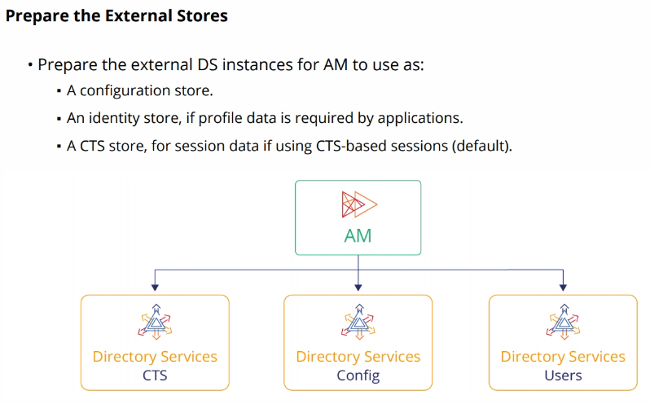

See https://backstage.forgerock.com/docs/ds/7.1/install-guide/preface.html

### Preparing Truststore

AM requires access to the self-signed certificate that DS generates. AM may also require access to CA certificates for secure connections to other sites.

* Use a (JDK default) truststore that contains the necessary CA certificates, and change the default truststore password.
* Export the DS certificate (for each external DS server).
* Add (or import) the DS certificate to the truststore.
* Configure the AM JVM container to use that truststore when starting up.

See https://backstage.forgerock.com/docs/am/7.1/install-guide/prepare-trust-store.html


### Installing

#### Web Wizard

Both the web wizard and Amster methods collect input in different ways, and perform the same installation and configuration tasks. Both methods need you to accept the terms and conditions when starting installation. Amster provides a command-line driven approach for installation of AM.


* Server URL: The server URL is the FQDN of the server. The server name should be resolvable through DNS services or through the `/etc/hosts` file.
* Cookie Domain: The cookie domain is optional. An empty cookie domain creates a host-only cookie. Otherwise, a cookie domain value must be a DNS domain or subdomain under the AM server FQDN. Setting a domain cookie allows any host in the specified domain, and any of its subdomains, to receive a cookie. If the cookie domain is different to the domain used to access AM, then the AM administrator is unable to log in to the AM console.
* Platform Locale: The default value is `en_US`.
* Configuration Directory: The path to a configuration directory that AM uses to store its persistent information. If you use the embedded DS as a configuration store, then the embedded DS instance is created within the specified folder. The configuration directory specified also contains the AM log and debug files, and must be writable by the user's account under which the container is running.

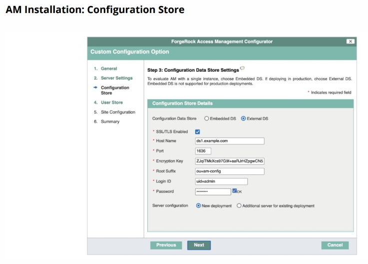

On the Configuration Store settings page, choose one of the following two options before entering the connection details:
* Embedded DS, the default option.
* External DS, select for production configurations and for creating clusters, with or without a site configuration. The external DS instance should have been created with the am-config profile and started prior to entering the connection details. When using an external configuration store, you must set up replication as AM will not do it for you.

See https://backstage.forgerock.com/docs/am/7.1/install-guide/configure-sites.html#add-servers-to-site


When you select the New deployment option in the Configuration Store page (the previous step), the User Store page is displayed to configure where AM looks for user identities. AM must have write access to the directory service chosen, and adds to the directory schema needed for AM to manage access for users. For production implementations it is common for the administrator to select the Embedded User Data Store option, and then perform the following additional actions:
* Create a sub realm in AM, and add the external user store to the sub realm.
* Remove the embedded user store from the sub realm.
* Either remove:
  * The default `demo` user account from the embedded user store configured in the top-level realm, or
  * The embedded data store from the top-level realm as well.


The Site Configuration page configures a site name and a URL for a load balancer that is used to balance requests across multiple AM servers. When you deploy multiple servers, AM automatically enables session high availability. By default, AM is configured to store session data in a CTS DS service that is shared by multiple AM servers. If an AM server fails, the shared storage means that other AM servers in the deployment:
* Have access to the user's session data.
* Can serve requests about that user.
* Does not ask the user to log in again.

On the Summary page, you can:
1. Choose to edit any of the settings for the configuration store, user store, and site before starting the installation.
2. Select Create Configuration to start the installation process.

After starting the installation, the progress of the installation and configuration process is displayed. The information is written to a log file in the `/path/to/amconfig/install.log`, where `/path/top/amconfig` is the configuration directory you selected in the Server Settings page.

#### Common Deployment Problems

Installing and configuring AM is usually straightforward. However, occasionally the issues listed in the slide are causes of common problems.

* Memory: Can fail if the heap size < 1024 MB.
* Disk space: Will fail if free space < 5% + 5GB.
* No permissions on the configuration folder:
  * Which is created for the DS instance (if the Embedded DS options is selected) and bootstrap files.
  * Must be writable by the user process under which the AM container is running.
* Cookie domain misconfigured: The wrong cookie domain prevents the administrator from logging in to the AM Admin UI.

#### Amster

* A command-line interface built upon REST APIs, available since version 5.
* Provides remote access, scripted deployments, configuration export and import, and encryption of sensitive data.
* Downloaded from backstage.forgerock.com.
* Installed by unzipping the Amster .zip archive file into an empty directory.


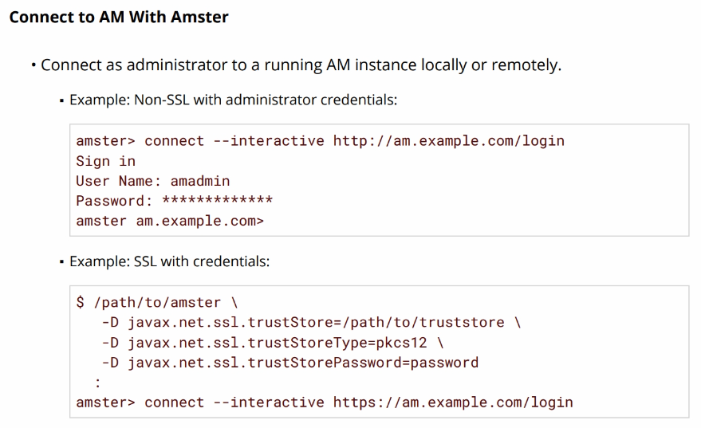


There are a heap of `cfg` options that can also be specified, e.g. `cfgStoreDirMgrPwd` and `cfgStoreHost` to connect to an external FR DS.


See https://backstage.forgerock.com/docs/amster/7.1/entity-reference/preface.html

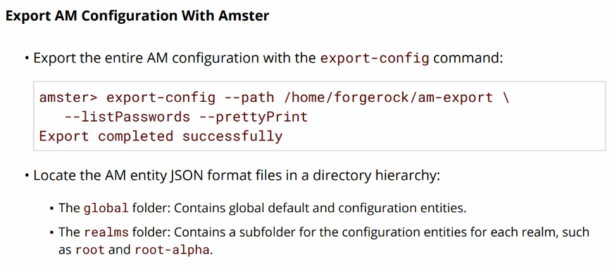

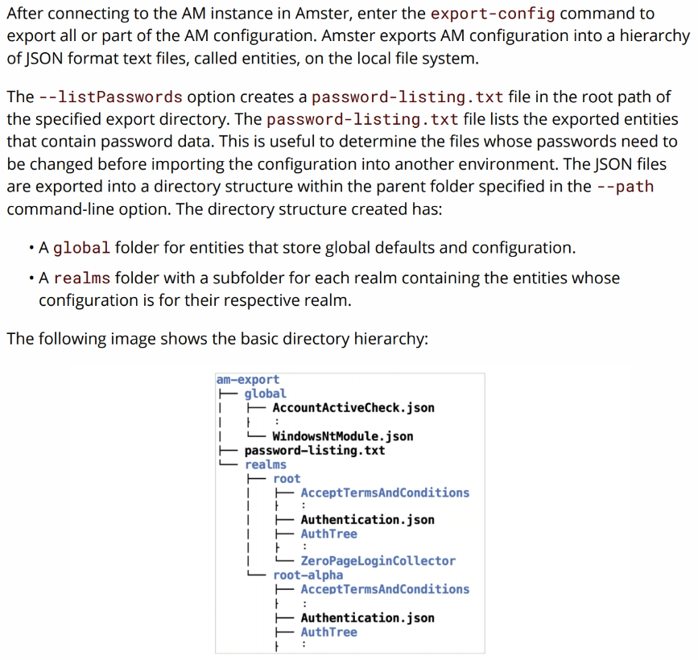

See https://backstage.forgerock.com/docs/amster/7.1/entity-reference/preface.html

Amster can export all the configuration related to an AM instance, and import it back to the same instance, or a different one. Note that Amster only manages configuration data. User information in data stores is not imported or exported, or modified in any way by Amster.


### Bootstrap Process


The AM bootstrap process steps are:
1. AM looks for the .openamcfg folder, located in the `$HOME` folder of the user running the AM container.
2. In the `.openamcfg` folder, AM reads a file named `AMConfig_<deploy-path>_`, where:
   1. The `<deploy-path>` is the name of the container path where AM is deployed; joined with underscore (_) characters.
   2. For example; if the AM deployment path is `/opt/tomcats/am/webapps/login`, the `<deploy-path>` is the `AMConfig_opt_tomcats_am_webapps_login_` name.
   3. The `AMConfig_<deploy-path>_` file contains the AM configuration folder path (specified during install time).
3. AM uses the configuration folder and looks for the bootstrap `boot.json` file in the `config` subfolder, as shown.

In the home directory of the user running the Java EE container process, a folder called `.openamcfg` is created when AM is installed the first time. For each AM instance installed, the `.openamcfg` folder contains a deployment file that contains the configuration folder specified when the AM instance was installed.


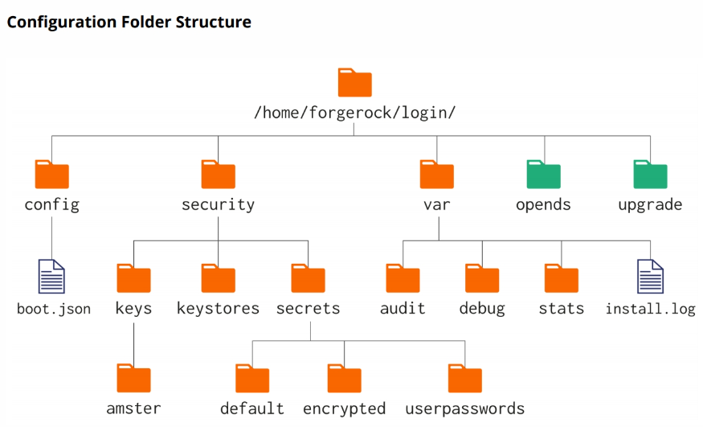

The AM configuration folder structure contains the following folders and their contents:
* `config`: Contains the boot.json file, and a subfolder structure with property files, such as the log4j.properties file.
* `security`: Contains the following important security related folders:
  * `keys/amster`: Contains key files for Amster to connect to AM without a password.
  * `keystores`: Contains the default AM keystore files.
  * `secrets/encrypted`: Contains files with the keystore passwords. If you decide to change the amadmin password by using a secret store, then the default location of the special secret store is in the `userpasswords` folder. The folder for the special secret store can be changed by configuring the `org.forgerock.openam.secrets.special.user.passwords.dir` advanced server property.
* `var`: Contains the following folders and files:
  * `audit`: The audit log files, such as access.audit.json, among others.
  * `debug`: The AM service and component log files, such as the Authentication log file.
  * `stats`: Statistics related to different AM functions.
  * `install.log`: The log file created when the AM instance is installed.

Other folders that may optionally be present are:
* `opends`: Contains the embedded DS folder structure, which is only present if the AM configuration is created with the embedded DS.
* `backups`: Contains backup .zip files of the embedded DS server (if used).
* `upgrade`: Contains log files related to the AM upgrade process.

AM also requires a DS for the configuration store to storage AM configuration. The DS configuration store can be an external or an embedded DS. Therefore, the AM administrator should check the DS configuration store log files to ensure the DS server is operating normally. When using embedded DS as a configuration store, the DS logs are located in the `/path/to/am-config/opends/logs` folder.

### Labs

The AM instance you install in this lesson is the first server you create for a cluster configuration. The initial architecture of the AM installation topology is shown in the following diagram:


## Lesson 1 - Upgrading AM

### Versions


You can migrate AM from `5.5.x` versions and later to AM `7.1`.

See https://backstage.forgerock.com/knowledge/kb/article/a18529200

Backing the deployment is essential before any upgrade and at a minimum includes backup of:
* The DS servers in the deployment
* The AM configuration and bootstrap files
* The AM deployment folders in the Java container

Have a read of https://backstage.forgerock.com/docs/am/7.1/upgrade-guide/upgrade-planning.html and https://backstage.forgerock.com/docs/ds/7.1/maintenance-guide/backup-restore.html

All customizations need to be developed and tested on the new software before an upgrade is done. AM customization can be applied at different levels. Prepare an AM .war file that contains any tested customizations you require and include changes to AM.

### Upgrade Overview

General upgrade steps are:
* Back up an AM deployment.
* Prepare the new AM .war file.
* Copy the new AM .war file to the AM container and start the container.
* Upgrade AM with one of the following methods:
  * Access and follow the web wizard instructions.
  * Install and use the command-line configuration tool.
* Access and test the AM services and customizations.

### Backup Steps

General backup steps:
* Stop AM.
* For an embedded and external DS configuration: Archive the AM configuration folder and the `.openamcfg` folder; excluding log and lock files. For external DS servers, ensure the configuration DS is backed up using the DS backup operations.
* Start AM, if you require it to be running before an upgrade.

See https://backstage.forgerock.com/docs/ds/7.1/maintenance-guide/backup-restore.html

### Upgrade Steps

Upgrade steps for single AM instances:
* Stop AM.
* Deploy new customized .war file in the container.
* Start AM.
* Access AM, such as https://am.example.com/am and follow the upgrade instructions in the web wizard, or use the command-line configuration tool.
* Restart AM.

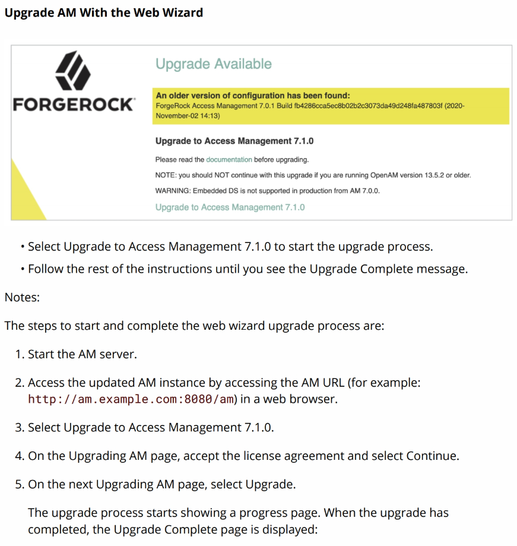

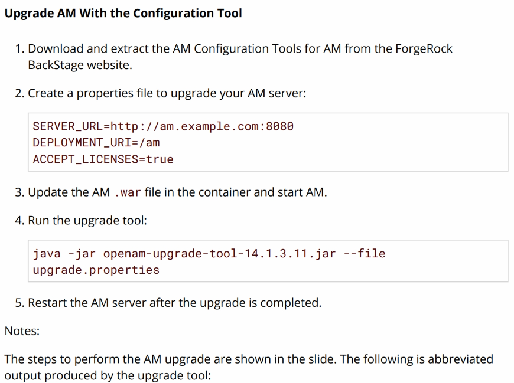

You can upgrade with the GUI or a CLI tool.

### Restore From Backup

It is not enough to back up a deployment. You must be able to restore it. That seems obvious, but actually learning to restore an environment is as important as backing it up every day.

* Do not mix versions: Structure of the configuration changes from release to release.
* In replicated environments, directory replication mechanically applies new changes, and data restored from the backup must not be older than the replication purge delay.
* To restore AM:
  * Stop the AM server.
  * Restore the AM container and configuration folders from the last backup.
  * Restart AM.

## Lesson 2 - Hardening AM (Security)

### Considerations

* Keep up-to-date on patches, cryptographic methods, and algorithms.
* Turn off unnecessary or unused features.
* Limit access to the servers hosting AM.
* Consult security documentation for open standards (see notes for a list).

### Communications

* Use encryption wherever possible.
* Configure HTTPS and LDAPS connections.
* Secure sessions and cookies:
  * Use host cookies instead of domain cookies.
  * Enable HttpOnly cookies, if appropriate.
  * Manage subdomain cookies subject to cross-domain single sign-on (CDSSO) implications.
* Create your own signing keys, instead of using default test keys provided in AM.
* Audit access and configuration changes.


* Enforce secure connections and use a reverse proxy (IG or a load balancer) to protect specified URLs.
* Control access by network address.

A reverse proxy exposes only the endpoints needed for an application. Endpoints can be secured by using a whitelist approach, which is supported by IG and some load balancers. See https://backstage.forgerock.com/docs/am/7/reference/endpoints-reference.html and https://backstage.forgerock.com/knowledge/kb/article/a23862128#lW0i8_

### Changing Defaults

Recommended changes are:
* Change the DS administrator bind DN (default: `uid=admin`):
  * Bind with specific administrative account rather than root DN account.
* Change the session cookie name (default: `iPlanetDirectoryPro`).
* Choose a unique AM context during installation: Instead of `.../am`, use `.../login`.
* Remove the `demo` user or any test user accounts.
* Set the list of valid `goto` and `gotoOnFail` URLs.
* Secure access by tidying up trees (modules, and chains too, if any).

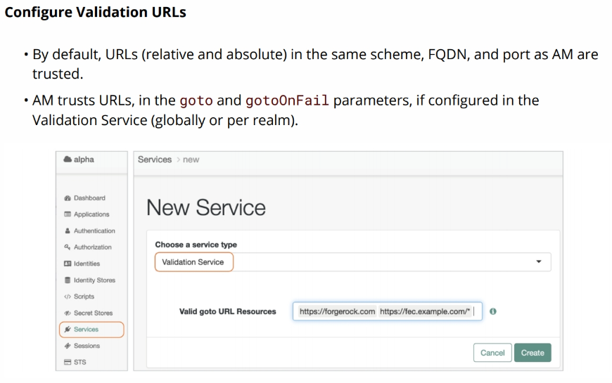

URLs can be relative to AM's URL, or absolute. By default, AM trusts all relative URLs and those absolute URLs that are in the same scheme, FQDN, and port as AM. This increases security against possible phishing attacks through open redirect.

When adding URLs to the Validation Server, you can use the `*` wildcard, which matches all characters except `?`.

### Secure Authentication

Users can bypass a carefully designed tree, authenticate with a simpler tree, and gain access to resources. When you have finished development, carefully consider the set of authentication services and decide which services are needed, and in which context. In user realms:
* Remove unused services and sample trees, such as `Example`, and sample services, such as `ldapService`.
* Ensure inner trees cannot be used on their own:
  * Do not request the username within an inner tree.
  * Enforce access to specific services using policy environment conditions.
* Disable module-based authentication (deprecated): Users should always go through a tree to authenticate.

### Secure Administration

The same AM login page, used by administrators to access the AM Admin UI, can be used by non-administrative users to access the AM End User UI. Administrators have complete access; non-administrative users can only access their user profile page.

It is best practice to separate administrative users and end users into separate realms, keeping the administrators in the Top Level Realm.

* Privileges are assigned to a group of users at the realm level:
  * Create a group in realm > Identities > Groups > Add Group.
  * Select the group > Members to add users, and group > Privileges to assign realm privileges.
* Delegated administrators can perform tasks in a realm and its subrealms.
* Delegation is enabled through policies internal to AM.

See https://backstage.forgerock.com/docs/am/7.1/security-guide/securing-administration.html#realm-privileges-delegation-ref

### Secrets

AM depends on signing and encryption to protect network communication and to keep data confidential and unalterable.
* **Encryption** makes it possible to protect sensitive data, encoding it so that only authorized parties can access it.
* **Signing** allows the receiver of a piece of data to validate the sender's identity and ensures that the data has not been tampered with.

A secret ID is a unique reference used to configure a key. Each cryptographic operation using a specific algorithm has a static secret ID.

See https://backstage.forgerock.com/docs/am/7.1/security-guide/secret-mapping.html#secret-id-mappings

### Keys & Certificates

Keys are used to:
* Sign data.
* Encrypt data.

Certificates:
* Contain public keys.
* Establish trust when issued and signed (verified) by a trusted authority, known as a Certificate Authority.
* Provide a link between a public key and the verified entity.
* Provide a way of distributing trusted public encryption keys.

Public key encryption requires a public key and a private key to be generated for an application. Data encrypted with the public key can only be decrypted using the related private key. Conversely, data encrypted with the private key can only be decrypted with the associated public key.

The private key is carefully protected and only the owner can decrypt messages encrypted with the public key.
The public key is embedded into a digital certificate along with additional information about the owner of the public key, such as name, street address, and email address.

A private key and digital certificate provide an identity for the application. The data embedded in a digital certificate is verified by a trusted CA and digitally signed with the CA digital certificate.

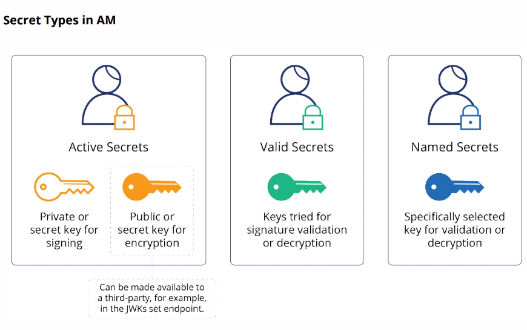

### Secrets

Once a secret store has been created, mappings provide the ability to rotate active secrets and retire non-active secrets. Secret types are:
* Active secrets: The current key for signature generation and encryption.
* Valid (non-active) secrets: Any valid value key for signature verification and decryption.
* Named secrets: A specifically selected key for validation or decryption; for example, a key identified using the JWT Key id (kid) header.

Secrets (aliases) are managed by:
* Rotating an alias
* Retiring an alias
* Revoking an alias

### Keystores

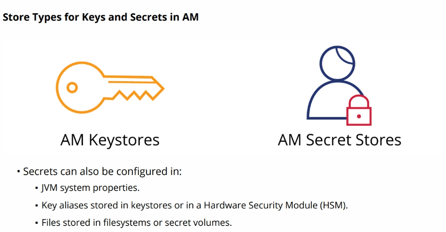

To store keys or secrets, AM uses:
* The AM keystore is used by some features, such as starting up AM. It can be configured globally (for all instances in a deployment), or per individual server.
* AM secret stores are repositories for cryptographic keys and credentials. They can be configured globally (for all instances in the site), or by realm.

During installation, AM creates a JKS and a JCEKS keystore with several self-signed key aliases for demo and test purposes only. The AM keystore and the default secret stores use the default JCEKS keystore.
* The keystore is located at `/path/to/amconfig/security/keystores/ keystore.jceks`
* The password to access the JCEKS keystore is located in the hidden `/path/to/amconfig/security/secrets/default/.storepass` file.

See https://backstage.forgerock.com/docs/am/7.1/security-guide/keys-secrets.html#about-default-keystores-secrets

* The JKS keystore is not used by default, and can be safely deleted.
* Do not use the default keys, keystores, and secret stores in a production environment.

The AM keystore is used by:
* User self-service
* Amster
* Persistent cookie node (in trees)

AM's startup (bootstrap) process requires two password strings. ForgeRock recommends that you use the AM keystore as the bootstrap keystore. See https://backstage.forgerock.com/docs/am/7.1/security-guide/configuring-keystores.html#proc-bootstrap-keystore

### Secret Stores

Secret stores are used by:
* Client-based sessions
* Web and Java agents
* Auth2 providers
* The remote consent service
* Authentication trees
* SAML2 federation

A secret store can be created with these scopes:
* A global store
* A realm store

Secret stores can be created as:
* Keystore: Includes JKS, JCEKS, PKCS11, and PKCS12.
* HSM stores.
* File based: Directories with encrypted and/or encoded secrets.
* Environment and system property: Environment variables and system properties with encrypted and/or encoded secrets.
* Google Cloud Key Management Service (Google KMS) stores.
* Google Cloud Secret Manager (Google GSM) stores.
* As an administrator, encrypt AM secrets with the https://am.example.com/am/encode.jsp URL.

AM creates a default keystore of type JCEKS when installing a fresh instance or during an upgrade. There are no default secret stores in AM.
* The `default-keystore` contains test keys.
* The file-based `default-password-store` contains the secret to access the `default-keystore`.

For production deployments, generate a new keystore with the key aliases you need.
* Some AM features support different keystore configurations, and other features do not use the default keystore to store key aliases.
* Key aliases are not migrated from one keystore to another when changing the keystore configuration. Prepare the new keystore before configuring it.
* Restart AM if you make keystore changes, such as adding or removing keys, or modifying key or keystore passwords.

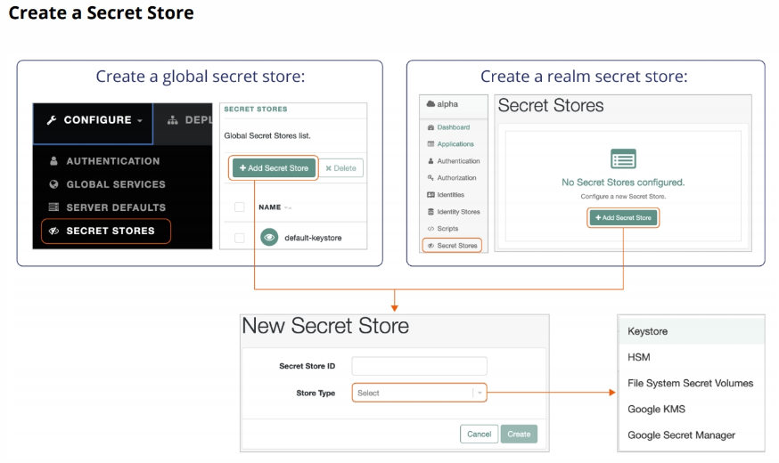

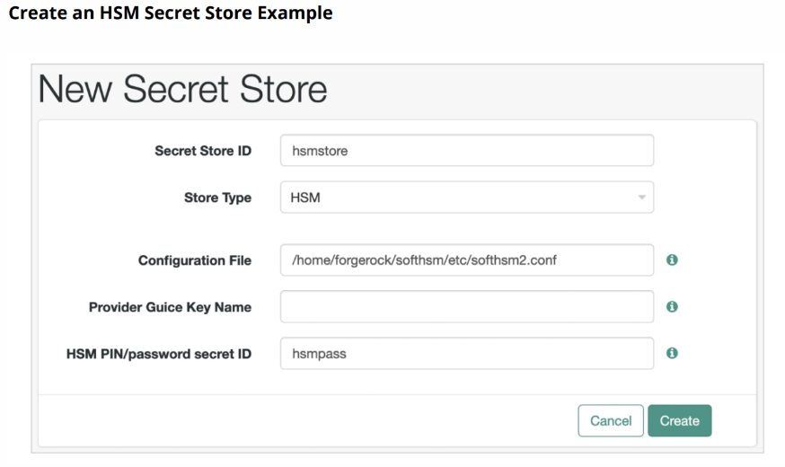

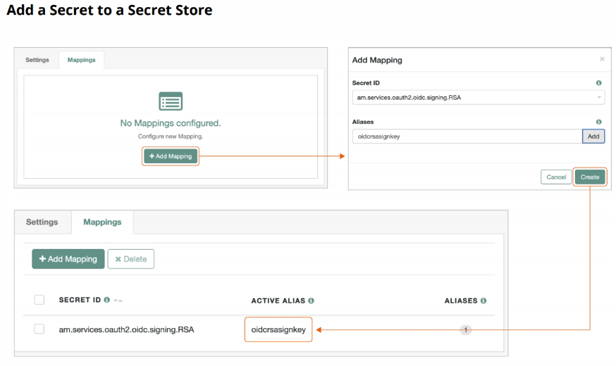

Mapping secret IDs to an alias is supported by keystore and HSM secret store types.


### Key Resolution


Stores can be configured per realm or globally, but the realm configuration takes precedence. AM resolves secrets in the following order:
* Any secret store configured for the realm, regardless of type.
* Any secret store configured globally, regardless of type.
  * If the key alias is not found, AM logs an error and the operation (for example, signing a client-based session token).

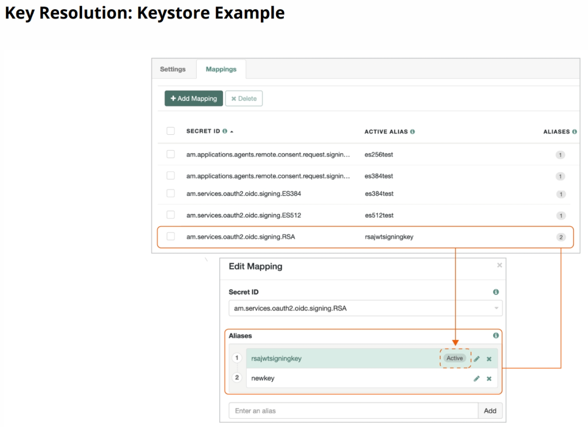


### Default AM Keystore

By default, AM installations provide a JCEKS keystore with several preconfigured test-only key aliases. For production deployments, generate a new keystore with your own key aliases, either by:
* Replacing the AM keystore, or
* Modifying the AM keystore configuration.

See https://backstage.forgerock.com/docs/am/7.1/security-guide/configuring-keystores.html#proc-bootstrap-keystore

### Labs

Working with an OIDC ID token for this exercise requires that the AM realm is configured with an OAuth2 Provider and an OIDC relying party profile (essentially an OAuth2 client) to test the configuration changes and view the key IDs used.

To validate an ID token received from an OIDC Authorization Code grant type flow, you configure AM to expose its public keys on the internet. AM publishes signing keys for the OAuth2 service in the alpha realm at the following URL: http://am.example.com:8080/am/oauth2/alpha/connect/jwk_uri which is created from:
* `https://{{jwks-www}}/oauth2/{[realm}}/connect/jwk_uri`
  * The `{{jwks-www}}` part represents your AM server and path (am.example.com: 8080/am)
  * The `{{realm}}` part would be `alpha`, resulting in the above URL.

https://jwt.davetonge.co.uk can be used to validate JWT after exposing the public end points.


http://am.example.com:8080/am/encode.jsp can be used to create an encrypted secret for an AM secret store.

## Lesson 2 - Hardening AM (Auditing & Monitoring)

### Auditing

The AM logging service is used for recording operational information about the AM components. AM writes log messages generated from audit events triggered by its instances, policy agents, and connected Identity Platform implementations. The AM logs are not designed to debug code and configuration problems within AM; that is the role of the debug files. In general the auditing logs covers:
* Captures key auditing events.
* Audit logs track processes and security data, such as:
  * Authentication mechanism
  * System access
  * User and admin activity
  * Error messages
  * Configuration changes
* Adheres to a consistent log structure across the Identity Platform.
* Supports transaction ID propagation across the Identity Platform.

Some features of auditing are:
* Log configuration: Global and realm-based.
* Audit event handlers: Where to publish the logs.
* Tamper-evident logging: Digitally sign audit logs to ensure no tampering has taken place.
* Data management: Log rotation and retention policies.
* Blacklisting sensitive fields: For example, headers or cookies. Reverse DNS lookup: For network troubleshooting purposes.

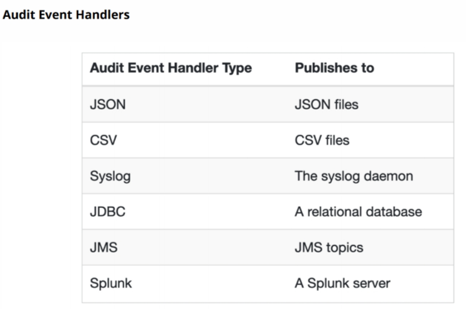

AM supports the types of audit event handlers as per the table above. See https://backstage.forgerock.com/docs/am/7.1/security-guide/implementing-audit.html#configuring-audit-event-handlers

AM integrates log messages based on four different audit topics.
1. Access: Who, what, when, and output for every access request.
2. Activity: Changes made to sessions by end users.
3. Authentication: When and how a subject is authenticated.
4. Configuration: Which config was modified by whom with timestamp.

A topic is a category of audit log events that has an associated one-to-one mapping to a schema type. Topics can be broadly categorized as access details, system activity, authentication operations, and configuration changes.

It is possible to cross-reference activity on the different topics and log files by using the transaction ID.

The audit log files reside in the `/path/to/amconfig/var/audit`.

### Monitoring

Monitoring in general:
* Is an important component when maintaining applications.
* Verifies the health and availability of the application.
* Helps identify any issues.
* Gives insight into various areas that are used to fine tune the application.

Monitoring AM:
* Provides visibility of how a server performs.
* Verifies health and availability.
* Helps identify issues.
* Gives insight with a view on tuning through info on:
  * Heap
  * Threads
  * Garbage collection
  * CPU utilization
  * Java classes

The goal of Java memory analysis is to optimize the garbage collection in such a way that its impact on application response time or CPU usage is minimized. It is equally important to ensure the stability of the application. Memory shortages and leaks often lead to instability.

To identify memory-related instability or excessive garbage collection, we need to monitor our application with the appropriate tools.

See https://backstage.forgerock.com/docs/am/7.1/maintenance-guide/monitoring-am.html for details of the various monitoring interfaces and REST APIs access that AM ships with. They are:
* HTTP: Using a browser or HTTP client.
* JMX: Using the RMI protocol and a JMX console.
* SNMP: Any SNMP network console.
* Prometheus: Third-party software used for processing and monitoring data.
* CREST: AM REST API that exposes information about AM, in JSON format.
* Graphite: AM pushes metrics data to the Graphite server.


AM contains a monitoring framework that makes configuration and operational information available to AM administrators. AM exposes a ForgeRock Common REST (CREST) metrics API and Prometheus metrics endpoints. The CREST API can be queried by any REST client and the Prometheus endpoint can be queried by a Prometheus server.

You can use tools such as Grafana to query the repository, organize the data, and display it in a meaningful way.

### Labs

When the name of the cookie is changed on a production system, you invalidate the sessions for all users that still have a valid cookie.

## Lesson 3 -  Clustering AM

### High Availability

For some organizations, having a system up and running at all times is fundamental. Ensuring high availability goals can be achieved by eliminating single points of failure and detecting failures immediately.

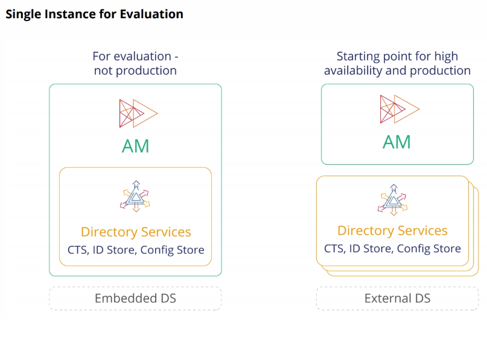

You could start with an evaluation instance of AM, and then make appropriate configuration changes to the AM instance to prepare it as the first instance of a cluster for a highly available architecture. Part of the preparation would involve migrating the embedded DS to one or more external DS stores.

It is recommended that you start by installing your first AM instance with one or more external DS instances as the basis for creating a production-ready cluster.

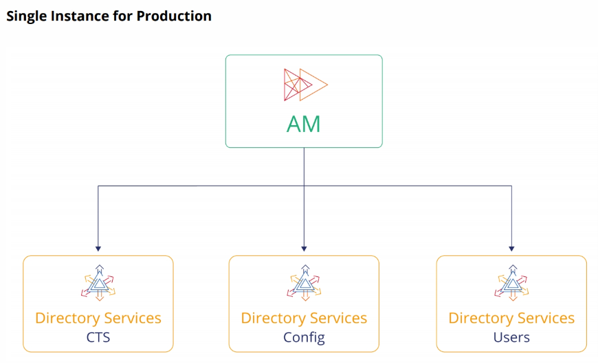

The diagram illustrates an acceptable basis for a single instance in production. In this case, if one component fails, the whole deployment will be down. However, this topology is easier to scale horizontally to eliminate single points of failure.

* Configuration is mostly static. Can use an embedded store but still not recommended.
* Identity data is more dynamic.
* CTS data is typically volatile (long-and short-lived).


To avoid a single point of failure and ensure high availability, all the components of the solution must be duplicated.

AM instances will be put behind a load balancer, which will spread the load evenly between them. If one server is down, the load balancer will detect it and reroute all the requests to the healthy server.

Similarly, the directory stores should be duplicated; however, do not use a load balancer in front of your directories. The issue is that all the data and all the updates must be replicated between the directory servers.

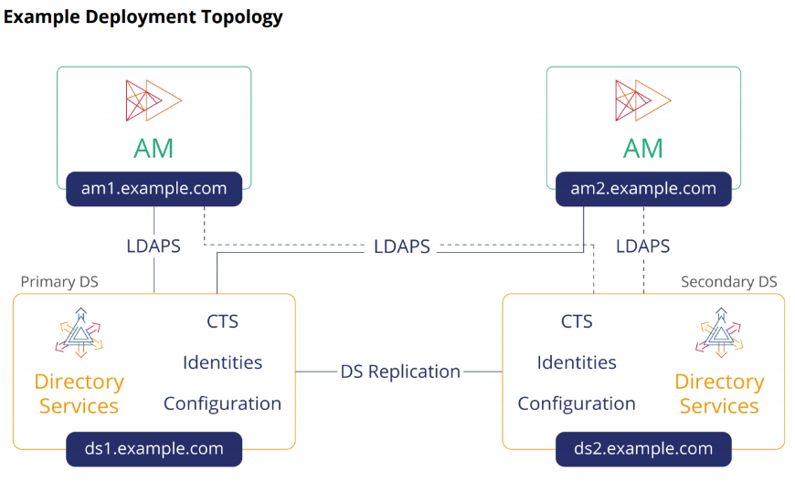

This is basic deployment architecture that is designed for high availability, by ensuring no single point of failure for AM and DS instances in the topology. The architecture can be extended for more redundancy and higher availability, by adding:
* More DS instances in the replication architecture for the configuration, CTS, and identity stores.
* More AM instances into the site or cluster configuration

### Scalability

Scalability is the capability of a system to handle growing loads, and its potential to accommodate the growth. The 2 approaches are:
1. **Horizontal scaling:** Means adding more servers to a solution. This typically works well to increase the throughput for authentication. Horizontal growth is made easy by autonomous AM servers, and containerization facilitates its implementation.
2. **Vertical scaling:** Means using bigger machines. Although this is an effective solution in some cases, for instance, for LDAP directories. It may not be as effective for AM servers. For example, if the session volume increases, it is tempting to increase the Java heap. Consider this action carefully, because the overall performance may degrade, due to garbage collection overheads for example.

AM is a good candidate for horizontal scaling. Use two or more AM instances to provide availability, and implement horizontal scalability.

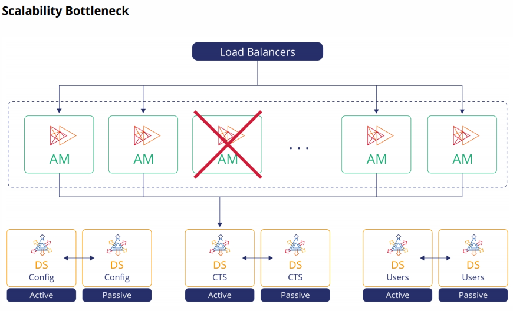

Scalability for AM is achieved horizontally by adding more servers to a deployment. However, a scalability bottleneck can occur as demand to access the active CTS is increased. More AM servers mean that more sessions need to be retrieved and updated in the CTS. However, the CTS cannot be scaled horizontally and can lead to a situation where performance degrades due to load on the active CTS. 3 possible solutions:
1. Connect each AM instance to a unique CTS, which becomes the active CTS for the associated AM server, to ensure high availability with an active-passive mechanism.
2. Enabling CTS affinity in AM deployments.
3. Enabling client-based sessions.
  1. Make sure black listed sessions is on. This is for logged out user sessions and makes sure logged out users can't get access unless they log back in.


Affinity deployments are well suited for deployments with many AM servers. In an affinity deployment, AM balances LDAP requests across one or more DS instances. Without this,  AM always routes LDAP requests for a specific CTS token to the same DS.

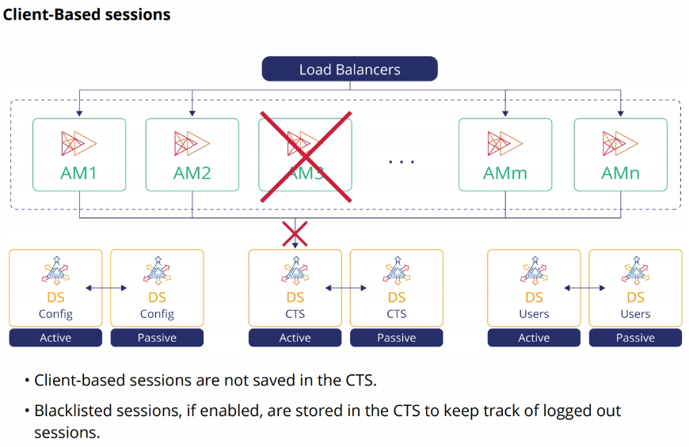

Client-based sessions are not persisted in the CTS. Sessions are stored in a token sent to the client as a JWT. Therefore, any server can deal with the session without the need to read it from the CTS. Some things not available with client sessions:
* It is not possible to terminate a client-based session before its expiry time.
* Session upgrade
* Session quotas
* Authorization policies with conditions that reference current session properties
* CDSSO
* Both session signing and encryption (browser size limitation)
* SAML2 single logout
* SNMP session monitoring
* Session management by using the AM Admin UI
* Session notification

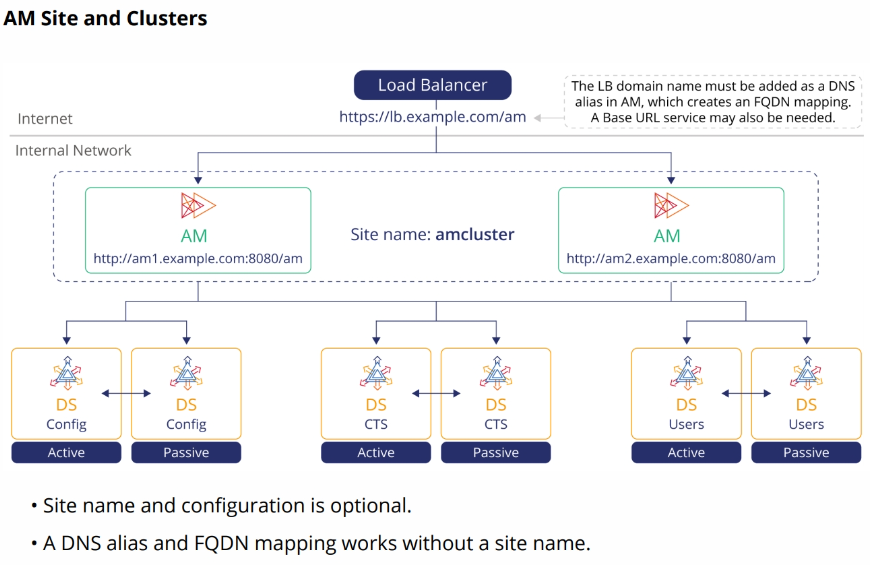

A site is an AM concept and configurable name that defines a different URL used to access AM instances. The site URL refers to a load balancer with an external DNS name that is different from the one used when the AM instance was installed.

You can create an AM cluster without configuring an AM site. Configuring a site name and assigning the AM servers to a site is optional.

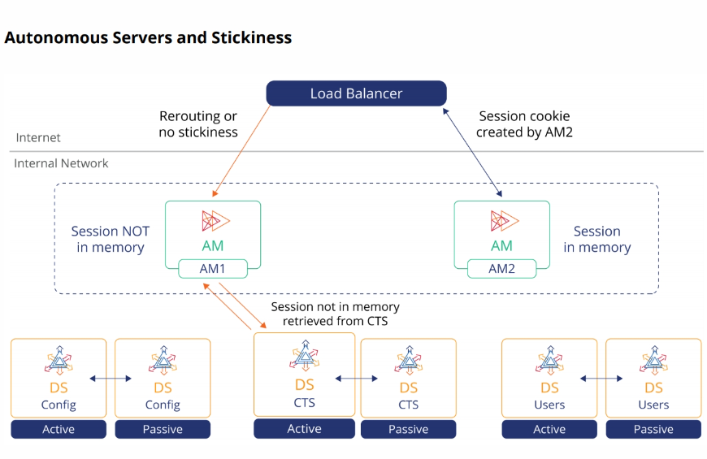

AM servers manage sessions autonomously. They provide session access and management independently of each other. Sticky sessions may or may not be used.

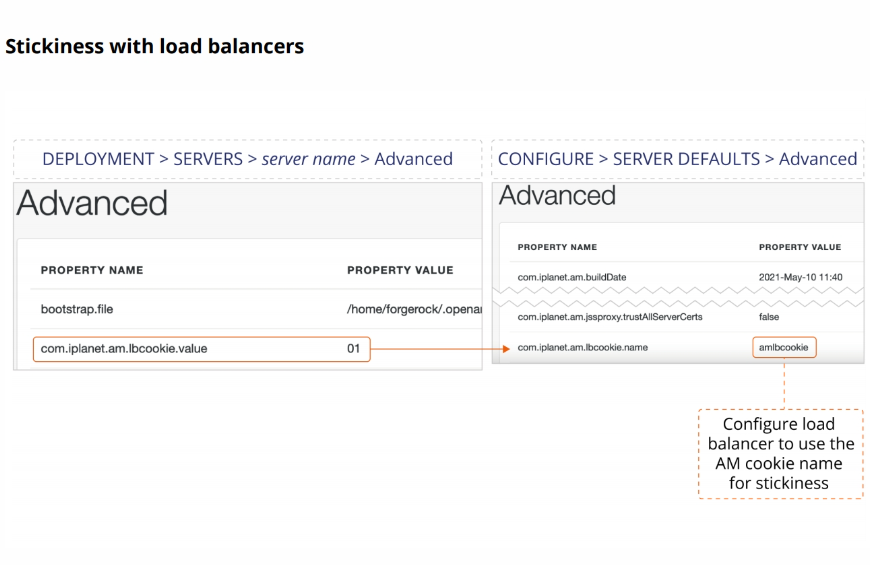

Stickiness can be enabled in many load balancers by configuring them to recognise a special cookie that identifies the server to which a request has been routed. Configuring the load balancer to enable session stickiness can make use of the `amlbcookie`, which an AM server adds to response headers as a form of server identification.

You should configure your load balancer to enforce stickiness wherever possible, because it can help improve overall performance.

Terminating SSL at the load balancer ensures that internal communications between the AM servers runs unencrypted, allowing intrusion detection systems to be deployed. The decision to terminate SSL or not depends on your company security policy.

CTS offers de facto session failover and persistence.

CTS needs tuning to offer an optimal performance. See https://backstage.forgerock.com/docs/am/7.1/cts-guide/cts-reaper.html and https://backstage.forgerock.com/docs/am/7.1/cts-guide/cts-tuning-considerations.html

### Creating The Cluster

Key asks are:
* Prepare the truststore and external DS stores.
* Install the first AM server in the cluster.
* Configure the external CTS store.
* Configure External DS high availability in AM.
* Configure the load balancer.
* Configure the AM Base URL service.
* Install additional AM instances in the cluster.


See https://backstage.forgerock.com/docs/am/7.1/cts-guide/cts-openam-config.html#cts-testing-ha

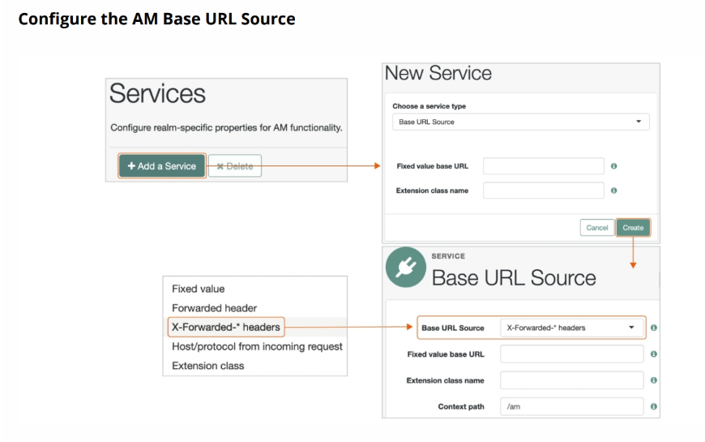

### Labs


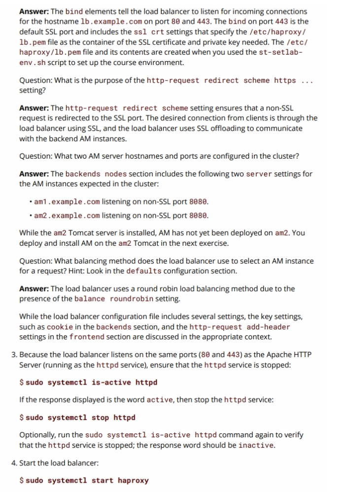

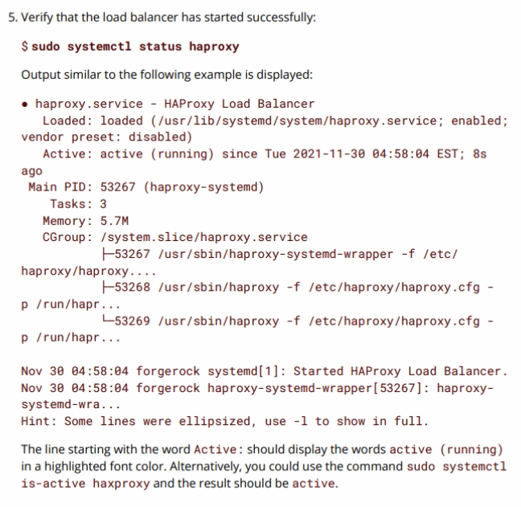

Your existing cluster topology has one AM running with an external DS that is replicating its data with a second external DS. You now add a second AM server to the cluster topology, which includes:
* Deploying the AM `.war` file in the `am2` Tomcat server.
* Starting the `am2` server.
* Obtaining the encryption key from the first AM server that is needed for the second AM installation.
* Installing AM in the `am2` server with the same encryption key, configuration store, and identity store as the existing `am1` instance. By sharing the same encryption key and external DS, the second AM server can participate in the AM cluster. Creating an AM site configuration is optional.

To obtain the password encryption key from `am1`, use either the AM Admin UI or the REST API.

It is recommended to initially configure the CTS settings as AM server default properties in a cluster topology, so that all AM servers in the cluster use a common CTS architecture.

The value in AM Admin UI > Deployment > Servers > `$SITE` > Advanced: `com.iplanet.am.lbcookie.value` is stored in the `amlbcookie`.  This value determines what server you are on. You can view this in a browser by:
* Firefox - Dev tools > Storage > Cookies
* Chrome - Dev tools > Application > Cookies

In many deployments, AM determines the base URL of a provider using the incoming HTTP request. However, the base URL of a provider may not be correctly derived from the incoming HTTP request, when the request is routed through a proxy server, such as the HAProxy load balancer. The load balancer / proxy needs to be configured to forward the `X-Forwarded-*` headers onto AM. The 3 headers are:
1. `X-Forwarded-Proto`  is a de-facto standard header for identifying the protocol (HTTP or HTTPS) that a client used to connect to your proxy or load balancer. - https://developer.mozilla.org/en-US/docs/Web/HTTP/Headers/X-Forwarded-Proto
2. `X-Forwarded-Host` is a de-facto standard header for identifying the original host requested by the client in the `Host` HTTP request header. - https://developer.mozilla.org/en-US/docs/Web/HTTP/Headers/X-Forwarded-Host
3. `X-Forwarded-Port` helps you identify the destination port that the client used to connect to the load balancer. - https://docs.aws.amazon.com/elasticloadbalancing/latest/classic/x-forwarded-headers.html#x-forwarded-port

See https://backstage.forgerock.com/docs/am/7/security-guide/reverse-proxy.html#configure-base-url-provider

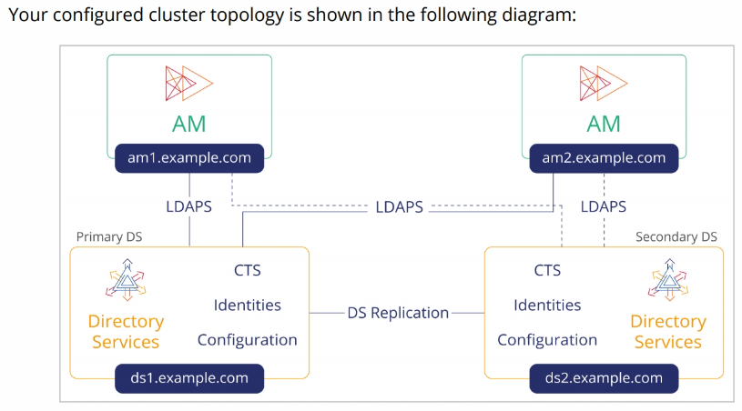

Note that the secondary server configuration is generally best done in the server defaults for the cluster configuration. This means that all the AM instances in the cluster inherit this change. When you modify the CTS configuration, you need to restart all the AM servers in the cluster. However, you need to restart the AM servers after modifying the configuration store and identity store settings.

## Lesson 4 - Deploying the Identity Platform to the Cloud

### Identity Platform

The ForgeRock Identity Platform is the only offering for access management, identity management, user-managed access, directory services, and an identity gateway, designed and built as a single, unified platform. It provides:
* Docker images with evaluation-only versions of AM, ForgeRock Identity Management (IDM), DS, and IG components.
* Sample configurations in the ForgeRock forgeops Git repository that use DevOps tools to support cloud-agnostic deployment.
* Increased flexibility, availability, and scalability inherent in cloud and Kubernetes contexts.
* Organizations with the ability to speed time-to-market while reducing complexity and saving time and money.

### CDK & CDM

The configuration provided by the ForgeRock [forgeops](https://github.com/ForgeRock/forgeops) Git repository is a basic installation that can be extended by developers to meet their requirements. Developers should create a fork of this repository, clone the fork, and modify the various configuration files. it:
* Creates a Kubernetes deployment for the Identity Platform.
* Provides default configurations for deployment of AM, IDM, and a shared DS. By default, IG is available and not deployed.
* Provides Docker and Kustomize artifacts for deploying version 7.1 products to a Kubernetes cluster.
* Uses Git release branches for a specific release of the repository files for deploying the Identity Platform.
* Includes a **Cloud Development Kit (CDK)** providing a minimal sample deployment for development purposes.
* Includes a **Cloud Deployment Model (CDM)** as a reference implementation for cloud deployments.

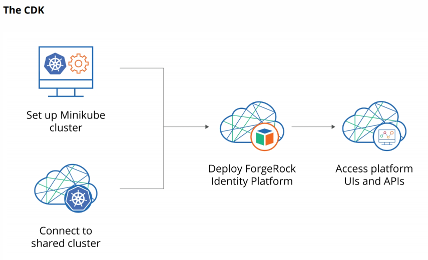

The CDK is for developers to quickly deploy the Identity Platform and configure and customize AM and IDM. If you have access to a cluster, you can install the CDK in a namespace on your cluster. However, if you don't have access to a cloud-based cluster, you can deploy the CDK on a local computer running Minikube.

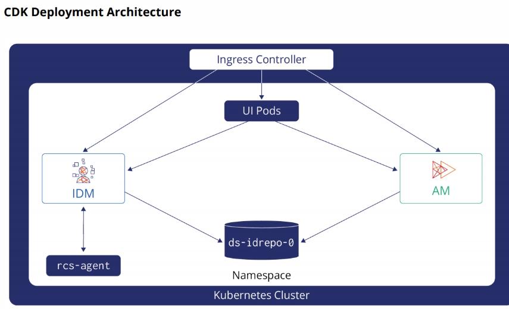

CDK deployments are suitable for demonstration and proof-of-concept purposes. It is a quick way to get the Identity Platform up and running on Kubernetes.


The CDM is well-suited for a proof-of-concept deployment that can be used for validation against ForgeRock published benchmarks.


The CDM deployment basically follows the same deployment procedure as the CDK, with the exception of the Kustomize overlay that is used for the Kubernetes environment. The Kustomize overlays contain different optimizations, sizing, and placing of the Identity Platform components in the target environment.

### Cloud Environment Setup

Set up the cloud provider SDK and the Kubernetes cluster:
* Install third-party software, including the cloud provider SDK.
* Authenticate with the cloud provider and obtain cluster details.
* Connect to the Kubernetes cluster, if it exists; otherwise create the cluster first.
* Create a Kubernetes namespace.

See https://backstage.forgerock.com/docs/forgeops/7.1/cdk/setup-cdk.html & https://backstage.forgerock.com/docs/forgeops/7.1/cdm/setup-cdm.html

Supported environments are:
* Minikube
* GKE
* EKS
* AKS

### Bundled Third Party Software

All tools listed in the slide, except Helm, are used for deployment with the CDK; otherwise, all tools listed are used for deployment with the CDM.
* Docker CE.
* The Kubernetes command-line client `kubectl`.
* Kustomize.
* Cloud provider SDK, such as The Google Cloud SDK.
* Helm to deploy the ingress controller.

### Kubernetes

A cluster needs to be created that supports a Kubernetes environment. This can be done in any of the cloud platforms that support Kubernetes.

Cloud provider SDK commands are used to connect to a Kubernetes cluster.

The external IP address of the cluster:
* Must be mapped to a FQDN name in the domain name service so that you can access your cluster via the Internet.
* Is mapped to its FQDN in the /etc/hosts file in the lab for this lesson.
* Is needed for deploying the ingress controller.

The external IP address needs to be determined so that you can deploy the ingress controller to accept a correct IP address for the FQDN.

The CDK automatically installs other required packages such as the:
* Secret Agent Operator
* DS Operator
* Necessary third-party components:
  * Ingress Controller (if not already deployed)
  * Certificate Manager

Before you can access the Identity Platform Admin UI, you must obtain the randomly generated secrets that are generated when the Identity Platform is deployed using the CDK.

### Labs

Various commands for software needed to run in GKE.
* Docker CLI: `docker --version`
* kubectl client: `kubectl version`
* kustomize: `kustomize version`
* k8s context-switching tool: `kubectx -h`
* k8s namespace-switching tool: `kubens -h`
* Google Cloud SDK: `gcloud -v`

Google provides an administration console called Google Cloud Console to manage your GCP resources.

Display the Google Cloud SDK information about the environment settings: `gcloud info`. The command output might be useful for troubleshooting if you experience issues with the Google Cloud SDK.

Display the Google Cloud SDK authentication information: `gcloud auth list`.

Initialize the Google Cloud SDK configuration settings: `gcloud init`.

Change the project default compute engine zone: `gcloud config set compute/zone $NAME`

Change the project default compute engine region: `gcloud config set compute/region $NAME`

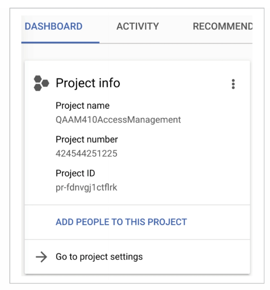

Change the current project: `gcloud config set project $PROJECT_ID`. To access the GCP Project Info panel, select the Google Console VM and in the GCP console (if signed in), select the GCP navigation menu > Home

Authenticate with Googe Cloud SDK: `gcloud auth login $EMAIL`

To display your current GCP project ID and zone values: `gcloud info --format="text(config.project,config.properties.compute)"`


View your project's external IP: `gcloud compute addresses list` or `gcloud compute addresses list --format="text (address)"`

Normally, you would use a DNS service to do hostname resolution. In this course, you use sudo to edit the `/etc/hosts` file, which is used for name resolution. The FQDN `dev.example.com` is resolved to the external IP address you added to your `/etc/hosts` file. The FQDN is used in the URLs that access the Identity Platform Admin UI, AM Admin UI, and IDM Admin UI pages, after the Identity Platform has been deployed.

Note that the external IP address is needed in the next exercise, when you deploy the ingress controller for the Identity Platform to be accessible through a load balancer in the GCP environment. Currently, the external IP address is allocated and not used until the ingress controller is deployed.

The cloud provider cluster needs to be created before you deploy the Identity Platform. When the CloudShare VM is created, a Terraform script is used to create the associated Google Cloud account with a GKE cluster.

An ingress controller component needs to be deployed to the Kubernetes environment in your namespace so that external client applications are able to access the Identity Platform after it is deployed to the cluster. When you deploy the ingress controller, you must provide the external IP address of your cluster to configure the environment for external client access.

```bash
# Get the repo and switch to correct branch
git clone https://github.com/ForgeRock/forgeops.git
git checkout release/7.1.0

# Update Helm chart which installs the Ingress Controller (IC)
helm repo update

# Get the IP address
gcloud compute addresses list --format="text (address)"

# Run the IC installer
cd forgeops
bin/ingress-controller-deploy.sh -g $IP_ADDRESS

# View the installed IC
k -n nginx get svc,po
NAME                                         TYPE           CLUSTER-IP    EXTERNAL-IP     PORT(S)                      AGE
service/ingress-nginx-controller             LoadBalancer   10.24.7.85    35.196.230.20   80:31329/TCP,443:32340/TCP   3m22s
service/ingress-nginx-controller-admission   ClusterIP      10.24.11.24   <none>          443/TCP                      3m22s

NAME                                            READY   STATUS    RESTARTS   AGE
pod/ingress-nginx-controller-5fdccdbcfd-ptl4q   1/1     Running   0          3m22s

# Deploy the CDK
bin/cdk install --namespace frudev --fqdn $DOMAIN

# Check the deployment
k -n frudev get po
NAME                           READY   STATUS    RESTARTS   AGE
admin-ui-5ff5c55bd9-fvtr7      1/1     Running   0          36s
am-7cd8f55b87-nszqj            1/1     Running   0          2m33s
ds-idrepo-0                    1/1     Running   0          4m42s
end-user-ui-59f84666fb-w2q6s   1/1     Running   0          35s
idm-6db77b6f47-qgpf6           1/1     Running   0          2m32s
login-ui-856678c459-wm9rw      1/1     Running   0          34s
rcs-agent-54755574cc-gnpz5     1/1     Running   0          2m31s
[forgerock@forgerock forgeops]$ k -n frudev get all
NAME                               READY   STATUS    RESTARTS   AGE
pod/admin-ui-5ff5c55bd9-fvtr7      1/1     Running   0          41s
pod/am-7cd8f55b87-nszqj            1/1     Running   0          2m38s
pod/ds-idrepo-0                    1/1     Running   0          4m47s
pod/end-user-ui-59f84666fb-w2q6s   1/1     Running   0          40s
pod/idm-6db77b6f47-qgpf6           1/1     Running   0          2m37s
pod/login-ui-856678c459-wm9rw      1/1     Running   0          39s
pod/rcs-agent-54755574cc-gnpz5     1/1     Running   0          2m36s

NAME                  TYPE        CLUSTER-IP     EXTERNAL-IP   PORT(S)                                        AGE
service/admin-ui      ClusterIP   10.24.10.135   <none>        8080/TCP                                       44s
service/am            ClusterIP   10.24.4.39     <none>        80/TCP                                         2m41s
service/ds-idrepo     ClusterIP   None           <none>        4444/TCP,1389/TCP,1636/TCP,8989/TCP,8080/TCP   4m48s
service/end-user-ui   ClusterIP   10.24.15.175   <none>        8080/TCP                                       43s
service/idm           ClusterIP   10.24.15.112   <none>        80/TCP                                         2m40s
service/login-ui      ClusterIP   10.24.10.73    <none>        8080/TCP                                       43s
service/rcs-agent     ClusterIP   10.24.7.215    <none>        80/TCP                                         2m40s

NAME                          READY   UP-TO-DATE   AVAILABLE   AGE
deployment.apps/admin-ui      1/1     1            1           42s
deployment.apps/am            1/1     1            1           2m39s
deployment.apps/end-user-ui   1/1     1            1           41s
deployment.apps/idm           1/1     1            1           2m38s
deployment.apps/login-ui      1/1     1            1           40s
deployment.apps/rcs-agent     1/1     1            1           2m37s

NAME                                     DESIRED   CURRENT   READY   AGE
replicaset.apps/admin-ui-5ff5c55bd9      1         1         1       43s
replicaset.apps/am-7cd8f55b87            1         1         1       2m40s
replicaset.apps/end-user-ui-59f84666fb   1         1         1       42s
replicaset.apps/idm-6db77b6f47           1         1         1       2m39s
replicaset.apps/login-ui-856678c459      1         1         1       41s
replicaset.apps/rcs-agent-54755574cc     1         1         1       2m38s

NAME                         READY   AGE
statefulset.apps/ds-idrepo   1/1     4m49s

# Delete the deployment
bin/cdk delete
bin/ingress-controller-deploy.sh -d
bin/ds-operator delete
```

If you use `watch -d`, then the changes are highlighted as well.
